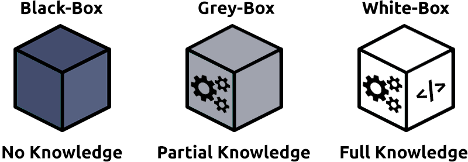

# Pentest Fundamentals

## Introduction

Sebelum mempelajari aspek teknis mengenai *Ethical Hacking*, kita harus memahami tentang tanggung jawab seorang *pentester* (orang yang melakukan *pentest*) dan proses apa yang dilalui ketika melakukan *pentest*. 

*Pentest* adalah upaya dengan etika yang baik untuk menguji dan menganalisis pertahanan dan keamanan dalam melindungi aset maupun informasi. 

*Pentest* melibatkan penggunaan *tools*, teknik, dan metodologi yang sama yang akan dilakukan seseorang dengan niat jahat dan mirip dengan audit.

## Penetration Testing Ethics

*Pentest*, atau *Penetration Testing*, adalah audit resmi atas keamanan dan pertahanan sistem komputer sebagaimana yang disepakati oleh pemilik sistem.

Sebelum *pentest* dimulai, terjadi diskusi dengan penguji (pentester) dan pemilik sistem mengenai Berbagai alat, teknik, dan sistem yang akan diuji.
Diskusi ini membentuk perjanjian yang akan menentukan jalannya pentest.

Etika adalah perdebatan moral antara benar dan salah, di mana suatu tindakan mungkin legal, itu mungkin bertentangan dengan sistem kepercayaan individu tentang benar dan salah.

*Pentester* akan sering dihadapkan dengan keputusan yang berpotensi dipertanyakan secara moral selama *pentest*. Misalnya, mereka (pentester) mendapatkan aksus ke database yang mengandung data sensitif, atau mereka melakukan serangan *phising* terhadap seorang karyawan untuk menguji keamanan manusia dalam suatu organisasi. Jika tindakan tersebut telah disepakati selama tahap awal, itu sah, meskipun etisnya dipertanyakan.

### Type of Hacker 

*Hacker* terbagi menjadi tiga golongan, yaitu :

| Hat Category| Description | Example |
| ----------- | ----------- | ------- |
| White Hat   | Dianggap sebagai "orang baik". Patuh terhadap hukum dan menggunakan skill-nya untuk memberi manfaat terhadap orang lain |  *Pentester* yang melakukan testing resmi pada sebuah perusahaan |
| Grey Hat    | Menggunakan skill-nya untuk memberi manfaat terhadap orang lain, namun tidak menghormati/mengikuti hukum/standar etika setiap saat | Seseorang yang men-takedown website scam |
| Black Hat    | Dianggap sebagai kriminal dan sering berusaha merusak organisasi dan mengambil keuntungan secara finansial | Pembuat virus ransomware yang menginfeksi perangkat dan mengambil/merusak datanya untuk dijadikan tebusan |

### Rules of Engagement (ROE)

ROE adalah dokumen yang dibuat pada tahap awal *pentest*. Dokumen ini terdiri dari tiga bagian yaitu:

| Section | Description |
| ------- | ----------- |
| Permission | Memberikan izin eksplisit untuk pelaksanaan perikatan. Izin ini penting untuk melindungi individu dan organisasi secara hukum atas aktivitas yang mereka lakukan |
| Test Scope | Menjelaskan target spesifik yang harus diterapkan oleh perjanjian. Misalnya, pentest mungkin hanya berlaku untuk server atau aplikasi tertentu tetapi tidak untuk seluruh jaringan |
| Rules | Menentukan teknik yang diizinkan selama perjanjian. Misalnya, aturan mungkin secara khusus menyatakan bahwa teknik seperti serangan phishing dilarang, tetapi serangan MITM (Man-in-the-Middle) boleh saja |

> Contoh dokumen ROE dari institut SANS: [lihat](https://sansorg.egnyte.com/dl/bF4I3yCcnt/?)

## Penetration Testing Methodologies

Langkah-langkah yang dilakukan *pentester* relevan dengan situasi yang dihadapinya. Misal, langkah untuk *pentest* keamanan aplikasi web tentu berbeda dengan *pentest* ketika menguji keamanan jaringan.

Berikut adalah tema umum untuk langkah-langkah dalam pentest:

| Stage | Description |
| ----- | ----------- |
| Information Gathering | Mengumpulkan informasi sebanyak mungkin dari yang dapat diakses publik tentang target/organisasi     **Catatan**: Ini tidak melibatkan pemindaian sistem apa pun.|
| Enumeration/Scanning | Menemukan aplikasi dan layanan yang berjalan pada sistem. Contoh, menemukan web server yang mungkin rentan |
| Exploitation | Memanfaatkan celah keamanan yang ditemukan pada sistem atau aplikasi. Tahap ini dapat melibatkan penggunaan eksploitasi publik atau eksploitasi logika aplikasi |
| Privilege Escalation | Setelah berhasil mengeksploitasi sistem atau aplikasi (dikenal sebagai foothold), tahap ini adalah upaya untuk memperluas akses ke suatu sistem. Dapat mengeskalasi secara horizontal dan vertikal, di mana secara horizontal mengakses akun lain dari grup izin yang sama (yaitu pengguna lain), sedangkan secara vertikal adalah akun grup izin lain (yaitu administrator) |
| Post-Exploitation | Terdiri dari beberapa sub-langkah:    1. Apa host lain yang dapat di eksploit (pivoting)   2. Apa informasi tambahan yang bisa didapatkan dari host saat ini dengan kita sebagai privileged user   3. Menutupi jejak   4. Membuat laporan |

### OSSTMM 

[OSSTMM](https://www.isecom.org/OSSTMM.3.pdf) (Open Source Security Testing Methodology Manual) menyediakan framework dari strategi pengujian (testing) untuk sistem, perangkat lunak, aplikasi, komunikasi, dan aspek manusia dari cybersecurity.

Metodologi ini mencakup:
- Telekomunikasi (Phones, VoIP, dll)
- Jaringan Berkabel
- Komunikasi Nirkabel

| Advantages | Disadvantages |
| ---------- | ------------- |
| Mencakup berbagai strategi testing secara mendalam | Framework susah untuk dipahami, sangat mendetail, dan cenderung menggunakan definisi unik |
| Sudah termasuk strategi testing untuk target tertentu (contoh, telekomunikasi dan networking) | - |
| Framework fleksibel terhadap kebutuhan organisasi | - |
| Framework ini dimaksudkan untuk menetapkan standar untuk sistem dan aplikasi, yang berarti bahwa metodologi universal dapat digunakan dalam skenario pentest | - |

### OWASP

[OWASP](https://owasp.org/) (Open Web Application Security Project) adalah framework berbasis komunitas yang sering diperbarui dan digunakan untuk menguji keamanan aplikasi dan layanan web.

| Advantages | Disadvantages |
| ---------- | ------------- |
| Mudah untuk diambil dan dimengerti | Mungkin tidak jelas jenis kerentanan apa yang dimiliki aplikasi web (seringkali dapat overlap) |
| Di-update secara berkala dan Di-rawat (maintained) secara aktif | OWASP tidak memberikan saran untuk siklus hidup software development tertentu |
| Mencakup semua tahap perjanjian dari pengujian hingga pelaporan dan perbaikan | Tidak memiliki akreditasi apapun seperti CHECK |
| Spesialisasi di aplikasi dan layanan web | - |

### NIST Cybersecurity Framework 1.1

[NIST](https://www.nist.gov/cyberframework) adalah framework untuk meningkatkan standar keamanan siber organisasi dan mengelola risiko ancaman siber.

Framework ini memberikan panduan tentang kontrol keamanan & tolok ukur keberhasilan bagi organisasi dari infrastruktur penting (pembangkit listrik, dll.) hingga komersial. Ada bagian terbatas pada pedoman standar untuk metodologi yang harus diambil oleh *pentester*.

| Advantages | Disadvantages |
| ---------- | ------------- |
| NIST diperkirakan digunakan oleh 50% organisasi di Amerika pada tahun 2020 | NIST memiliki banyak framework, jadi mungkin sulit untuk memutuskan yang cocok untuk organisasi |
| Framework sangat rinci dalam menetapkan standar untuk membantu organisasi mengurangi ancaman siber | Mempunyai kebijakan audit yang lemah, sehingga sulit untuk menentukan bagaimana pelanggaran terjadi |
| Framework di-update secara berkala | Tidak mempertimbangkan cloud computing, yang dengan cepat menjadi populer untuk organisasi |
| NIST memberikan akreditasi untuk organisasi yang menggunakan framework ini | - |
| NIST dirancang untuk diimplementasikan bersama framework lainnya. | - |

### NCSC CAF

[CAF](https://www.ncsc.gov.uk/collection/caf/caf-principles-and-guidance) (Cyber Assessment Framework) adalah framework luas dari 14 prinsip yang digunakan untuk menilai risiko berbagai ancaman siber dan pertahanan organisasi terhadapnya.

Framework ini berlaku untuk organisasi yang dianggap melakukan "layanan dan aktivitas yang sangat penting" seperti infrastruktur penting, perbankan, dan sejenisnya. Framework ini terutama berfokus pada dan menilai topik-topik berikut:
- Keamanan data
- Keamanan sistem
- Identitas dan kontrol akses
- Kegembiraan
- Pemantauan
- Perencanaan respons dan pemulihan

| Advantages | Disadvantages |
| ---------- | ------------- |
| Framework ini didukung oleh badan keamanan siber pemerintah | Framework masih baru di industri, yang berarti bahwa organisasi tidak punya banyak waktu untuk membuat perubahan yang diperlukan agar sesuai untuk itu |
| Menyediakan akreditasi | Framework ini didasarkan pada prinsip dan ide sehingga tidak langsung memiliki aturan seperti beberapa kerangka kerja lainnya |
| Mencakup empat belas prinsip yang berkisar dari keamanan hingga respons | - |

## Black-Box, Grey-Box, White-Box

### Black-Box Testing

Proses testing ini adalah proses tingkat tinggi di mana *pentester* tidak diberikan informasi apa pun tentang cara kerja bagian dalam aplikasi atau layanan.

Black-Box Testing secara signifikan meningkatkan jumlah waktu yang dihabiskan selama pengumpulan informasi dan fase enumerasi untuk memahami permukaan serangan target.

### Grey-Box Testing

Proses testing ini adalah proses dimana *pentester* diberi pengetahuan terbatas mengenai aplikasi atau layanan namun akan melakukan *pentest* seolah-olah Black-Box Testing.

Dengan Grey-Box Testing, pengetahuan terbatas yang diberikan menghemat waktu, dan sering dipilih untuk permukaan serangan yang sulit.

### White-Box Testing

Proses testing ini adalah proses dimana *pentester* diberikan pengetahuan penuh mengenai aplikasi dan layanan seperti source code, maupun logic aplikasi.

Pengetahuan penuh dalam skenario White-Box Testing menyediakan pendekatan pengujian yang menjamin seluruh permukaan serangan dapat divalidasi.
