# 02_01_Walking An Application

> Pada chapter ini membahas review aplikasi web untuk masalah keamanan hanya dengan menggunakan *browsers developer tools.* Chapter ini hanya meretas dengan browser, tanpa penggunaan tools atau script.
> 

## Introduction

Pada chapter ini akan menggunakan *in-built browser tools* berikut.

- **View Source →** untuk melihar source code web page sisi client.
- **Inspector →** untuk memeriksa/ *inspect page elements*  dan membuat perubahan untuk melihat konten yag biasanya diblokir.
- **Debugger →** memeriksa dan mengontrol *flow* dari Javascript suatu halaman.
- **Network →** untuk melihat *network request* suatu halaman.

Pertama kita perlu untuk “*Start Machine”* untuk mendapatkan *IP address.*

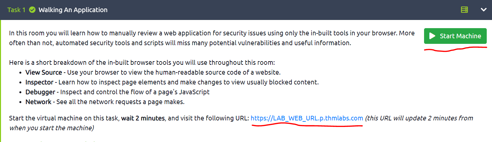

Ini membutuhkan sekitar maksimum 2 menit untuk deploy memunculkan IP pada URL : [https://x.x.x.x.p.thmlabs.com](https://x.x.x.x.p.thmlabs.com/). Berikut merupakan tampilan apabila web berhasil

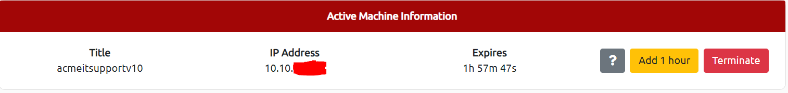

## Exploring the Website

***Penetration tester*** bertugas untuk mereview website atau website application dalam menemukan fitur yang berpotensi rentan dan mencoba untuk mengeksploitasinya untuk menilai apakah fitur tersebut rentan atau tidak. Fitur-fitur ini biasanya bagian dari website dan memerlukan beberapa interaksi dengan user.

Menemukan bagian interaktif dari website dapat dengan mudah ditemukan contohnya adalah form login dan kita dapat script JS halaman tersebut secara manual.  

Contoh review Acme IT Support website akan terlihat berikut.

| Fitur | URL | Deskripsi |
| --- | --- | --- |
| Home Page | / | Halaman ini berisi ringkasan tentang apa yang dilakukan Acme IT Support dengan foto perusahaan staf mereka. |
| Latest News | /news | Halaman ini berisi daftar artikel berita yang baru saja diterbitkan oleh perusahaan, dan setiap artikel berita memiliki tautan dengan nomor id, yaitu /news/article?id=1 |
| News Article | /news/article?id=1 | Menampilkan artikel berita individu. Beberapa artikel tampaknya diblokir dan hanya diperuntukkan bagi pelanggan premium. |
| Contact Page | /contact | Halaman ini berisi formulir bagi pelanggan untuk menghubungi perusahaan. Ini berisi bidang input nama, email dan pesan dan tombol kirim. |
| Customers | /customers | Tautan ini dialihkan ke /customers/login. |
| Customer Login | /customers/login | Halaman ini berisi form login dengan field username dan password. |
| Customer Signup | /customers/signup | Halaman ini berisi formulir pendaftaran pengguna yang terdiri dari kolom input nama pengguna, email, kata sandi, dan konfirmasi kata sandi. |
| Customer Reset Password | /customers/reset | Formulir pengaturan ulang kata sandi dengan bidang input alamat email. |
| Customer Dashboard | /customers | Halaman ini berisi daftar tiket pengguna yang dikirimkan ke perusahaan dukungan TI dan tombol "Create Ticket". |
| Create Ticket | /customers/ticket/new | Halaman ini berisi formulir dengan kotak teks untuk memasukkan masalah TI dan opsi unggah file untuk membuat tiket dukungan TI. |
| Customer Account | /customers/account | Halaman ini memungkinkan pengguna untuk mengedit nama pengguna, email, dan kata sandi mereka. |
| Customer Logout | /customers/logout | Tautan ini membuat pengguna keluar dari area pelanggan. |

## Viewing The Page Source

***Page source*** merupakan *human-readable code* yang dikembalikan ke browser/ client dari web server setiap kita membuat *request*. 

Kode yang dikembalikan terdiri dari HTML, CSS, dan JS. Kode ini berfungsi untuk memberitahu browser bahwa konten apa yang akan ditampilkan, cara menampilkannya, serta menambahkan elemen interaktif menggunakan JS.

Dengan melihat ***page source*** kita dapat menemukan lebih banyak informasi tentang aplikasi web. 

### Cara Melihat *Page Source*

1. Saat melihat situs web, Anda dapat mengklik kanan halaman, dan Anda akan melihat opsi “*View page source* ”pada menu.
2. Sebagian besar browser mendukung penempatan view-source: di depan URL misalnya,  **view-source:https://www.google.com/.**
3. Di menu browser, Anda akan menemukan opsi untuk melihat *page source*. Opsi ini terkadang dapat berada di submenu seperti *developer tools* atau *tools* lainnya.

### *****Let's view some Page Source!*****

Coba untuk melihat ***page source*** dari *home page* Acme IT Support website.

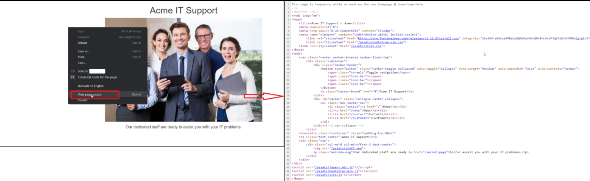

Pada bagian atas halaman, Anda akan melihat beberapa kode yang dimulai dengan `<!--`dan diakhiri dengan `-->`komentar. Komentar adalah pesan yang ditinggalkan oleh pengembang situs web, biasanya untuk menjelaskan sesuatu dalam kode kepada pemrogram lain atau bahkan catatan/pengingat untuk diri mereka sendiri. Komentar ini tidak ditampilkan di halaman web yang sebenarnya. Komentar ini menjelaskan bagaimana *homepage* bersifat sementara karena web page yang baru sedang dalam pengembangan. Lihat halaman web di komentar untuk mendapatkan *flagnya*.

Tautan ke halaman yang berbeda dalam HTML ditulis dalam *anchor tags* ( ini adalah elemen HTML yang dimulai dengan `<a`), dan tautan yang akan  dituju disimpan dalam `href`atribut. Contohnya, Anda akan melihat tautan ke *contact page* pada *line* 30.

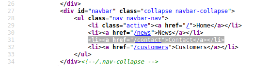

Jika Anda melihat lebih jauh ke *page source*, ada tautan tersembunyi ke halaman yang dimulai dengan "secret", lihat link ini untuk mendapatkan *flag*nya. Anda jelas tidak akan mendapatkan *flag* dalam *real case*, tetapi Anda mungkin menemukan beberapa area pribadi ataupun sensitif yang digunakan oleh bisnis untuk menyimpan informasi perusahaan/staf/pelanggan.

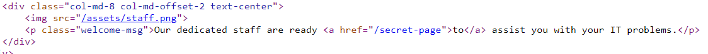

File eksternal seperti CSS, JavaScript dan gambar dapat dimasukkan menggunakan kode HTML. Dalam contoh ini, Anda akan melihat bahwa semua file ini disimpan dalam direktori yang sama. Jika Anda melihat direktori ini di browser web Anda, ada kesalahan konfigurasi. Apa yang harus ditampilkan adalah halaman kosong atau halaman 403 Forbidden dengan kesalahan yang menyatakan Anda tidak memiliki akses ke direktori. Sebagai gantinya, fitur daftar direktori telah diaktifkan, yang sebenarnya, mencantumkan setiap file dalam direktori. Terkadang hal ini tidak menjadi masalah, dan semua file dalam direktori aman untuk dilihat oleh publik, tetapi dalam beberapa kasus, file cadangan, kode sumber, atau informasi rahasia lainnya dapat disimpan di sini. Dalam contoh ini, kita mendapatkan *flag* di file flag.txt.

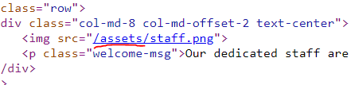

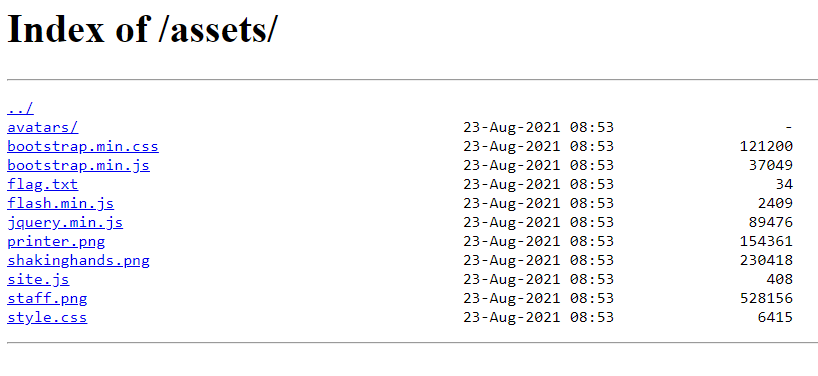

Banyak situs web hari ini tidak dibuat dari awal dan menggunakan apa yang disebut *framework*. *Framework* adalah kumpulan kode premade yang dengan mudah memungkinkan pengembang untuk memasukkan fitur umum yang dibutuhkan situs web, seperti blog, manajemen pengguna, pemrosesan formulir, dan banyak lagi, menghemat jam atau hari pengembangan pengembang.

Melihat ***page source*** sering kali dapat memberi kita petunjuk tentang apakah suatu *framework* sedang digunakan dan, jika demikian, *framework* mana dan bahkan versi apa. Mengetahui *framework* dan versinya dapat menjadi penemuan yang kuat karena mungkin ada kerentanan publik dalam kerangka kerja, dan situs web mungkin tidak menggunakan versi terbaru. Di bagian bawah halaman, Anda akan menemukan komentar tentang kerangka kerja dan versi yang digunakan dan tautan ke situs web kerangka kerja. Melihat situs web kerangka kerja, Anda akan melihat bahwa situs web kami sebenarnya sudah ketinggalan zaman. Baca pemberitahuan pembaruan dan gunakan informasi yang tersebut untuk menemukan *flag*.

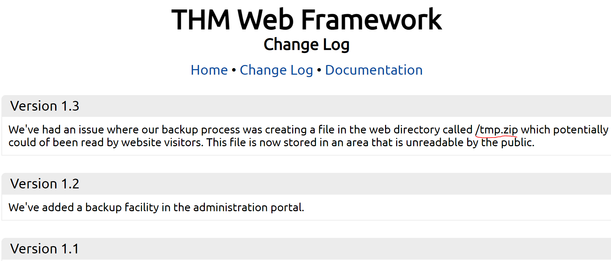

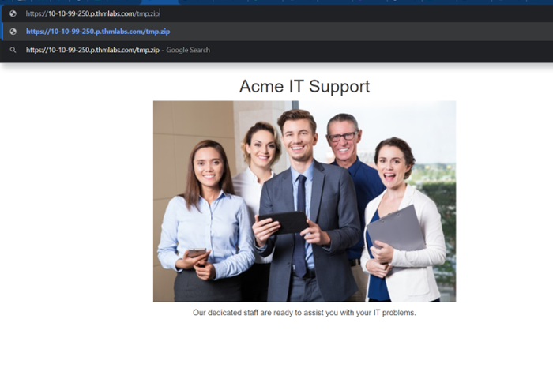

## Developer Tools - Inspector

Setiap browser modern menyertakan *developer tools*; ini adalah *tool kit* yang digunakan untuk membantu pengembang web dalam *debugging* aplikasi web dan memberi Anda pandangan di balik situs web untuk melihat apa yang sedang terjadi. Sebagai seorang pentester, kita dapat memanfaatkan alat ini untuk memberi kita pemahaman yang jauh lebih baik tentang aplikasi web. Kita secara khusus berfokus pada tiga fitur *developer tool kit*, *Inspector, Debugger,* dan *Network.*

### ****Opening Developer Tools****

Cara mengakses *developer tools* berbeda untuk setiap browser. 

**Firefox**

Klik pada Firefox menu pada kanan-atas browser, kemudian pilih **Web Developer** dan pilih submenu **Web Developer Tools**.

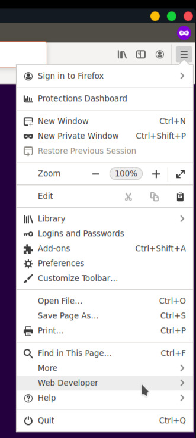
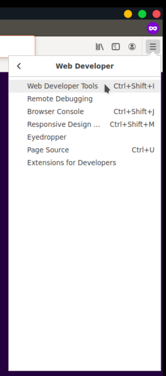

**Chrome**

Untuk membuka *developer tools* pada chrome, klik Chrome Menu pada kanan-atas browser dan kemudian pilih **More Tools** dan kemudian **Developer Tools**.

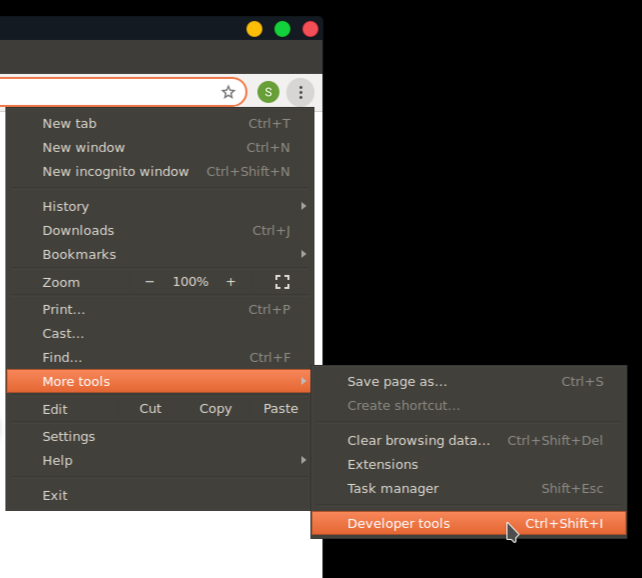

**Safari** 

Untuk membuka *developer tools* pada **Safari **diharuskan mengaktifkan ***develop menu***. Pada Safari*,* buka *preferences*, klik pada *advanced tab* lalu centang *checkbox* di bagian bawah “***Develop menu in menu bar***”.

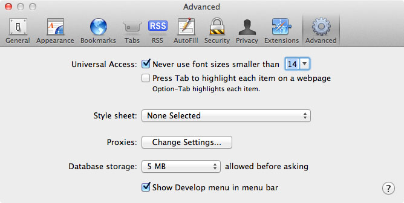

Pada bagian atas Safari browser Anda akan memiliki *Develop Menu*, klik “***Show Web Inspector”*** untuk membuka *developer tools.*

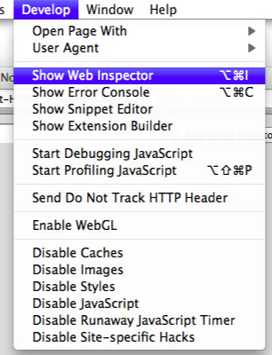

**Edge**

Klik pada *Edge Menu* pada sisi kanan-atas browser dan kemudian pilih “***More Tools***” dan kemudian pilih “***Developer Tools***”.

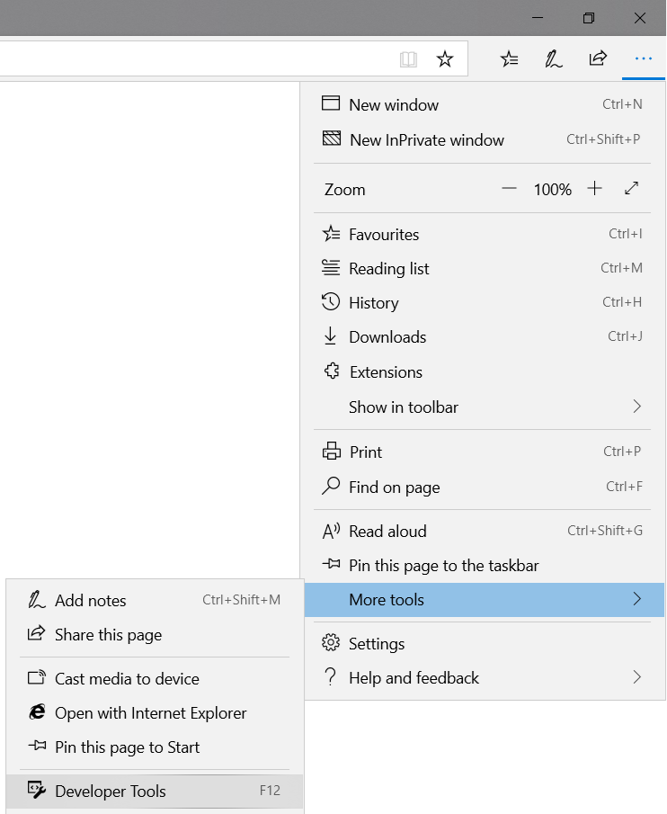

**Internet Explorer**

Untuk membuka *developer tools*, klik roda gigi pada bagian kanan-atas browser kemudian pilih “***F12 Developer Tools***”.

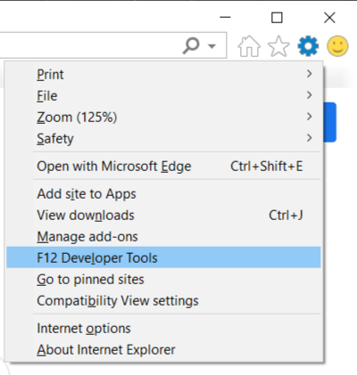

### Inspector

*Page source* tidak selalu merepresentasikan apa yang ada pada *webpage*. Hal ini karena CSS, JS, dan *user interaction* akan merubah konten dan style dari halaman, yang berarti kita memerlukan cara untuk melihat apa yang telah ditampilkan di *browser window* pada waktu yang tepat. *Element inspector* membantu kita dengan menyediakan represntasi langsung dari apa yang saat ini ada pada situs web.

Selain melihat tampilan langsung, kita juga dapat mengedit dan berinteraksi dengan elemen halaman, yang berguna bagi pengembang web untuk men-debug masalah.

Pada Acme IT Support website, klik ke bagian *news*, di mana Anda akan melihat tiga artikel berita.

Dua artikel pada website ini dapat dibaca, tetapi artikel ketiga telah diblokir dengan pemberitahuan yang menyatakan bahwa Anda harus menjadi pelanggan premium untuk melihat artikel tersebut. Kotak mengambang yang memblokir konten halaman ini sering disebut sebagai *paywalls* karena mereka memasang dinding metaforis di depan konten yang ingin Anda lihat sampai Anda membayar.

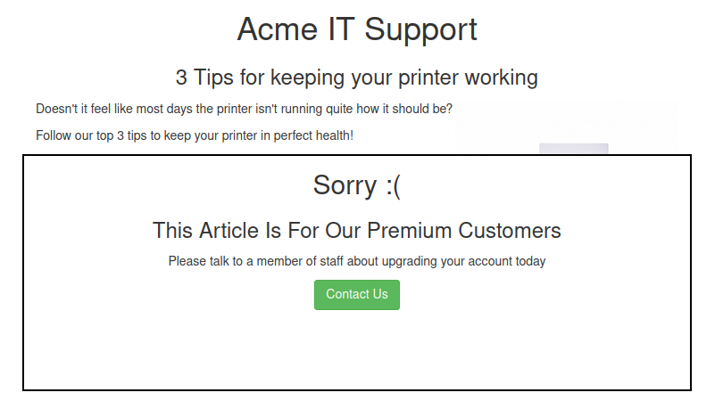

Klik kanan pada pemberitahuan premium ( *paywall* ), Anda seharusnya dapat memilih opsi *Inspect* dari menu, yang membuka *developer tools* baik di sisi bawah atau kanan tergantung pada browser atau preferensi Anda. Sekarang Anda akan melihat elemen/HTML yang membentuk situs web (mirip dengan tangkapan layar di bawah).

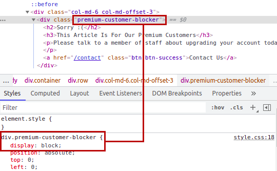

Temukan elemen **DIV** dengan **premium-customer-blocker** dan klik di atasnya. Anda akan melihat semua *CSS styles* di *styles box* yang berlaku untuk elemen ini, seperti **margin-top: 60px** dan **text-align: center**. *Style* yang kita minati adalah **display: block**. Jika Anda mengklik pada kata **block**, Anda dapat mengetikkan nilai pilihan Anda sendiri. Coba ketik **none**, dan ini akan membuat kotak menghilang, menampilkan konten di bawahnya dan sebuah *flag*. Jika elemen tidak memiliki bidang tampilan, Anda dapat mengeklik di bawah gaya terakhir dan menambahkan gaya Anda sendiri. Bermainlah dengan *element inspector*, dan Anda akan melihat bahwa Anda dapat mengubah informasi apa pun di situs web, termasuk kontennya. Ingat ini hanya diedit di jendela browser Anda, dan ketika Anda menekan refresh, semuanya akan kembali normal.

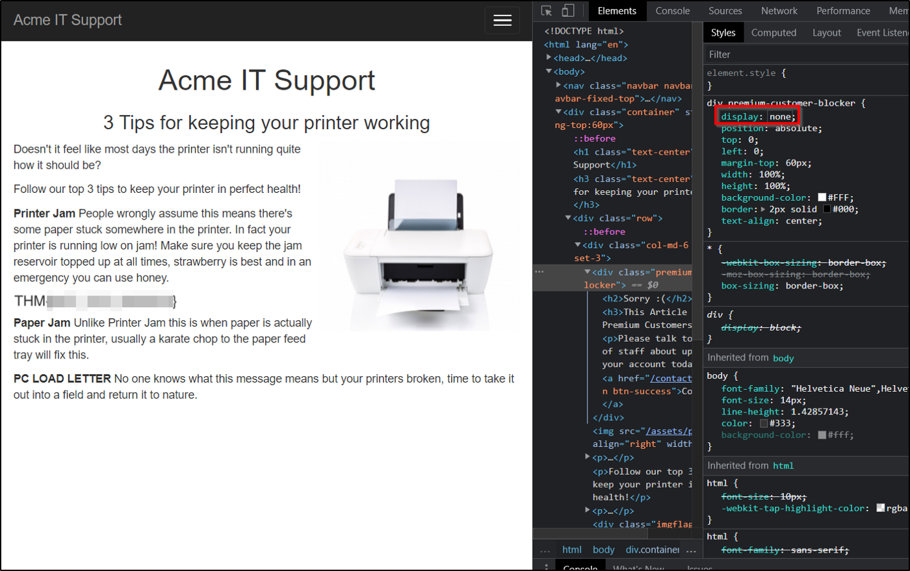

## **Developer Tools - Debugger**

Panel ini pada *developer tools* dimaksudkan untuk men-debug JavaScript, dan sekali lagi merupakan fitur luar biasa bagi *developer web* yang ingin mencari tahu mengapa sesuatu mungkin tidak berfungsi. Tetapi sebagai *penetration testers*, ini memberi kita pilihan untuk menggali lebih jauh ke dalam kode JavaScript. Di Firefox dan Safari, fitur ini disebut ***Debugger***, tetapi di Google Chrome, disebut ***Sources***.

Pada Acme IT Support website, klik *contact page*, setiap kali halaman dimuat, Anda mungkin melihat kilatan merah cepat di layar. Kami akan menggunakan Debugger untuk mencari tahu apa itu flash merah dan apakah itu berisi sesuatu yang menarik. Men-debug titik merah tidak akan menjadi sesuatu yang Anda lakukan di dunia nyata sebagai *penetration testers*, tetapi ini memungkinkan kita untuk menggunakan fitur ini dan membiasakan diri dengan ***Debugger***.

Di kedua browser, di sisi kiri, Anda akan melihat *list* semua *resources* yang digunakan halaman web saat ini. Jika Anda mengklik folder assets, Anda akan melihat file bernama flash.min.js. Mengklik file ini akan menampilkan konten file JavaScript.

Sering kali saat melihat file javascript, Anda akan melihat bahwa semuanya berada dalam satu baris, karena telah diminimalkan, yang berarti semua pemformatan ( tab, spasi, dan *newlines* ) telah dihapus untuk membuat file lebih kecil. File ini tidak terkecuali untuk ini, dan juga telah dikaburkan, yang membuatnya sulit untuk dibaca, sehingga tidak dapat disalin dengan mudah oleh pengembang lain.

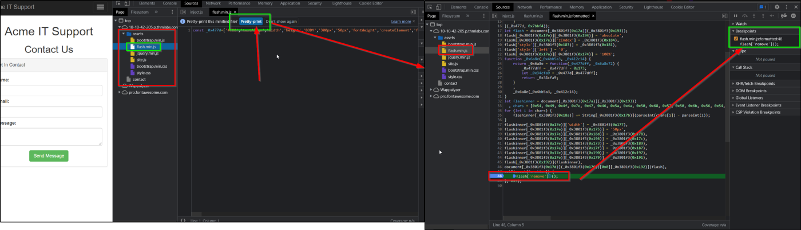

Kita dapat mengembalikan beberapa pemformatan dengan menggunakan opsi "***Pretty Print***", yang terlihat seperti dua kurung kurawal **{}** untuk membuatnya sedikit lebih mudah dibaca, meskipun karena kebingungan, masih sulit untuk memahami apa yang terjadi dengan file tersebut. Jika Anda scroll ke bagian bawah file flash.min.js, Anda akan melihat baris:`flash['remove']();`

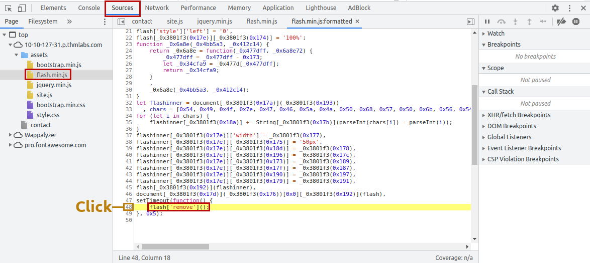

Kode JavaScript inilah yang menghapus popup merah dari halaman. Kita dapat memanfaatkan fitur debugger lain yang disebut ***breakpoints***. Ini adalah poin dalam kode yang kita dapat memaksa browser untuk berhenti memproses JavaScript dan menghentikan sementara (*pause)* eksekusi saat ini (sesuai penanda). Saat aplikasi berhenti, secara otomatis *DevTools* akan melakukan *State Dumping,* sehingga kita dapat berinteraksi secara langsung dengan aplikasi via *Console*

Jika Anda mengklik nomor baris yang berisi kode di atas, Anda akan melihatnya berubah menjadi biru; Anda sekarang telah memasukkan breakpoint pada baris ini. Sekarang coba *refresh* halaman, dan Anda akan melihat kotak merah tetap berada di halaman alih-alih menghilang, dan berisi sebuah ***flag***.

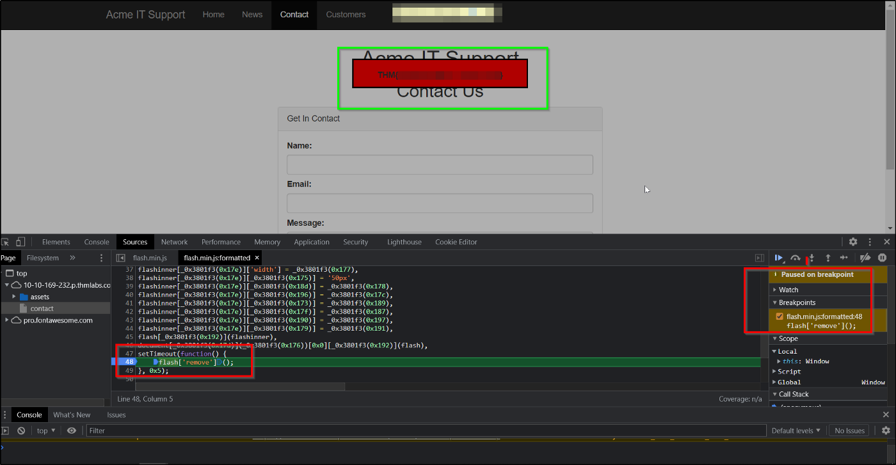

## **Developer Tools - Network**

Tool *network* pada *DevTools* dapat digunakan untuk melacak setiap *external request* yang dibuat halaman web. Jika Anda mengklik tab *Network* dan kemudian *refresh* halaman, Anda akan melihat semua file yang diminta halaman tersebut.

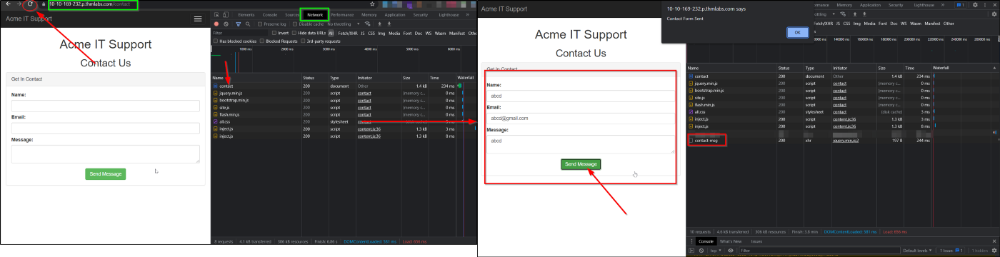

Coba lakukan ini pada *contact page.* Dengan tab *network* terbuka, coba isi *form contact* dan tekan tombol “***Send Message***”. Anda akan melihat sebuah *event* di menu *network*, dan ini adalah formulir yang dikirimkan di *background* menggunakan metode yang disebut **AJAX**. **AJAX** adalah metode untuk mengirim dan menerima data jaringan pada *background web application* tanpa mengganggu dengan mengubah halaman web saat ini.

Periksa entri baru pada tab *network* yang dibuat oleh *form contact* dan lihat halaman tempat data dikirim untuk mengungkapkan ***flag***.
