# 02_03_Subdomain Enumeration

> Mempelajari berbagai cara untuk menemukan subdomain dengan tujuan memperluas permukaan serangan target.
> 

## Brief

***Subdomain enumeration*** merupakan proses menemukan subdomain yang valid dari sebuah domain. Tujuannya adalah untuk memperluas permukaan serangan kita untuk mencoba dan menemukan lebih banyak titik kerentanan potensial.

Terdapat tiga metode *subdomain enumeration:*

- Brute Force
- OSINT (Open-Source Intelligence)
- Virtual Host

---

### Subdomain

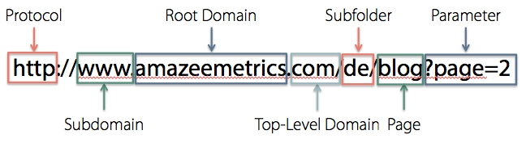

Subdomain merupakan bagian dari domain yang lebih besar yang digunakan untuk mengatur situs web yang ada ke dalam URL halaman yang berbeda. Subdomain biasanya ditemukan di awal URL. Misalnya, "support.google.com" adalah subdomain dari "google.com".

Fungsi subdomain adalah untuk membagi satu situs website menjadi beberapa bagian. Dengan adanya subdomain, maka kita dapat membuat halaman baru namun tetap masih menggunakan nama domain yang sama.

---

## OSINT - SSL/TLS Certificates

### **SSL/TLS Certificates**

Ketika *SSL/TLS (Secure Sockets Layer/Transport Layer Security)* *certificate* dibuat untuk domain oleh *CA (Certificate Authority)*, *CA* mengambil bagian dalam apa yang disebut "***Certificate Transparency (CT) logs***". Ini adalah log yang dapat diakses publik dari setiap sertifikat SSL/TLS yang dibuat untuk nama domain. Tujuan dari *Certificate Transparency logs* adalah untuk menghentikan penggunaan sertifikat yang berbahaya dan tidak sengaja. Kita dapat menggunakan layanan ini untuk keuntungan kita untuk menemukan subdomain milik domain, situs seperti [https://crt.sh](http://crt.sh/)  dan  [https://transparencyreport.google.com/https/certificates](https://transparencyreport.google.com/https/certificates)  menawarkan database sertifikat yang dapat dicari yang menunjukkan saat ini dan historis hasil.

### **crt.sh**

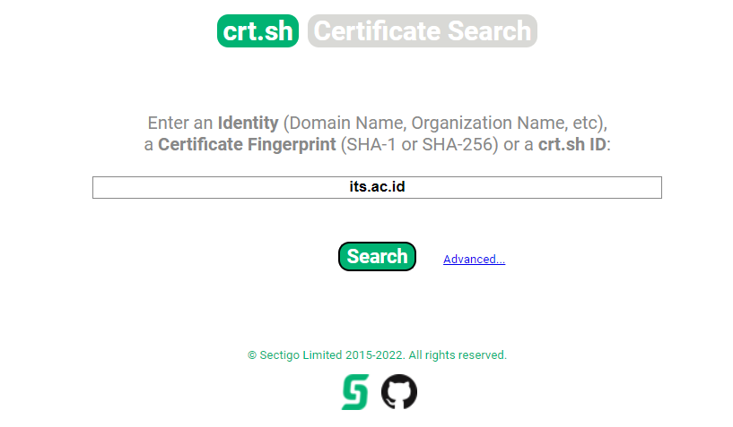

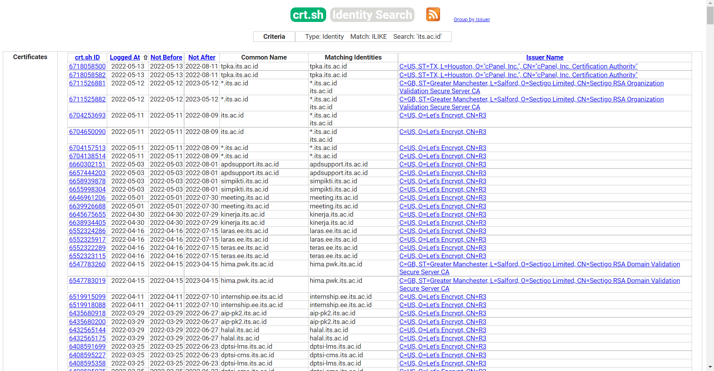

### **Google Transparency Report**

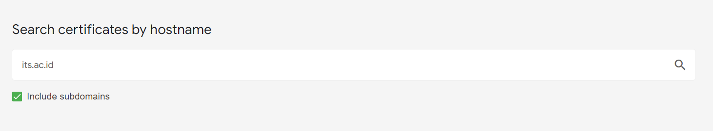

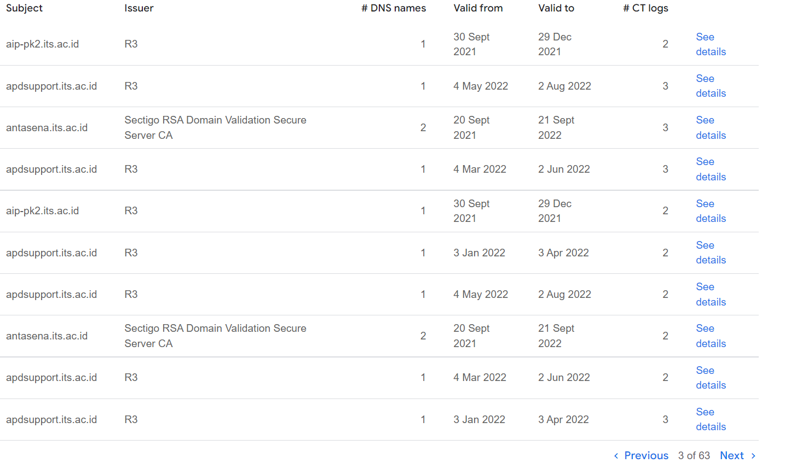

Dapat dilihat bahwa terdapat banyak subdomain yang dimiliki oleh domain utama [its.ac.id](http://its.ac.id), seperti [meeting.its.ac.id](http://meeting.its.ac.id/), [kinerja.its.ac.id](http://kinerja.its.ac.id/), [hima.pwk.its.ac.id](http://hima.pwk.its.ac.id/), [antasena.its.ac.id](http://antasena.its.ac.id/) dan lain-lain.

## **Search Engines**

*Search engines* berisi triliunan tautan ke lebih dari satu miliar situs web, yang dapat menjadi sumber yang bagus untuk menemukan subdomain baru. Menggunakan metode pencarian lanjutan di situs web seperti Google, seperti filter situs: dapat mempersempit hasil pencarian. Misalnya, 

"**-site:www.domain.com site:*.domain.com**" 

hanya akan berisi hasil yang mengarah ke nama domain domain.com tetapi mengecualikan tautan apa pun ke www.domain.com; oleh karena itu, ini hanya menunjukkan kepada kita nama subdomain milik domain.com.

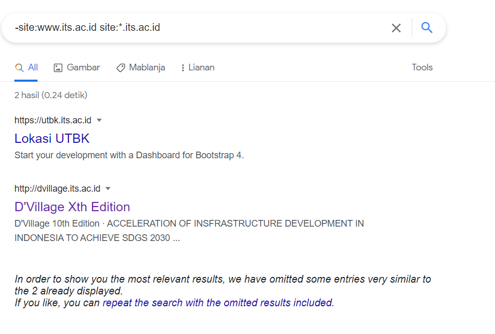

Dari gambar di atas, dapat dilihat bahwa hasil dari pencarian subdomain its terdapat dua subdomain yaitu [utbk.its.ac.id](http://utbk.its.ac.id) dan [dvillage.its.ac.id](http://dvillage.its.ac.id/)

## DNS Bruteforce

*Bruteforce DNS (Domain Name System) enumeration* adalah metode mencoba puluhan, ratusan, ribuan, atau bahkan jutaan kemungkinan subdomain yang berbeda dari daftar subdomain yang umum digunakan yang telah ditentukan sebelumnya. Karena metode ini membutuhkan banyak permintaan, kita dapat mengotomatiskannya dengan alat untuk mempercepat proses. Dalam contoh ini, menggunakan alat yang disebut **dnsrecon**. 

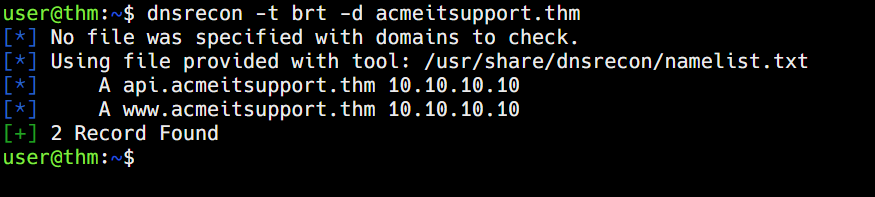

Keterangan:

**-t** : tipe enumeration yang dilakukan.

**brt** : enumeration yang dilakukan menggunakan tipe bruteforce.

**-d** : domain target.

**acmeitsupport.thm** : target DNS bruteforce.

## OSINT - Sublist3r

### **Automation Using Sublist3r**

Untuk mempercepat proses penemuan subdomain OSINT, kita dapat mengotomatiskan dengan menggunakan bantuan alat seperti  [Sublist3r](https://github.com/aboul3la/Sublist3r). 

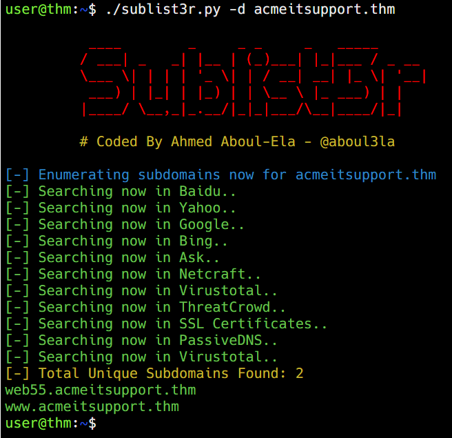

Keterangan:

**-d** : target nama domain subdomain enumeration.

**acmeitsupport.thm** : target subdomain enumeration.

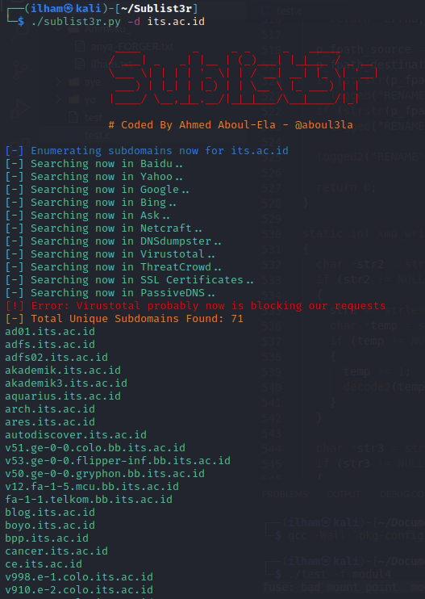

## Virtual Hosts

Beberapa subdomain tidak selalu dihosting dalam hasil DNS yang dapat diakses publik, contohnya seperti versi pengembangan aplikasi web atau portal administrasi. Sebagai gantinya, *DNS record* dapat disimpan di *private DNS server* atau disimpan pada mesin pengembang di file /etc/hosts mereka (atau file c:\windows\system32\drivers\etc\hosts untuk pengguna Windows) yang memetakan nama domain ke alamat IP.

Karena server web dapat meng-host beberapa situs web dari satu server ketika sebuah situs web direquest oleh klien, server mengetahui situs web mana yang diinginkan klien dari header **Host.**  Kita dapat memanfaatkan *header host* ini dengan membuat perubahan padanya dan memantau responsnya untuk melihat apakah kita telah dapat menemukan situs web baru.

Seperti halnya DNS Bruteforce, kita dapat mengotomatiskan proses ini dengan menggunakan *wordlist* dari subdomain yang umum digunakan. 

```bash
ffuf -w /usr/share/wordlists/dirbuster/directory-list-2.3-medium.txt -H "Host: FUZZ.acmeitsupport.thm" -u http://10.10.4.129
```

Keterangan:

**-w** : untuk menentukan daftar kata yang akan kita gunakan.

**-H** :  menambahkan/mengedit header (dalam hal ini, header Host).

**FUZZ** : untuk target subdomain enumeration.

Hasil:

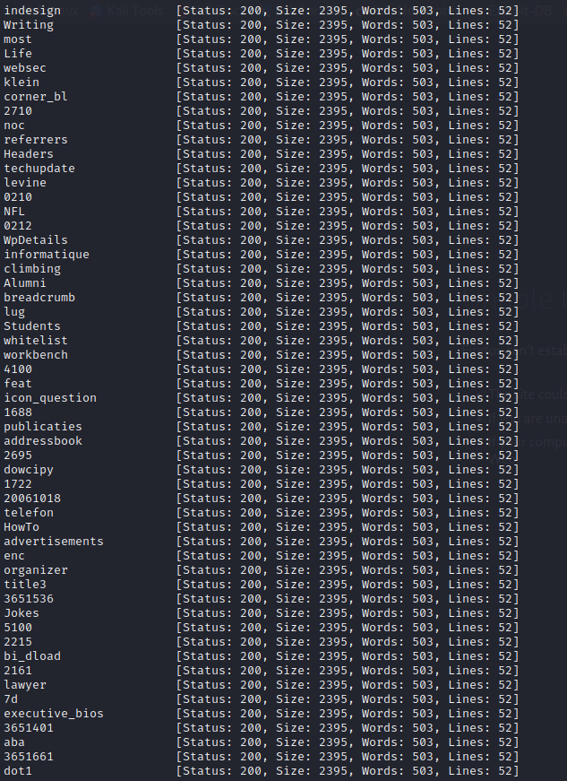

Karena perintah di atas akan selalu menghasilkan hasil yang valid, kita perlu memfilter outputnya. Kita dapat melakukan ini dengan menggunakan hasil ukuran halaman dengan menambahkan opsi **-fs**. **{size}** digunakan untuk memunculkan size yang paling banyak muncul dari hasil yang didapat.

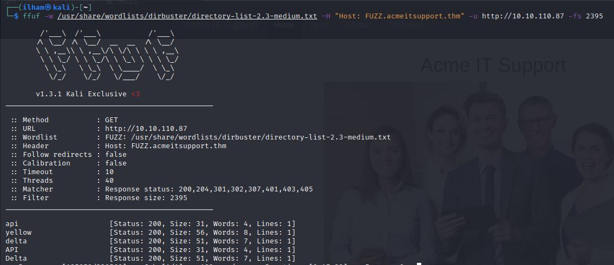

