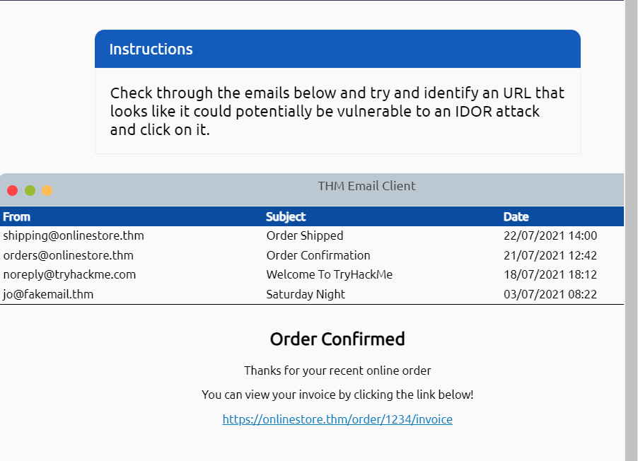
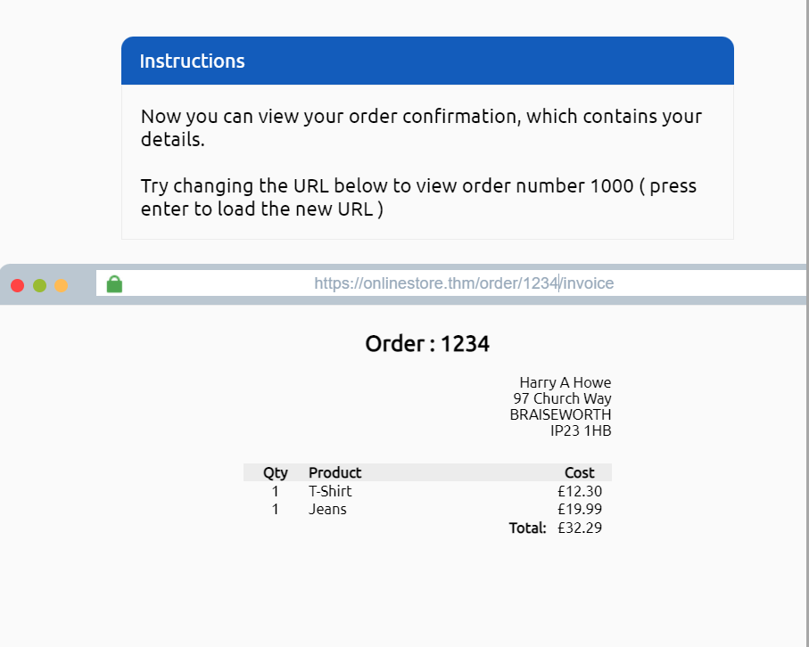
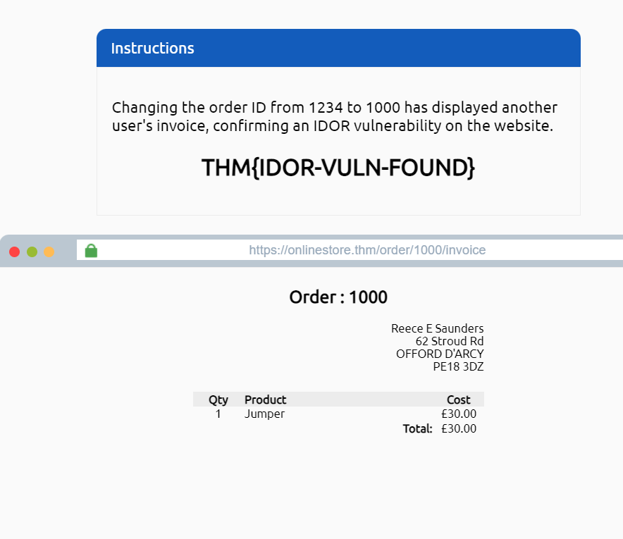
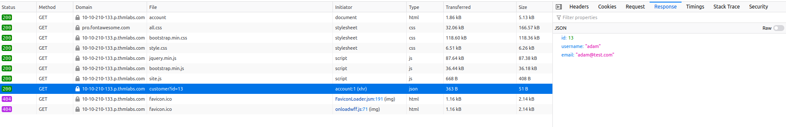
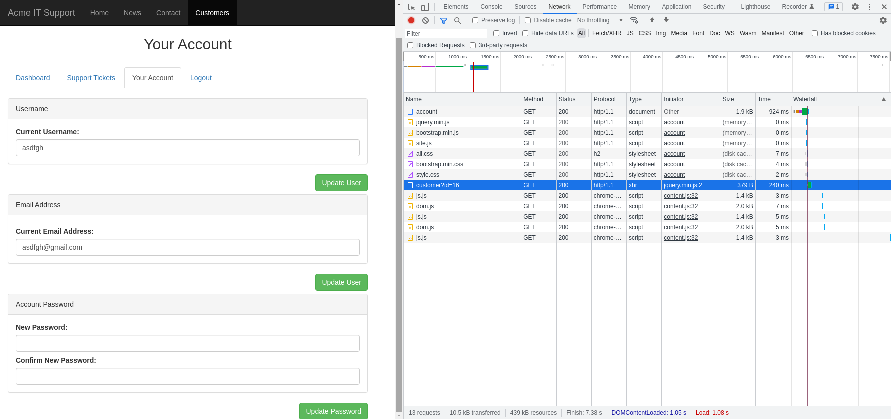
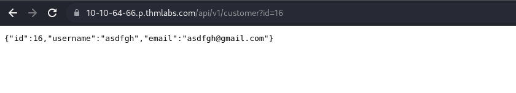
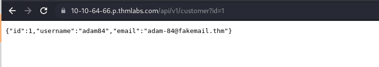
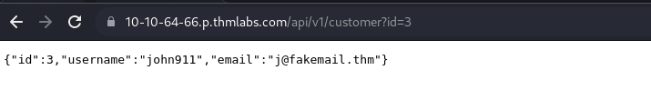

# 02_05_IDOR

> Pelajari cara menemukan dan mengeksploitasi kerentanan IDOR dalam aplikasi web yang memberi Anda akses ke data yang seharusnya tidak Anda miliki.
> 

## Apa itu IDOR

**IDOR** merupakan singkatan dari Insecure Direct Object Reference dan merupakan jenis kerentanan kontrol akses.

Jenis kerentanan ini dapat terjadi ketika server web menerima input yang disediakan pengguna untuk mengambil objek (file, data, dokumen), terlalu banyak kepercayaan telah ditempatkan pada data input, dan tidak divalidasi di sisi server untuk mengonfirmasi objek yang diminta adalah milik pengguna yang melakukan *request*.

## Contoh IDOR

Bayangkan Anda baru saja mendaftar ke layanan online, dan Anda ingin mengubah informasi profil Anda. Tautan yang Anda klik menuju ke `http://online-service.thm/profile?user_id=1305`, dan Anda dapat melihat informasi Anda.

Keingintahuan menguasai Anda, dan Anda mencoba mengubah nilai user_id menjadi 1000 sebagai gantinya (http://online-service.thm/profile?user_id=1000), dan yang mengejutkan Anda, Anda sekarang dapat melihat informasi pengguna lain. Anda sekarang telah menemukan kerentanan IDOR! Idealnya, harus ada pemeriksaan di situs web untuk mengonfirmasi bahwa informasi pengguna adalah milik pengguna yang login yang memintanya.







## Menemukan IDOR pada Encode ID

### Encode ID

Saat meneruskan data dari halaman ke halaman baik dengan data posting, string kueri, atau cookie, pengembang web akan sering kali mengambil data mentah terlebih dahulu dan menyandikannya. Encoding memastikan bahwa server web penerima akan dapat memahami isinya. Encoding mengubah data biner menjadi string ASCII yang biasanya menggunakan

```
a-z, A-Z, 0-9 and =
```

karakter untuk padding. Teknik encoding yang paling umum di web adalah encoding base64 dan biasanya cukup mudah dikenali. Anda dapat menggunakan situs web seperti [https://www.base64decode.org/](https://www.base64decode.org/) untuk memecahkan kode string, kemudian mengedit data dan menyandikan ulang lagi menggunakan [https://www.base64encode.org/](https://www.base64encode.org/) dan kemudian mengirimkan kembali permintaan web untuk melihat apakah ada perubahan respon.

Lihat gambar di bawah sebagai contoh grafis dari proses ini:


## Menemukan IDOR pada Hash ID

### **ID yang di-hash**

ID yang di-hash sedikit lebih rumit untuk ditangani daripada yang disandikan, tetapi mereka mungkin mengikuti pola yang dapat diprediksi, seperti versi hash dari nilai integer. Misalnya, nomor id **123** akan menjadi **202cb962ac59075b964b07152d234b70** jika hashing md5 digunakan.

Sebaiknya letakkan hash yang ditemukan melalui layanan web seperti [https://crackstation.net/](https://crackstation.net/) (yang memiliki database miliaran hash untuk menilai hasil) untuk melihat apakah kita dapat menemukan kecocokan.

## Menemukan IDOR dalam ID yang Tidak Dapat Diprediksi

Jika id tidak dapat dideteksi menggunakan metode di atas, metode deteksi IDOR yang sangat baik adalah dengan membuat dua akun dan menukar nomor id di antara keduanya. Jika Anda dapat melihat konten pengguna lain menggunakan nomor id mereka saat masih masuk dengan akun yang berbeda (atau tidak masuk sama sekali), Anda telah menemukan kerentanan IDOR yang valid.

## Di mana IDOR berada?

Titik akhir rentan yang Anda targetkan mungkin tidak selalu menjadi sesuatu yang dapat Anda lihat di *address bar*. Itu bisa berupa konten yang dimuat browser Anda melalui permintaan AJAX atau sesuatu yang Anda temukan direferensikan dalam file JavaScript.

Terkadang titik akhir dapat memiliki parameter yang tidak direferensikan yang mungkin berguna selama pengembangan dan didorong ke produksi. Misalnya, Anda mungkin melihat panggilan ke  `/user/details`  yang menampilkan informasi pengguna Anda (diautentikasi melalui sesi Anda). Tetapi melalui serangan yang dikenal sebagai ***parameter mining***, Anda menemukan parameter yang disebut `user_id` yang dapat Anda gunakan untuk menampilkan informasi pengguna lain, misalnya, `/user/details?user_id=123`.

## A Practical IDOR Example

Mulai dengan menekan tombol ***Start Machine***; setelah dimulai, klik tautan di bawah ini dan buka di tab browser baru:

[https://10-10-64-66.p.thmlabs.com](https://10-10-64-66.p.thmlabs.com/)

Pertama, Anda harus masuk. Untuk melakukannya, klik bagian ***Customers*** dan buat akun. Setelah masuk, klik tab ***Your Account***.

Bagian ***Your Account*** memberi Anda kemampuan untuk mengubah informasi Anda seperti nama pengguna, alamat email, dan kata sandi. Anda akan melihat nama pengguna dan email yang telah diisi sebelumnya dengan informasi Anda.

Kita akan mulai dengan menyelidiki bagaimana informasi ini terisi sebelumnya. Jika Anda membuka ***DevTools*** browser, pilih tab ***Network***, lalu *refresh* halaman, Anda akan melihat panggilan ke endpoint dengan *path* `/api/v1/customer?id= {user_id}`.

Halaman ini kembali dalam format JSON yang berisi id pengguna, nama pengguna, dan alamat email pengguna. Kita dapat melihat dari *path* bahwa informasi pengguna yang ditampilkan diambil dari parameter id string kueri (lihat gambar di bawah).



Apabila Anda ingin menemukan informasi pengguna lain Anda dapat mengklik dua kali `customer?id={user id}` dan Anda respon berupa informasi dari user. Anda dapat memperoleh informasi pengguna lain dengan merubah *address bar* dengan id yang berbeda.









# Perbedaan Hashing Encoding dan Enkripsi

# Hashing

Hashing merupakan metode untuk mengubah sebuah string atau data dalam sebuah kode yang ditujukan untuk merahasiakan data dan berjalan dalam 1 arah. Artinya kita tidak dapat melihat nilai atau data aslinya, kecuali dengan mencocokan data antara karakter yang sudah di hashing dengan karakter yang sudah di hashing lainnya. Terdapat beberapa algoritma populer yang sering dipakai pada hashing, seperti MD5, SHA1, dan Whirlpool.

Berikut adalah contoh menggunakan hashing dengan beberapa algoritma di PHP.

```php
**<?php
echo hash('sha1', 'mari belajar pemrograman'); 
echo hash('md5', 'mari belajar pemrograman'); 
echo hash('whirlpool', 'mari belajar pemrograman');
?>**
```


*Perbedaan Hashing Encoding dan Enkripsi*

# Encoding

Encoding merupakan sebuah metode untuk merubah bentuk atau format data. Tujuan dari encoding adalah supaya data yang dimaksud dapat dipakai pada system yang lain tetapi tidak ditujukan untuk merahasiakan data. Kita dapat dengan mudah mengetahui data aslinya dengan fungsi decode nya. Beberapa contoh dari encoding adalah ASCII dan base64.

Berikut adalah contoh penggunaan encoding dan decoding dengan PHP.

```php
**<?php
echo base64_encode('mari belajar pemrograman');
echo base64_decode('bWFyaSBiZWxhamFyIHBlbXJvZ3JhbWFu');
?>**
```


*Perbedaan Hashing Encoding dan Enkripsi*

# Enkripsi

Enkripsi merupakan sebuah metode untuk merahasiakan data sehingga kita tidak akan bisa membaca nilai atau data aslinya tanpa menggunakan key atau kunci. Contoh algoritmanya adalah blowfish.

Berikut adalah contoh penggunaan enkripsi dan dekripsi dengan menggunakan blowfish.

```php
**<?php 
function encrypt($string, $key) {   
	$iv_size = mcrypt_get_iv_size(MCRYPT_BLOWFISH, MCRYPT_MODE_ECB);   
	$iv = mcrypt_create_iv($iv_size, MCRYPT_RAND);   
	$encrypted_string = mcrypt_encrypt(MCRYPT_BLOWFISH, $key, utf8_encode($string), MCRYPT_MODE_ECB, $iv);   
	return $encrypted_string;
} 
function decrypt($encrypted_string, $key) {   
	$iv_size = mcrypt_get_iv_size(MCRYPT_BLOWFISH, MCRYPT_MODE_ECB);   
	$iv = mcrypt_create_iv($iv_size, MCRYPT_RAND);   
	$decrypted_string = mcrypt_decrypt(MCRYPT_BLOWFISH, $key, $encrypted_string, MCRYPT_MODE_ECB, $iv);   
	return $decrypted_string;}
?>**
```

Untuk menggunakannya seperti contoh di bawah, pada parameter kedua merupakan privat key nya. Anda bisa menseting key ini sesuai dengan selera temen – temen.

```php
**<?php
	encrypt("mari belajar pemrograman", "blablabla"); 
	decrypt($encrypted_string, "blablabla")
?>**
```

Hasilnya kurang lebih seperti berikut.


*Perbedaan Hashing Encoding dan Enkripsi*
