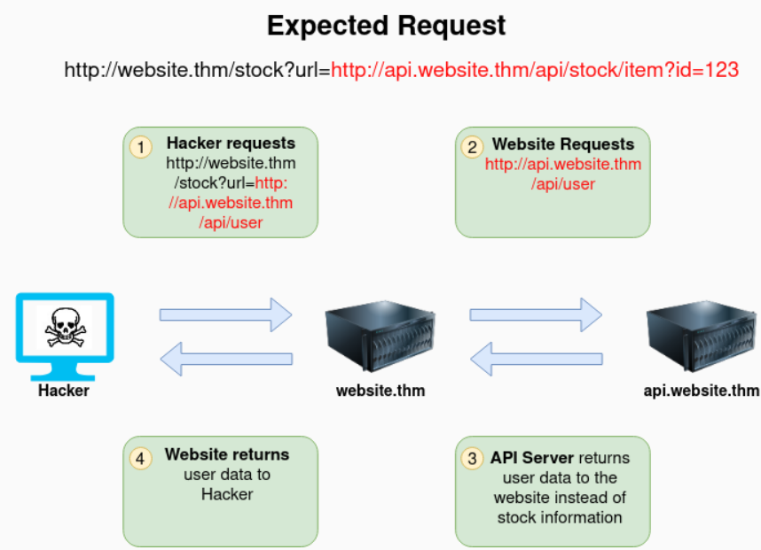
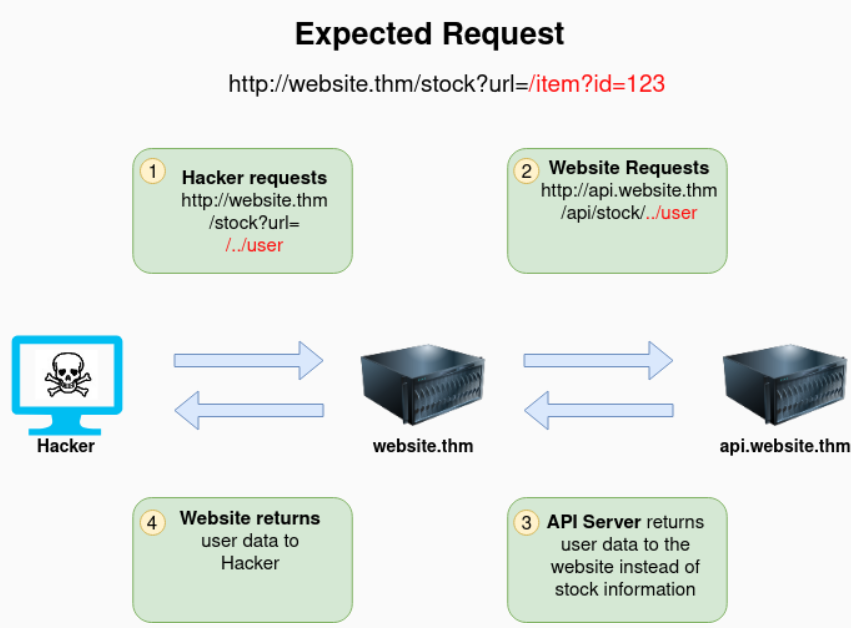
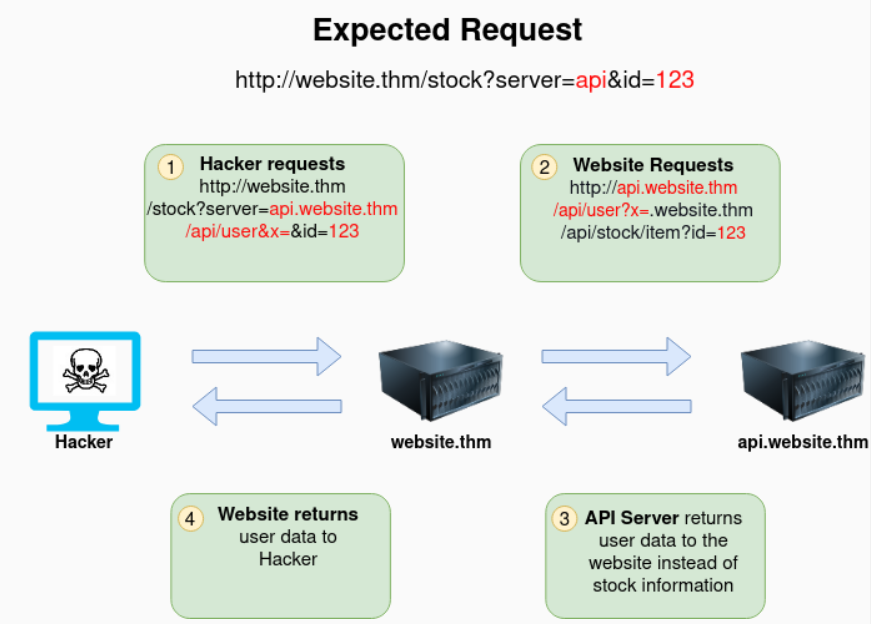
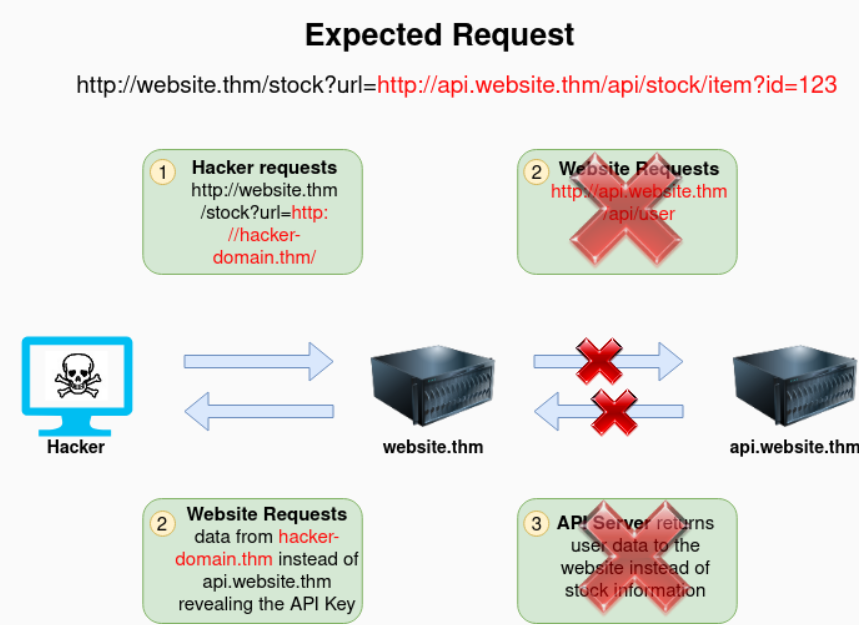
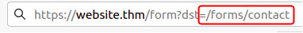
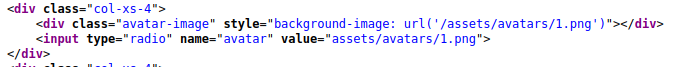
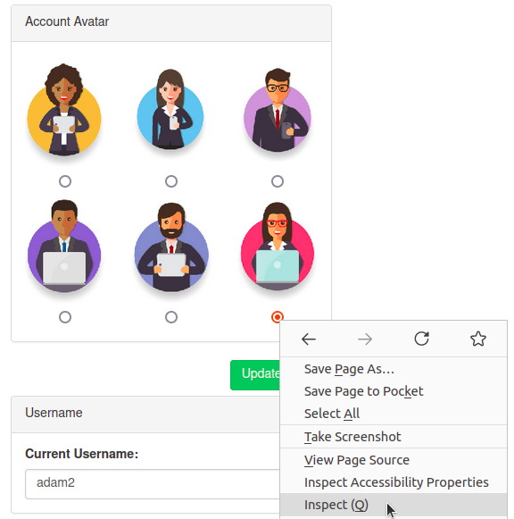
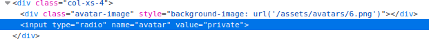
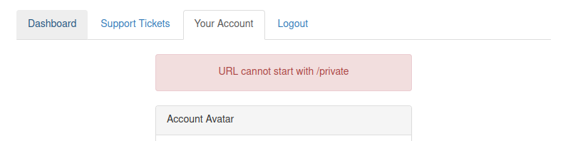
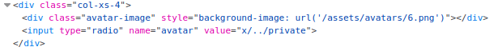

# 02_07_SSRF

> Mempelajari cara mengeksploitasi kerentanan “Server-Side Request Forgery (SSRF)” seperti bagaimana menemukan kerentanan SSRF dan cara menghindari aturan input  untuk mengakses *internal server resources*.
> 

## Apa itu SSRF?

**Server-Side Request Forgery (SSRF)**, merupakan kerentanan yang memungkinkan *attacker*  menyebabkan server web membuat permintaan HTTP tambahan atau mengedit ke sumber daya yang dipilih *attacker*.

Terdapat dua jenis keretanan SSRF, yaitu:

- **SSRF biasa** di mana data akan dikembalikan ke screen *attacker*.
- Kerentanan **Blind SSRF** dimana SSRF terjadi namun, informasi tidak dikembalikan ke screen *attacker*.

Serangan SSRF dapat mengakibatkan salah dari berikut ini:

- Akses ke area yang tidak sah.
- Akses ke data pelanggan/ organisasi.
- Kemampuan untuk menskalakan ke jaringan internal.
- Mengungkapkan token/ kredensial otentikasi.

## Contoh SSRF

### Contoh 1

Contoh di bawah ini menunjukkan bagaimana *attacker* dapat memiliki kontrol penuh atas halaman yang diminta oleh server web. Permintaan yang diharapkan adalah apa yang diharapkan untuk diterima oleh server website.thm, dengan bagian berwarna merah sebagai URL yang akan diambil oleh situs web untuk informasi tersebut. Penyerang dapat memodifikasi area dengan warna merah menjadi URL pilihan mereka.

*Request*  yang awalnya untuk menampilkan stok item diedit oleh hacker untuk mendapatkan identitas dari user yang telah terdaftar.

### Contoh 2

Contoh di bawah ini menunjukkan bagaimana *attacker* masih dapat mencapai halaman `/api/user` dengan hanya memiliki kendali atas *path* dengan memanfaatkan *directory traversal*. Ketika website.thm menerima `../` ini adalah pesan untuk pindah ke direktori yang menghapus bagian `/stock` dari permintaan dan mengubah permintaan terakhir menjadi `/api/user`.

### Contoh 3

Dalam contoh ini, *attacker* dapat mengontrol subdomain server yang mana *request* dibuat. Perhatikan payload yang diakhiri dengan `&x=` digunakan untuk menghentikan *path* yang tersisa agar tidak ditambahkan ke akhir URL *attacker* dan sebagai gantinya mengubahnya menjadi parameter (`?x=`) pada string kueri.

### Contoh 4

Kembali ke *request* awal pada contoh 1, *attacker* dapat memaksa server web untuk meminta server sesuai pilihan *attacker*. Dengan melakukan itu, kita dapat menangkap *request header* yang dikirim ke domain yang ditentukan *attacker*. *Header* ini dapat berisi kredensial autentikasi atau kunci API yang dikirim oleh `website.thm` (yang biasanya akan mengautentikasi ke `api.website.thm`).

## Menemukan SSRF

Potensi kerentanan SSRF dapat terlihat di aplikasi web dalam berbagai cara. Berikut adalah contoh dari empat tempat umum untuk dilihat:

**Saat URL lengkap digunakan dalam parameter di *address bar*:**

***A hidden field* pada *form*:**

**URL parsial seperti hanya nama host:**

**Atau mungkin hanya *path* di URL:**

Beberapa contoh ini lebih mudah dieksploitasi daripada yang lain, dan di sinilah banyak percobaan dan kesalahan akan diperlukan untuk menemukan *payload* yang berfungsi.

Jika bekerja dengan *blind SSRF* di mana tidak ada output yang dikembalikan kepada Anda, Anda harus menggunakan alat pencatatan HTTP eksternal untuk memantau permintaan seperti [requestbin.com](https://requestbin.com/), server HTTP Anda sendiri, atau Burp Suite's Collaborator client.

## Melewati Pertahanan SSRF Umum

*Developer* yang lebih paham keamanan yang menyadari risiko kerentanan SSRF dapat menerapkan pemeriksaan dalam aplikasi mereka untuk memastikan sumber daya yang diminta memenuhi aturan tertentu. Biasanya ada dua pendekatan untuk ini, baik *deny list* atau *allow list*.

### ***Deny List***

*Deny list* adalah daftar di mana semua permintaan diterima selain dari sumber daya yang ditentukan dalam daftar atau cocok dengan pola tertentu. *Web application* dapat menggunakan *deny list* untuk melindungi *endpoints* sensitif, alamat IP, atau domain agar tidak diakses oleh publik sambil tetap mengizinkan akses ke lokasi lain. *Endpoint* khusus untuk membatasi akses adalah localhost, yang mungkin berisi *performance data* server atau informasi sensitif lebih lanjut, sehingga nama domain seperti localhost dan `127.0.0.1` akan muncul di *deny list*. *Attacker* dapat melewati *deny list* dengan menggunakan referensi localhost alternatif seperti `0`, `0.0.0.0`, `0000`, `127.1`, `127.*.*.*`, `2130706433`, `017700000001` atau subdomain yang memiliki catatan DNS yang diselesaikan ke alamat IP `127.0.0.1` seperti `127.0.0.1.nip.io`.

Selain itu, di *cloud environment*, akan bermanfaat untuk memblokir akses ke alamat IP `169.254.169.254`, yang berisi metadata untuk server cloud yang digunakan, termasuk kemungkinan informasi sensitif. *Attacker* dapat melewati ini dengan mendaftarkan subdomain di domain mereka sendiri dengan catatan DNS yang mengarah ke Alamat IP `169.254.169.254`.

### *Allow List*

*Allow list* adalah daftar di mana semua permintaan ditolak kecuali jika permintaan tersebut muncul di daftar atau cocok dengan pola tertentu, seperti aturan bahwa URL yang digunakan dalam parameter harus dimulai dengan  **`https://website.thm` .** *Attacker* dapat dengan cepat menghindari aturan ini dengan membuat subdomain pada nama domain *attacker*, seperti `https://website.thm.attackers-domain.thm`. Logika aplikasi sekarang akan mengizinkan input ini dan membiarkan penyerang mengontrol permintaan HTTP internal .

### ***Open Redirect***

Jika bypass di atas tidak berhasil, kita dapat menggunakan cara *open redirect*. *Open redirect* adalah *endpoint* di server tempat pengunjung situs web secara otomatis dialihkan ke alamat situs web lain. Misalnya, tautan `https://website.thm/link?url=https://tryhackme.com` . *Endpoint* ini dibuat untuk mencatat berapa kali pengunjung mengklik tautan ini untuk tujuan periklanan/pemasaran. Tapi bayangkan ada potensi kerentanan SSRF dengan aturan ketat yang hanya mengizinkan URL yang dimulai dengan `https://website.thm/`. Penyerang dapat memanfaatkan fitur di atas untuk mengarahkan permintaan HTTP internal ke domain pilihan penyerang.

## SSRF Praktis

Diketahui terdapat dua penemuan *endpoint yang mencurigakan.* Yang pertama adalah  `/private` , yang memberi kita pesan kesalahan yang menjelaskan bahwa konten tidak dapat dilihat dari alamat IP kita. Yang kedua adalah versi baru halaman akun pelanggan di  `/customers/new-account-page`  dengan fitur baru yang memungkinkan pelanggan memilih avatar untuk akun mereka.

Pertama, buat akun pelanggan dan masuk. Setelah masuk, kunjungi  [https://LAB_WEB_URL.p.thmlabs.com/customers/new-account-page](https://lab_web_url.p.thmlabs.com/customers/new-account-page) untuk melihat fitur pemilihan avatar baru. Dengan melihat *page source* formulir avatar, kita dapat melihat nilai bidang formulir avatar berisi *path* ke gambar. *Background-image style* dapat mengonfirmasi ini di elemen `DIV` di atas sesuai gambar di bawah ini:

Jika kita memilih salah satu avatar dan kemudian mengklik tombol  **Update Avatar**, kita akan melihat formulir berubah dan, di atasnya, menampilkan avatar yang kita pilih saat ini. Melihat sumber halaman akan menunjukkan avatar kita saat ini ditampilkan menggunakan skema URI data, dan konten gambar dikodekan base64 sesuai gambar di bawah.

ekarang mari kita coba membuat permintaan lagi tetapi mengubah *avatar value* menjadi `private` **dengan harapan server akan mengakses sumber daya dan melewati blok alamat IP. Untuk melakukan ini, pertama-tama, klik kanan pada salah satu *radio buttons* pada form avatar dan pilih **Inspect** :

Kemudian, edit `value` *radio buttons* tersebut ke `private` :

Dan kemudian klik tombol ***Update Avatar*** . Sayangnya, sepertinya aplikasi web memiliki daftar penolakan dan telah memblokir akses ke `/private` *endpoint*.

Seperti yang kita lihat dari pesan kesalahan, jalur tidak dapat dimulai dengan `/private`, lalu gunakan cara lain. Kita dapat menggunakan cara *directory traversal* untuk mencapai *endpoint* yang kita inginkan. Coba atur *avatar value* ke `x/../private`**.**

Kita akan melihat bahwa kita sekarang telah melewati aturan, dan pengguna memperbarui avatar. Cara ini berhasil karena ketika server web menerima permintaan untuk `x/../private` , ia mengetahui bahwa  string `../`  berarti naik ke direktori yang sekarang menerjemahkan permintaan menjadi hanya  `/private` .

Ketika melihat *page source* form avatar, kita akan melihat avatar yang saat ini disetel sekarang berisi konten dari direktori `/private` dalam pengkodean base64, dekode konten ini dan flag berhasil didapatkan.
