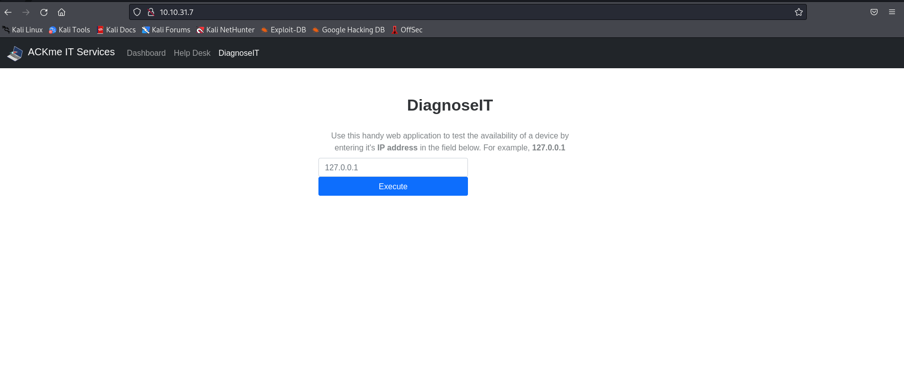

# 02_09_Command Injection

> Mempelajari tentang kerentanan yang memungkinkan Anda menjalankan perintah melalui aplikasi yang rentan, dan perbaikannya.
> 

## Pendahuluan

***Commad injection*** merupakan penyalahgunaan perilaku aplikasi untuk menjalankan perintah pada sistem operasi, menggunakan hak istimewa yang sama dengan yang dijalankan oleh aplikasi pada perangkat.

Kerentanan *command injection* juga dikenal sebagai "***Remote Code Execution***" (RCE) karena *attacker* dapat mengelabui aplikasi agar menjalankan serangkaian *payload* yang mereka berikan, tanpa akses langsung ke mesin itu sendiri (yaitu shell interaktif). Server web akan memproses kode ini dan menjalankannya di bawah hak istimewa dan kontrol akses pengguna yang menjalankan aplikasi itu.

*Command injection* juga sering dikenal sebagai "***Remote Code Execution***" (RCE) karena kemampuan untuk mengeksekusi kode dari jarak jauh dalam suatu aplikasi. Kerentanan ini sering kali paling menguntungkan bagi *attacker* karena ini berarti *attacker* dapat langsung berinteraksi dengan sistem yang rentan. Misalnya, *attacker* dapat membaca file sistem atau pengguna, data, dan hal-hal semacam itu.

Misalnya, dapat menyalahgunakan aplikasi untuk melakukan perintah `whoami`untuk membuat daftar akun pengguna yang menjalankan aplikasi akan menjadi contoh injeksi perintah.

*Command injection* adalah salah satu dari sepuluh kerentanan teratas yang dilaporkan oleh laporan *Contrast Security’s AppSec intelligence* pada tahun 2019. ( [Contrast Security AppSec., 2019](https://www.contrastsecurity.com/security-influencers/insights-appsec-intelligence-report) ). Selain itu, OWASP *framework* terus-menerus mengusulkan kerentanan seperti ini sebagai salah satu dari sepuluh kerentanan teratas aplikasi web ( [kerangka OWASP](https://owasp.org/www-project-top-ten/) ).

## Menemukan *Command Injection*

Kerentanan ini ada karena aplikasi sering menggunakan fungsi dalam bahasa pemrograman seperti PHP, Python, dan NodeJS untuk meneruskan data ke dan untuk melakukan panggilan sistem pada sistem operasi mesin. Misalnya, mengambil input dari bidang dan mencari entri ke dalam file.

Dalam potongan kode di bawah ini, aplikasi mengambil data yang dimasukkan pengguna di bidang input bernama`$title`untuk mencari direktori untuk judul lagu. 


**1.** Aplikasi menyimpan file MP3 dalam direktori yang terdapat pada sistem operasi.

**2.** Pengguna memasukkan judul lagu yang ingin dicari. Aplikasi menyimpan input ini ke dalam variabel `$title`.

**3.** Data dalam variabel `$title` ini diteruskan ke perintah `grep`untuk mencari file teks bernama *songtitle.txt* untuk entri apa pun yang ingin dicari pengguna.

**4.** Output dari pencarian *songtitle.txt* akan menentukan apakah aplikasi menginformasikan kepada pengguna bahwa lagu tersebut ada atau tidak.

Sekarang, informasi semacam ini biasanya disimpan dalam database namun, ini hanyalah contoh di mana aplikasi mengambil input dari pengguna untuk berinteraksi dengan sistem operasi aplikasi.

*Attacker* dapat menyalahgunakan aplikasi ini dengan menyuntikkan perintah mereka sendiri agar aplikasi dapat dijalankan. Daripada menggunakan `grep`untuk mencari entri di `songtitle.txt`, mereka bisa meminta aplikasi untuk membaca data dari file yang lebih sensitif.

Penyalahgunaan aplikasi dengan cara ini dapat dilakukan, apa pun bahasa pemrograman yang digunakan aplikasi. Selama aplikasi memproses dan menjalankannya, itu dapat menghasilkan injeksi perintah. Sebagai contoh, potongan kode di bawah ini adalah aplikasi yang ditulis dengan Python.


Berikut langkah-langkah cara kerja potongan kode aplikasi di atas. 

1. Package `flask` digunakan untuk menyiapkan server web.
2. Fungsi yang menggunakan paket `subprocess` untuk menjalankan perintah pada perangkat.
3. Kita menggunakan *route* di server web yang akan mengeksekusi apa pun yang disediakan. Misalnya, untuk mengeksekusi `whoami`, kita perlu mengunjungi http://flaskapp.thm/whoami

## Meneksploitasi *Command Injection*

Aplikasi yang menggunakan input pengguna untuk mengisi perintah sistem dengan data sering kali dapat digabungkan dalam perilaku yang tidak diinginkan. **Misalnya, operator shell `;`, `&`dan `&&` akan menggabungkan dua (atau lebih) perintah sistem dan menjalankan keduanya .**

Command Injection sebagian besar dapat dideteksi dengan salah satu dari dua cara:

1. ***Blind command injection**,* jenis injeksi ini adalah di mana tidak ada output langsung dari aplikasi saat menguji *payload*. Anda harus menyelidiki perilaku aplikasi untuk menentukan apakah *payload* Anda berhasil atau tidak.
2. ***Verbose command injection,*** jenis injeksi ini adalah di mana ada umpan balik langsung dari aplikasi setelah Anda menguji *payload*. Misalnya, menjalankan perintah `whoami` untuk melihat pengguna apa yang menjalankan aplikasi. Aplikasi web akan menampilkan nama pengguna pada halaman secara langsung.

### Mendeteksi ***Blind Command Injection***

*Blind command injection* adalah ketika *command injection* terjadi; namun, tidak ada output yang terlihat, sehingga tidak langsung terlihat. Misalnya, perintah dijalankan, tetapi aplikasi web tidak mengeluarkan pesan.

Untuk jenis *command injection* ini, kita perlu menggunakan *payload* yang akan menyebabkan penundaan waktu. Misalnya, perintah `ping`and `sleep`adalah *payload* yang signifikan untuk diuji. Menggunakan `ping`sebagai contoh, aplikasi akan hang selama *x* detik sehubungan dengan berapa banyak *ping* yang telah Anda tentukan.

Metode lain untuk mendeteksi *blind command injection* adalah dengan memaksa beberapa keluaran. Ini dapat dilakukan dengan menggunakan operator pengalihan seperti `>`. Misalnya, kita dapat memberi tahu aplikasi web untuk menjalankan perintah seperti `whoami`dan mengarahkannya ke file. Kita kemudian dapat menggunakan perintah seperti `cat`untuk membaca konten file yang baru dibuat ini.

Menguji *command injection* dengan cara ini seringkali rumit dan memerlukan sedikit eksperimen, karena sintaks untuk perintah bervariasi antara Linux dan Windows.

Perintah `curl` adalah cara yang bagus untuk menguji *command injection*. Ini karena Anda dapat menggunakannya `curl` untuk mengirimkan data ke dan dari aplikasi di payload Anda. Ambil potongan kode di bawah ini sebagai contoh, muatan `curl` sederhana ke aplikasi dimungkinkan untuk *command injection*.

```
curl [http://vulnerable.app/process.php%3Fsearch%3DThe%20Beatles%3B%20whoami](http://vulnerable.app/process.php%3Fsearch%3DThe%20Beatles%3B%20whoami)
```

### Mendeteksi *Verbose Command Injection*

Mendeteksi *command injection* dengan cara ini bisa dibilang cara termudah dari keduanya. *Verbose Command Injection* adalah ketika aplikasi memberi Anda umpan balik atau keluaran tentang apa yang terjadi atau sedang dieksekusi.

Misalnya, output dari perintah seperti `ping`atau `whoami`langsung ditampilkan pada aplikasi web.

**Useful Payloads**

**LINUX**

| Payload | Deskripsi |
| --- | --- |
| whoami | melihat siapa (pengguna) yang menjalankan aplikasi. |
| ls | Daftar isi direktori saat ini. Anda mungkin dapat menemukan file seperti file konfigurasi, environment files (token dan kunci aplikasi), dan banyak lagi hal berharga lainnya. |
| ping | Perintah ini akan memanggil aplikasi untuk hang. Ini akan berguna dalam menguji aplikasi untuk blind command injection. |
| sleep | muatan yang berguna dalam menguji aplikasi untuk blind command injection, di mana mesin tidak ping diinstal. |
| nc | Netcat dapat digunakan untuk memunculkan reverse shell ke aplikasi yang rentan. Anda dapat menggunakan ini untuk menavigasi di sekitar mesin target untuk layanan lain, file, atau sarana potensial untuk meningkatkan hak istimewa. |

**WINDOW**

| Payload | Deskripsi |
| --- | --- |
| whoami | melihat siapa (pengguna) yang menjalankan aplikasi. |
| dir | Daftar isi direktori saat ini. Anda mungkin dapat menemukan file seperti file konfigurasi, environment files (token dan kunci aplikasi), dan banyak lagi hal berharga lainnya. |
| ping | Perintah ini akan memanggil aplikasi untuk hang. Ini akan berguna dalam menguji aplikasi untuk blind command injection. |
| timeout | muatan yang berguna dalam menguji aplikasi untuk blind command injection, di mana mesin tidak ping diinstal. |

## Memperbaiki *Command Injection*

*Command injection* dapat dicegah dengan berbagai cara. Semuanya, mulai dari penggunaan minimal fungsi atau *library* yang berpotensi berbahaya dalam bahasa pemrograman hingga memfilter input tanpa bergantung pada input pengguna. Contoh di bawah ini adalah bahasa pemrograman PHP ; namun, prinsip yang sama dapat diperluas ke banyak bahasa lain.

### **Vulnerable Functions**

Di PHP , banyak fungsi berinteraksi dengan sistem operasi untuk menjalankan perintah melalui shell; ini termasuk:

- [Exec](https://www.php.net/manual/en/function.exec.php)
- [Passthru](https://www.php.net/manual/en/function.passthru.php)
- [System](https://www.php.net/manual/en/function.system.php)

Pada potongan kode di bawah ini, aplikasi hanya akan menerima dan memproses nomor yang dimasukkan ke dalam form. Ini berarti bahwa setiap perintah seperti `whoami`tidak akan diproses.


1. Aplikasi hanya akan menerima pola karakter tertentu (digit 0-9)
2. Aplikasi kemudian hanya akan melanjutkan untuk mengeksekusi data ini yang semuanya numerik.

Fungsi-fungsi ini mengambil input seperti string atau data pengguna dan akan mengeksekusi apa pun yang disediakan pada sistem. Aplikasi apa pun yang menggunakan fungsi ini tanpa pemeriksaan yang tepat akan rentan terhadap *command injection*.

### **Input sanitisation**

Membersihkan input apa pun dari pengguna yang digunakan aplikasi adalah cara yang bagus untuk mencegah *command injection*. Ini adalah proses untuk menentukan format atau tipe data yang dapat dikirimkan oleh pengguna. Misalnya, bidang input yang hanya menerima data numerik atau menghapus karakter khusus seperti `>`,  `&`dan `/`.

Pada potongan kode di bawah ini, `filter_input` [fungsi PHP](https://www.php.net/manual/en/function.filter-input.php) digunakan untuk memeriksa apakah data yang dikirimkan melalui form input berupa angka atau bukan. Jika bukan angka, itu pasti input yang tidak valid.


### Bypassing Filters

Aplikasi akan menggunakan banyak teknik dalam menyaring dan membersihkan data yang diambil dari input pengguna. Filter akan membatasi Anda untuk *payload* tertentu; namun, kita dapat menyalahgunakan logika di balik aplikasi untuk melewati filter tersebut. Misalnya, aplikasi dapat menghapus tanda kutip; kita malah dapat menggunakan nilai heksadesimal ini untuk mencapai hasil yang sama.

Ketika dieksekusi, walaupun data yang diberikan akan berbeda format dari yang diharapkan, namun tetap dapat diinterpretasikan dan akan memiliki hasil yang sama.


## Practical: Command Injection (Deploy)

Di sini kita menggunakan machine [tryhackme](https://tryhackme.com/) room *[command injection](https://tryhackme.com/room/oscommandinjection).* 

Pertama-tama ***Start Machine*** dan aktifkan vpn terlebih dahulu. Kemudian, buka IP address.



Gambar di atas merupakan tampilan dari website. Kita dapat mengiputkan ip address untuk mengetesnya dan saya mencoba untuk menginputkan ip localhost.


Saat saya menginputkan `whoami`, command dikirim tetapi tidak ditampilkan pada web. 


Untuk menembus kita dapat menggunakan `&&` setelah input ip atau menggunkan `|` sebelum command. Jadi, untuk mendapatkan user yang menjalankan aplikasi kita dapat menggunakan command `127.0.0.1 && whoami` atau `|whoami`. Sedangkan untuk mendapatkan flag, kita dapat menggunakan command `127.0.0.1 && cat /home/tryhackme/flag.txt` atau `|cat /home/tryhackme/flag.txt`.


Berikut merupakan [cheat sheet](https://github.com/payloadbox/command-injection-payload-list) terkait *commad injection payload.*
