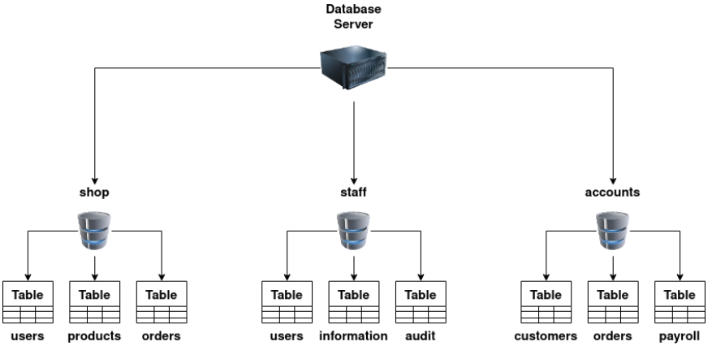
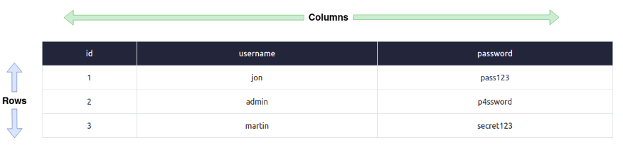
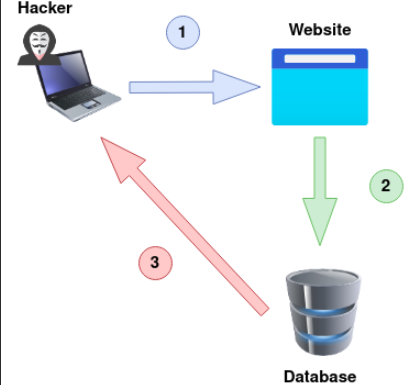

# SQL Injection

## Introduction

SQL (Structured Query Language) Injection, sebagian besar disebut sebagai SQLi, adalah serangan pada server database aplikasi web yang menyebabkan permintaan jahat dieksekusi. Ketika aplikasi web berkomunikasi dengan database menggunakan input dari pengguna yang belum divalidasi dengan benar, kemungkinan penyerang dapat mencuri, menghapus, atau mengubah data pribadi dan pelanggan dan juga menyerang metode otentikasi aplikasi web ke pribadi atau daerah pelanggan. Inilah sebabnya selain SQLi sebagai salah satu kerentanan aplikasi web tertua, SQLi juga bisa menjadi yang paling merusak.

### What is Database ?

Database adalah cara menyimpan koleksi data secara elektronik dengan cara yang terorganisir. Database dikendalikan oleh DBMS yang merupakan singkatan dari Sistem Manajemen Database, DBMS terbagi menjadi dua kubu Relasional atau Non-Relasional, fokus ruangan ini adalah pada Database Relasional, beberapa yang umum akan kita temui adalah MySQL, Microsoft SQL Server, Access, PostgreSQL, dan SQLite.

Dalam DBMS, kita dapat memiliki beberapa database, masing-masing berisi kumpulan data terkaitnya sendiri. Misalnya, kita mungkin memiliki database yang disebut "toko". Dalam database ini, kita ingin menyimpan informasi tentang produk yang tersedia untuk dibeli, pengguna yang telah mendaftar ke toko online kita, dan informasi tentang pesanan yang kita terima. kita akan menyimpan informasi ini secara terpisah dalam database menggunakan sesuatu yang disebut tabel, tabel diidentifikasi dengan nama unik untuk masing-masing tabel. kita dapat melihat struktur ini dalam diagram di bawah, tetapi kita juga dapat melihat bagaimana bisnis mungkin memiliki database terpisah lainnya untuk menyimpan informasi staf atau tim akun.

### Tables 

Sebuah tabel terdiri dari kolom dan baris, cara yang berguna untuk membayangkan sebuah tabel adalah seperti kotak dengan kolom melintasi atas dari kiri ke kanan berisi nama sel dan baris dari atas ke bawah dengan masing-masing memiliki data yang sebenarnya.

### Columns

Setiap kolom, lebih baik disebut sebagai bidang (field), memiliki nama unik per tabel. Saat membuat kolom, kita juga mengatur jenis data yang akan dikandungnya, yang umum adalah integer (angka), string (teks standar) atau tanggal. Beberapa database dapat berisi data yang jauh lebih kompleks, seperti geospasial, yang berisi informasi lokasi. Menyetel tipe data juga memastikan bahwa informasi yang salah tidak disimpan, seperti string "hello world" disimpan dalam kolom yang dimaksudkan untuk tanggal. Jika ini terjadi, server database biasanya akan menghasilkan pesan kesalahan. Kolom yang berisi bilangan bulat juga dapat mengaktifkan fitur peningkatan otomatis; ini memberikan setiap baris data nomor unik yang tumbuh (bertambah) dengan setiap baris berikutnya, hal itu menciptakan apa yang disebut bidang kunci (key field), bidang kunci harus unik untuk setiap baris data yang dapat digunakan untuk menemukan baris yang tepat dalam kueri SQL.

### Rows

Baris (rows) atau catatan (record) adalah apa yang berisi baris data individual. Saat kita menambahkan data ke tabel, baris/catatan baru dibuat, dan saat kita menghapus data, baris/catatan dihapus.

### Relational vs Non-Relational Database

Sebuah database relasional, menyimpan informasi dalam tabel dan sering tabel telah berbagi informasi di antara mereka, mereka menggunakan kolom untuk menentukan dan mendefinisikan data yang disimpan dan baris untuk benar-benar menyimpan data. Tabel akan sering berisi kolom yang memiliki ID unik (kunci utama) yang kemudian akan digunakan di tabel lain untuk referensi dan menyebabkan hubungan antara tabel, maka nama database relasional.

Basis data non-relasional kadang-kadang disebut NoSQL di sisi lain adalah segala jenis basis data yang tidak menggunakan tabel, kolom, dan baris untuk menyimpan data, tata letak basis data tertentu tidak perlu dibangun sehingga setiap baris data dapat berisi data yang berbeda. informasi yang dapat memberikan lebih banyak fleksibilitas atas database relasional. Beberapa database populer dari jenis ini adalah MongoDB, Cassandra dan ElasticSearch.

## What is SQL ?

SQL (Structured Query Language) adalah bahasa kaya fitur yang digunakan untuk query database, query SQL ini lebih baik disebut sebagai pernyataan.

Perintah paling sederhana yang akan kita bahas dalam tugas ini digunakan untuk mengambil (select), memperbarui (update), menyisipkan (insert), dan menghapus data (delete). Meskipun agak mirip, beberapa server database memiliki sintaks sendiri dan sedikit perubahan pada cara kerjanya. Semua contoh ini didasarkan pada database MySQL. Setelah mempelajari pelajaran, Anda akan dengan mudah dapat mencari sintaks alternatif online untuk server yang berbeda. Perlu dicatat bahwa sintaks SQL tidak case sensitive.

Berikut adalah contoh sintaks dalam SQL.

- `SELECT`
    - `SELECT * FROM users` : Ambil semua rows dalam tabel users. Tanda `*` menyatakan untuk mengembalikan semua column yang ada.
    - `SELECT username,password FROM users` : Ambil semua rows, namun column yang dikembalikan hanya `username` dan `password`.
    - `SELECT * FROM users LIMIT 1` :  Ambil rows dalam tabel users sesuai jumlah `LIMIT`. 
    - `SELECT * FROM users WHERE username='admin'` : Ambil semua rows dalam tabel users yang `usename`-nya adalah admin.
    - `SELECT * FROM users WHERE username LIKE 'a%'` : Ambil semua rows yang usernamenya berawalan dengan huruf `a`.
- `UNION` : Menggabungkan hasil dari 2 query `SELECT` atau lebih.
    - `SELECT * from customers UNION SELECT * from suppliers` : Ambil semua rows dari customer dan supplier.
- `INSERT`
    - `INSERT INTO users (username, password) VALUES ('admin', 'password')` : Memasukkan rows baru ke tabel users.
- `UPDATE` 
    - `UPDATE users SET username='users' WHERE username='admin'` : Mengganti value dari column username dari rows yang usernamenya adalah admin. 
- `DELETE`
    -  `DELETE FROM users WHERE username='admin'` : Menghapus rows yang usernamenya adalah admin.

## What is SQL Injection ?

SQL Injection adalah ketika data yang diberikan pengguna dimasukkan ke dalam kueri SQL.

Misalkan ada website dengan url seperti berikut :

`https://website.thm/blog?id=1`

Disini kita bisa tahu bahwa website tersebut melakukan SQL semacam `SELECT * from blog where id=1 and private=0 LIMIT 1` untuk mengambil data tentang halaman tersebut. Ambil contoh semisal nilai private adalah 0 yang dimaksudkan untuk publik, sehingga ketika kita mengambil rows yang memiliki id, misalkan 5, namun value private-nya 1, maka halaman tersebut tidak akan tampil.

Dalam SQL, ada sintaks `-- ` (dash-dash-space) untuk menjadikan apapun yang dituliskan setelah sintaks tersebut akan dianggap komentar.

Maka, ketika kita memasukkan url seperti ini :

`https://website.thm/blog?id=5;-- `

Kita misalkan id ke-5 memiliki value private 1, maka SQL akan nampak seperti ini `SELECT * from blog where id=5;-- and private=0 LIMIT 1`. Dengan sintaks ini, query `and private=0 LIMIT 1` akan dianggap komentar sehingga halaman akan tetap muncul meskipun value private-nya 1.

## In-Band SQLi

In-Band SQL Injection adalah jenis yang paling mudah dideteksi dan dieksploitasi; In-Band hanya mengacu pada metode komunikasi yang sama yang digunakan untuk mengeksploitasi kerentanan dan juga menerima hasil, misalnya, menemukan kerentanan SQL Injection pada halaman situs web dan kemudian dapat mengekstrak data dari database ke halaman yang sama.

### Error-Based SQLi

Jenis SQL Injection ini adalah yang paling berguna untuk mendapatkan informasi tentang struktur database dengan mudah karena pesan kesalahan dari database dicetak langsung ke layar browser. Ini sering dapat digunakan untuk menghitung seluruh database.

### Union-Based SQLi

Jenis Injeksi ini menggunakan operator SQL UNION bersama dengan pernyataan SELECT untuk mengembalikan hasil tambahan ke halaman. Metode ini adalah cara paling umum untuk mengekstrak data dalam jumlah besar melalui kerentanan SQL Injection.

Contoh Union-Based SQLi adalah sebagai berikut : 

`SELECT * FROM users WHERE user_id=0 UNION SELECT 1,2,group_concat(username,':',password SEPARATOR ' ') FROM staff_users`

## Blind SQLi

Tidak seperti injeksi SQL In-Band, di mana kita dapat melihat hasil serangan kita secara langsung di layar, blind SQLi adalah ketika kita mendapatkan sedikit atau tidak ada umpan balik untuk mengonfirmasi apakah kueri yang kita injeksikan, pada kenyataannya, berhasil atau tidak, ini karena pesan kesalahan telah dinonaktifkan, tetapi injeksi masih berfungsi.

### Authentication Bypass

Salah satu teknik Blind SQL Injection yang paling mudah adalah saat melewati metode otentikasi seperti formulir login. Dalam hal ini, kita tidak begitu tertarik untuk mengambil data dari database. kita hanya ingin melewati login.

Contoh SQL untuk authentication bypass :

`select * from users where username='' and password='' OR 1=1;`

## Boolean Based

SQL Injection Boolean Based mengacu pada respons yang kami terima kembali dari upaya injeksi kami yang dapat berupa benar/salah, ya/tidak, on/off, 1/0 atau respons apa pun yang hanya dapat memiliki dua hasil. Hasil itu menegaskan kepada kami bahwa muatan SQL Injection kami berhasil atau tidak. Pada pemeriksaan pertama, kita mungkin merasa respons terbatas ini tidak dapat memberikan banyak informasi. Namun, pada kenyataannya, hanya dengan dua respons ini, dimungkinkan untuk menghitung keseluruhan struktur dan konten basis data. 

## Time Based

Time Based SQL Injection sangat mirip dengan berbasis Boolean di atas, karena permintaan yang sama dikirim, tetapi tidak ada indikator visual bahwa kueri Anda salah atau benar kali ini. Sebagai gantinya, indikator kueri yang benar didasarkan pada waktu yang dibutuhkan kueri untuk menyelesaikannya. Penundaan waktu ini diperkenalkan dengan menggunakan metode bawaan seperti `SLEEP(x)` di samping pernyataan UNION. Metode `SLEEP()` hanya akan dieksekusi pada pernyataan `UNION SELECT` yang berhasil.

## Out-of-Band SQLi

Out-of-Band SQL Injection tidak biasa karena bergantung pada fitur spesifik yang diaktifkan di server database atau logika bisnis aplikasi web, yang membuat semacam panggilan jaringan eksternal berdasarkan hasil dari kueri SQL.

Serangan Out-Of-Band diklasifikasikan dengan memiliki dua saluran komunikasi yang berbeda, satu untuk meluncurkan serangan dan yang lainnya untuk mengumpulkan hasil. Misalnya, saluran serangan dapat berupa permintaan web, dan saluran pengumpulan data dapat memantau permintaan HTTP/DNS yang dibuat ke layanan yang Anda kendalikan.

1. Penyerang membuat permintaan ke situs web yang rentan terhadap SQL Injection dengan muatan injeksi.

2. Website membuat query SQL ke database yang juga melewati payload hacker.

3. Payload berisi permintaan yang memaksa permintaan HTTP kembali ke mesin peretas yang berisi data dari database.

## Remediation

Berikut adalah cara-cara yang bisa digunakan untuk mencegah sql injection :

- Prepared Statements
- Input Validation
- Escaping User Input