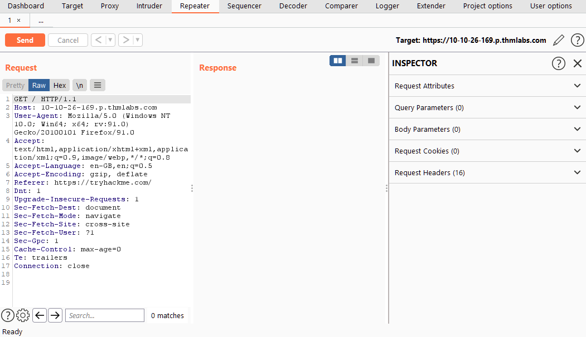

# 03_02_Burp Suite: Repeater

> Repeater untuk duplikasi *requests* di Burp Suite
> 

## Apa itu Repeater?

**Burp Suite Repeater** memungkinkan kita untuk membuat dan/atau menyampaikan *intercepted requests* ke target sesuka hati. Dalam istilah awam, itu berarti kita dapat mengambil *request* yang ditangkap di **Proxy**, mengeditnya, dan mengirim *request* yang sama berulang kali sebanyak yang kita inginkan. Alternatifnya, kita bisa membuat *request* sendiri, seperti yang dapat kita lakukan di **CLI** ( **C**ommand **L**ine **I**nterface), menggunakan alat seperti [cURL](https://curl.se/) untuk membuat dan mengirim *requests*.

Kemampuan untuk mengedit dan mengirim ulang permintaan yang sama beberapa kali membuat **Repeater** ideal untuk segala jenis manual eksploitasi *endpoint*, memberi kita (**G**raphical **U**ser **I**nterface) **GUI** yang bagus untuk menulis *request payload* dan banyak tampilan ****(termasuk rendering engine untuk tampilan grafis) dari respon sehingga kita dapat melihat hasil aksi kita.

---

**Repeater** *interface* dapat dibagi menjadi enam bagian utama, yaitu:

1. Di kiri atas tab, kita memiliki daftar **Repeater** *requests*. Kita dapat memiliki banyak *requests* berbeda melalui **Repeater**: setiap kali kita mengirim *request* baru ke **Repeater**, *request* itu akan muncul di sini.
2. Tepat di bawah daftar **Repeater** *requests*, kita memiliki kontrol untuk *request* saat ini. Ini memungkinkan kita untuk mengirim *request*, membatalkan *hanging request*, dan *forwards/backwards* dalam *request history*.
3. Masih di sisi kiri tab, tetapi mengambil sebagian besar jendela, kita memiliki *request and response view*. Kita mengedit *request* di *Request view* lalu tekan *send*. Respons akan muncul di *Response view*.
4. Di atas bagian permintaan/tanggapan, di sisi kanan, adalah serangkaian opsi yang memungkinkan kita mengubah tata letak untuk *request and response views*. Secara default, ini biasanya berdampingan (tata letak horizontal, seperti pada tangkapan layar); namun, kita juga dapat memilih untuk meletakkannya di atas/di bawah satu sama lain (tata letak vertikal) atau di tab terpisah (tampilan gabungan).
5. Di sisi kanan jendela, kita memiliki Inspektur, yang memungkinkan kita untuk memisahkan *request* untuk menganalisis dan mengeditnya dengan cara yang sedikit lebih intuitif daripada dengan *raw wditor*. 
6. Akhirnya, di atas *Inspector* kita memiliki target kita. Sederhananya, ini adalah alamat IP atau domain yang kita kirim *requests*. Ketika kita mengirim *requests* ke Repeater dari bagian lain dari Burp Suite, ini akan terisi secara otomatis.

## Penggunaan Dasar

Meskipun kita dapat membuat *request* kita sendiri, akan jauh lebih mudah untuk hanya menangkap *request* di **Proxy**, lalu mengirimkannya ke **Repeater** untuk diedit/dikirim ulang.

Dengan permintaan yang ditangkap di proxy, kita dapat mengirim ke **Repeater** baik dengan mengklik kanan pada permintaan dan memilih "***Send to Repeater***" atau dengan menekan `Ctrl + R`.

Beralih kembali ke **Repeater**, kita dapat melihat bahwa permintaan kita sekarang tersedia:

Elemen *Target* dan *Inspector* sekarang juga menunjukkan informasi; namun, kita belum memiliki *response*. Ketika kita mengklik tombol "***Send***", bagian *Response* dengan cepat terisi:

Jika kita ingin mengubah sesuatu tentang permintaan, kita cukup mengetik di jendela *Request* dan tekan "***Send***" lagi; ini akan memperbarui *Response* di sebelah kanan. Misalnya, mengubah *header* "*Connection*" menjadi `open`alih-alih `close`menghasilkan *Response* *header* "*Connection*" dengan nilai `keep-alive`:

Kita juga dapat menggunakan tombol riwayat di sebelah kanan tombol ***Send*** untuk maju dan mundur dalam riwayat modifikasi kita.

## Views

Repeater menawarkan kepada kita berbagai cara untuk menyajikan *Response* atas *Request* kita . Tampilan dapat berupa keluaran hex hingga versi halaman yang dirender sepenuhnya.

Kita dapat melihat opsi yang tersedia dengan melihat di atas *Response box*:

Kita memiliki empat opsi tampilan di sini:

1. ***Pretty*:**
    
    Ini adalah opsi default. Mengambil *raw response* dan tampilan dipercantik agar lebih mudah dibaca.
    
2. ***Raw*:**
    
    Respons yang murni dan tidak dipercantik dari server.
    
3. ***Hex*:**
    
    Tampilan ini mengambil *raw response* dan memberi kita tampilan byt, terutama berguna jika responsnya adalah sebuah *binary file*.
    
4. ***Render*:**
    
    Tampilan ini merender halaman seperti yang akan muncul di browser Anda. Meskipun tidak terlalu berguna mengingat bahwa kita biasanya tertarik pada *source code* saat menggunakan **Repeater**.
    

Dalam kebanyakan kasus, opsi "*Pretty*" sangat memadai; namun, ada baiknya mengetahui cara menggunakan tiga opsi lainnya.

---

Tepat di sebelah kanan tombol tampilan adalah tombol "*Show non-printable characters*" ( `\n`). Tombol ini memungkinkan kita untuk menampilkan karakter yang biasanya tidak akan muncul di tampilan *Pretty* atau *Raw*. Misalnya, setiap baris dalam respons akan diakhiri dengan karakter `\r\n`-- ini menandakan *carriage return* diikuti oleh baris baru dan merupakan bagian dari interpretasi header HTTP . Meskipun tidak diperlukan untuk sebagian besar tugas, opsi ini masih berguna.

## Inspector

Dalam banyak hal, Inspector sepenuhnya melengkapi *request and response fields* dari jendela **Repeater**. Jika Anda memahami cara membaca dan mengedit permintaan HTTP , Anda mungkin mendapati bahwa Anda jarang menggunakan Inspector sama sekali.

Meskipun demikian, ini adalah cara yang luar biasa untuk mendapatkan perincian permintaan dan tanggapan yang disempurnakan, serta untuk bereksperimen untuk melihat bagaimana perubahan yang dibuat menggunakan Inspector tingkat yang lebih tinggi memengaruhi *raw versions* yang setara.

Inspector dapat digunakan di Proxy serta **Repeater**. Dalam kedua kasus, itu muncul di sisi paling kanan jendela dan memberi kita daftar komponen dalam permintaan dan respons:

Dari jumlah tersebut, bagian permintaan hampir selalu dapat diubah, memungkinkan kita untuk menambah, mengedit, dan menghapus item. Misalnya, di bagian *Request Attributes*, kita dapat mengedit bagian permintaan yang berhubungan dengan lokasi, metode, dan protokol; misalnya mengubah sumber daya yang ingin kita ambil, mengubah permintaan dari GET ke metode HTTP lain , atau mengalihkan protokol dari HTTP/1 ke HTTP/2:

Bagian lain yang tersedia untuk dilihat dan/atau diedit adalah:

- ***Query Parameters***
    
    Yang mana merujuk pada data yang dikirim ke server di URL. Misalnya, dalam permintaan GET ke `https://admin.tryhackme.com/?redirect=false`, ada parameter kueri yang disebut "redirect" dengan nilai "false".
    
- ***Body Parameters***
    
    Yang mana melakukan hal yang sama seperti *Query Parameters*, tetapi untuk permintaan POST. Apa pun yang kita kirim sebagai data dalam permintaan POST akan muncul di bagian ini, sekali lagi memungkinkan kita untuk mengubah parameter sebelum mengirim ulang.
    
- ***Request Cookies***
    
    Berisi daftar cookie yang dapat dimodifikasi yang dikirim dengan setiap permintaan.
    
- ***Request Header***
    
    Memungkinkan kita untuk melihat, mengakses, dan memodifikasi (termasuk menambahkan atau menghapus secara langsung) setiap header yang dikirim dengan permintaan kita. Mengedit ini bisa sangat berguna ketika kita mencoba melihat bagaimana server web akan merespons header yang tidak terduga.
    
- ***Response Header***
    
    Menunjukkan kepada kita *header* yang dikirim kembali oleh server sebagai tanggapan atas permintaan kita. Ini tidak dapat diedit (karena kita tidak dapat mengontrol header apa yang dikembalikan server kepada kita). Perhatikan bahwa bagian ini hanya akan muncul setelah kita mengirim permintaan dan menerima tanggapan.
    

Semua komponen ini dapat ditemukan sebagai teks di dalam bagian *request and response.*

## Praktik 1

**Repeater** paling cocok untuk jenis tugas di mana kita perlu mengirim permintaan yang sama berkali-kali, biasanya dengan perubahan kecil di antara permintaan. Misalnya, kita mungkin ingin menguji secara manual kerentanan Injeksi SQL (yang akan kita lakukan dalam tugas yang akan datang), mencoba melewati filter firewall aplikasi web, atau sekadar menambah atau mengubah parameter dalam pengiriman formulir.

Untuk saat ini, mari kita mulai dengan contoh yang sangat sederhana: menggunakan Repeater untuk mengubah header dari permintaan yang kita kirim ke target.

Pertama-tama, klik “***Start Machine***” ******pada room thm Burp Suite: Repeater. Setelah itu, tunggu sampai ip address muncul. Buka Burp Suite dan lakukan *Intercept* lalu kirim respons ke Repeater. 

Untuk melihat Response dari Request klik “***Send***”. Disini kita dapat melihat Response baik bentuk Pretty maupun Render.

Untuk mengedit Request, kita dapat menambahkan melalui manual (pada Response view) ataupun Inspector (dengan klik “**Add**” ****Inspector view). Untuk mendapatkan pada flag pada tugas ini kita perlu menambahkan header `FlagAuthorised` dengan nilai `True`.

## Praktik 2

Pada tugas sebelumnya, kita menggunakan Repeater untuk menambahkan header dan mengirim permintaan.

Dengan Proxy Anda dinonaktifkan, buka `http://MACHINE_IP/products/`dan coba klik beberapa tautan "See More".

Apakah Anda memperhatikan bahwa itu mengarahkan Anda ke *endpoint* numerik (misalnya `/products/3`) ketika Anda mengklik untuk detail lebih lanjut?

*Endpoint* ini perlu divalidasi untuk memastikan bahwa nomor yang Anda coba navigasikan ada dan merupakan bilangan bulat yang valid; namun, apa yang terjadi jika *tidak* divalidasi secara memadai?

## SQLi with Repeater

Deskripsi:

Ada kerentanan Union SQL Injection di parameter ID `/about/ID`titik akhir. Temukan kerentanan ini dan lakukan serangan untuk mengambil catatan tentang CEO yang disimpan dalam database.

---

Mari kita mulai dengan menangkap permintaan ke http://MACHINE_IP/about/1 dalam Burp Proxy. Setelah Anda menangkap permintaan, kirimkan ke Repeater dengan `Ctrl + R`atau dengan mengklik kanan dan memilih "Send to Repeater".

Sekarang setelah permintaan kami siap, mari konfirmasikan bahwa ada kerentanan. Menambahkan satu apostrof ( `'`) biasanya cukup untuk menyebabkan server error ketika SQLi sederhana hadir, jadi, baik menggunakan Inspector atau dengan mengedit jalur permintaan secara manual, tambahkan apostrof setelah "2" di akhir jalur dan kirim permintaan:

Anda akan melihat bahwa server merespons dengan "500 Internal Server Error", yang menunjukkan bahwa kita berhasil memecahkan kueri:

Jika kita melihat isi dari respon server, kita melihat sesuatu yang sangat menarik di sekitar baris 40. Server memberitahu kita query yang kita coba jalankan:

Ini adalah pesan kesalahan yang sangat berguna yang seharusnya tidak dikirimkan oleh server kepada kita, *tetapi* fakta bahwa kita memilikinya membuat pekerjaan kita jauh lebih mudah.

Pesan tersebut memberi tahu kita beberapa hal yang akan sangat berharga saat mengeksploitasi kerentanan ini:

- Tabel database yang kita pilih disebut people.
- Kueri memilih lima kolom dari tabel:`firstName, lastName, pfpLink, role, bio`. Kita dapat menebak di mana ini cocok dengan halaman, yang akan membantu ketika kita memilih tempat untuk menempatkan tanggapan kita.

Dengan informasi ini, kita dapat melewati langkah-langkah *enumeration* kolom kueri dan nama tabel.

Meskipun kita telah berhasil memotong banyak *enumeration* yang diperlukan di sini, kami masih perlu menemukan nama kolom target kami.

Seperti yang kita ketahui nama tabel dan jumlah baris, kita bisa menggunakan kueri gabungan untuk memilih nama kolom untuk `people`tabel dari `columns`tabel di `information_schema`database default.

Permintaan sederhana untuk ini adalah sebagai berikut:`/about/0 UNION ALL SELECT column_name,null,null,null,null FROM information_schema.columns WHERE table_name="people"`

Ini membuat kueri gabungan dan memilih target kami lalu empat kolom nol (untuk menghindari kesalahan kueri). Perhatikan bahwa kita juga mengubah ID yang kami pilih `2`menjadi `0`. Dengan menetapkan ID ke nomor yang tidak valid, kita memastikan bahwa kita tidak mengambil apa pun dengan kueri asli (sah); ini berarti bahwa baris pertama yang dikembalikan dari database akan menjadi respons yang kita inginkan dari kueri yang disuntikkan.

Melihat melalui respons yang dikembalikan, kita dapat melihat bahwa nama kolom pertama ( `id`) telah dimasukkan ke dalam judul halaman:

Kita telah berhasil mengeluarkan nama kolom pertama dari database, tetapi sekarang kita memiliki masalah. Halaman ini hanya menampilkan item pertama yang cocok, kita perlu melihat semua item yang cocok.

Untungnya, kita dapat menggunakan SQLi untuk mengelompokkan hasilnya. Kita masih hanya dapat mengambil satu hasil pada satu waktu, tetapi dengan menggunakan `group_concat()`fungsi tersebut, kita dapat menggabungkan semua nama kolom menjadi satu keluaran:`/about/0 UNION ALL SELECT group_concat(column_name),null,null,null,null FROM information_schema.columns WHERE table_name="people"`

Proses ini ditunjukkan di bawah ini:

Kita telah berhasil mengidentifikasi delapan kolom dalam tabel ini: `id`, `firstName`, `lastName`, `pfpLink`, `role`, `shortRole`, `bio`, dan `notes`.

Mempertimbangkan tugas kita, tampaknya aman bahwa kolom target kami adalah `notes`.

Akhirnya, kita siap untuk mengambil flag dari database ini, kita memiliki semua informasi yang kita butuhkan:

- Nama tabel : `people`
- Nama kolom target: `notes`
- ID CEO adalah `1/about/` , ini dapat ditemukan hanya dengan mengklik profil Jameson Wolfe di halaman dan memeriksa ID di URL.

Masukkan kueri berikut ke dalam Request untuk mendapatkan flagnya.

`0 UNION ALL SELECT notes,null,null,null,null FROM people WHERE id = 1`
