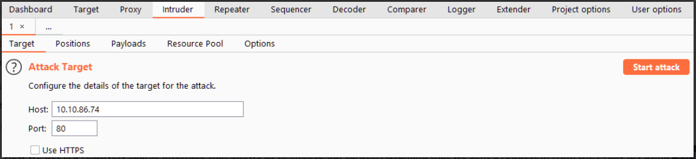
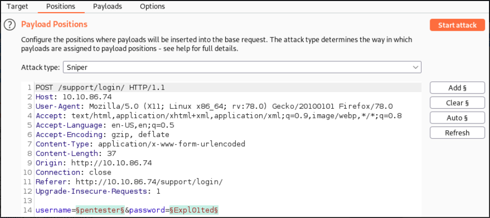
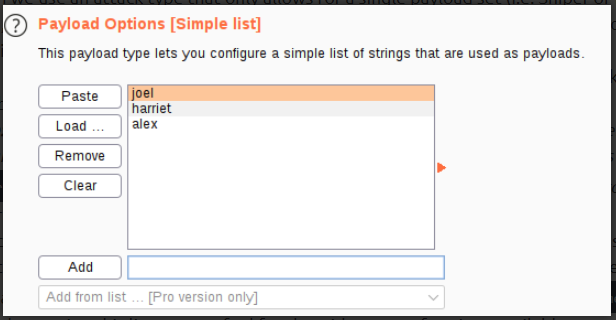

# Burp Suite Intruder

## Introduction

**Apa itu Intruder pada BurpSuite?**

Intruder adalah alat fuzzing built-in Burp Suite. Ini memungkinkan kita untuk menerima permintaan (biasanya ditangkap di Proxy sebelum diteruskan ke Intruder) dan menggunakannya sebagai template untuk mengirim lebih banyak permintaan dengan nilai yang sedikit diubah secara otomatis. Misalnya, dengan menangkap permintaan yang berisi upaya masuk, kita kemudian dapat mengonfigurasi Intruder untuk menukar bidang nama pengguna dan kata sandi dengan nilai dari daftar kata, yang secara efektif memungkinkan kita untuk memaksa formulir masuk. Demikian pula, kita dapat memasukkan daftar kata fuzzing dan menggunakan Intruder untuk melakukan fuzz untuk subdirektori, titik akhir, atau host virtual. Fungsionalitas ini sangat mirip dengan yang disediakan oleh alat baris perintah seperti Wfuzz atau Ffuf.

Singkatnya, sebagai metode untuk mengotomatisasi permintaan, Intruder sangat kuat, hanya ada satu masalah: untuk mengakses Intruder dengan kecepatan penuh, kita memerlukan Burp Professional. Kita masih bisa menggunakan Intruder dengan Burp Community, tapi rate-nya sangat terbatas. Pembatasan kecepatan ini berarti bahwa banyak peretas memilih untuk menggunakan alat lain untuk fuzzing dan bruteforcing.

Selain keterbatasan, Intruder masih sangat berguna, jadi sangat berharga untuk belajar menggunakannya dengan benar.

Mari kita lihat interface pada Intruder:



Tampilan pertama yang kita dapatkan adalah antarmuka yang relatif jarang yang memungkinkan kita untuk memilih target. Dengan asumsi bahwa kita mengirim permintaan dari Proxy (dengan menggunakan `Ctrl + I` atau klik kanan dan memilih "Send to Intruder").

Ada empat sub-tab Intruder lainnya:
1. **Positions** : Memungkinkan kita untuk memilih Jenis Serangan (kita akan membahas ini dalam tugas yang akan datang), serta mengonfigurasi di mana dalam template permintaan kita ingin memasukkan payload.
2. **Payloads** : Memungkinkan kita untuk memilih nilai untuk disisipkan ke setiap posisi yang kita definisikan di sub-tab sebelumnya. Misalnya, kami dapat memilih untuk memuat item dari daftar kata untuk dijadikan sebagai muatan. Bagaimana ini dimasukkan ke dalam template tergantung pada jenis serangan yang kami pilih di tab Posisi. Ada banyak jenis payload untuk dipilih (mulai dari daftar kata sederhana hingga regex berdasarkan tanggapan dari server). Sub-tab Payloads juga memungkinkan kita untuk mengubah perilaku Intruder sehubungan dengan payload; misalnya, kita dapat menentukan aturan pra-pemrosesan untuk diterapkan ke setiap muatan (misalnya menambahkan awalan atau akhiran, mencocokkan dan mengganti, atau melewati jika muatan cocok dengan regex yang ditentukan).
3. **Resource Pool** : tidak terlalu berguna bagi kami di Komunitas Burp. Ini memungkinkan kita untuk membagi sumber daya kita di antara tugas-tugas. Burp Pro akan memungkinkan kita untuk menjalankan berbagai jenis tugas otomatis di latar belakang, di mana kita mungkin ingin mengalokasikan memori dan kekuatan pemrosesan yang tersedia secara manual antara tugas otomatis ini dan Intruder. Tanpa akses ke tugas otomatis ini, tidak ada gunanya menggunakan ini, jadi kami tidak akan mencurahkan banyak waktu untuk itu.
4. Seperti kebanyakan alat Burp lainnya, Intruder memungkinkan kita untuk mengonfigurasi perilaku serangan di sub-tab **Option**. Pengaturan di sini berlaku terutama untuk bagaimana Burp menangani hasil dan bagaimana Burp menangani serangan itu sendiri. Misalnya, kita dapat memilih untuk menandai permintaan yang berisi potongan teks tertentu atau menentukan bagaimana Burp merespons redirect (3xx).

## Positions

Saat kita ingin melakukan serangan dengan Intruder, hal pertama yang perlu kita lakukan adalah melihat posisi. Posisi memberi tahu Intruder tempat memasukkan muatan.

Mari beralih ke sub-tab Posisi:



Perhatikan bahwa Burp akan mencoba untuk menentukan tempat yang paling mungkin kita mungkin ingin memasukkan muatan secara otomatis -- ini disorot dalam warna hijau dan dikelilingi oleh silcrows (`§`)

Di sisi kanan interface, terdapat tombol berlabel "Add §", "Clear §", dan "Auto §":
- **Add** memungkinkan kita menentukan posisi baru dengan menyorotnya di editor dan mengklik tombol.
- **Clear** menghapus semua posisi yang ditentukan, meninggalkan kanvas kosong untuk menentukan posisi sendiri.
- **Auto** mencoba untuk memilih posisi yang paling mungkin secara otomatis; ini berguna jika kita mengosongkan posisi default dan menginginkannya kembali.

## Attack Types 

Mari beralih ke sub-tab "Position" dan lihat di menu dropdown "Attack Types".

Ada empat jenis serangan yang tersedia:
- Sniper
- Battering ram
- Pitchfork
- Cluster bomb

### Sniper

Sniper adalah jenis serangan pertama dan paling umum.

Saat melakukan serangan sniper, kita menyediakan satu set payload. Misalnya, ini bisa berupa file tunggal yang berisi daftar kata atau rentang angka. Mulai sekarang, kita akan merujuk ke daftar item yang akan dimasukkan ke dalam permintaan menggunakan terminologi Burp Suite dari "Payload Set". Intruder akan mengambil setiap payload dalam satu set payload dan memasukkannya ke setiap posisi yang ditentukan secara bergantian.

```
POST /support/login/ HTTP/1.1
Host: MACHINE_IP
User-Agent: Mozilla/5.0 (X11; Ubuntu; Linux x86_64; rv:80.0) Gecko/20100101 Firefox/80.0
Accept: text/html,application/xhtml+xml,application/xml;q=0.9,image/webp,*/*;q=0.8
Accept-Language: en-US,en;q=0.5
Accept-Encoding: gzip, deflate
Content-Type: application/x-www-form-urlencoded
Content-Length: 37
Origin: http://MACHINE_IP
Connection: close
Referer: http://MACHINE_IP/support/login/
Upgrade-Insecure-Requests: 1

username=§pentester§&password=§Expl01ted§     
```

Ada dua posisi yang ditentukan di sini, menargetkan parameter isi nama `username` dan `password`.

Dalam sniper attack, Intruder akan mengambil setiap posisi dan mengganti setiap payload ke dalamnya secara bergantian.

Sebagai contoh, mari kita asumsikan kita memiliki daftar kata dengan tiga kata di dalamnya: burp, suite, dan intruder.

Dengan dua posisi yang kita miliki di atas, Intruder akan menggunakan kata-kata ini untuk membuat enam permintaan:

| Request Number | Request Body |
| -------------- | ------------ |
| 1 | `username=burp&password=Expl01ted` |
| 2 | `username=suite&password=Expl01ted` |
| 3 | `username=intruder&password=Expl01ted` |
| 4 | `username=pentester&password=burp` |
| 5 | `username=pentester&password=suite` |
| 6 | `username=pentester&password=intruder` |

Perhatikan bagaimana Intruder memulai dengan posisi pertama (username) dan mencoba setiap payload kita, kemudian pindah ke posisi kedua dan mencoba payload yang sama lagi. Kita dapat menghitung jumlah permintaan yang akan dibuat oleh Intruder Sniper sebagai `request = numberOfWords * numberOfPositions`.

Kualitas ini membuat Sniper sangat bagus untuk serangan posisi tunggal (misalnya bruteforce kata sandi jika kita mengetahui nama pengguna atau fuzzing untuk endpoint API).

### Battering Ram

Seperti Sniper, Battering ram membutuhkan satu set payload (misalnya satu daftar kata). Tidak seperti Sniper, Battering ram menempatkan payload yang sama di setiap posisi daripada di setiap posisi secara bergantian.

Mari kita gunakan daftar kata dan permintaan contoh yang sama seperti yang kita lakukan pada tugas terakhir untuk mengilustrasikannya.

```
POST /support/login/ HTTP/1.1
Host: MACHINE_IP
User-Agent: Mozilla/5.0 (X11; Ubuntu; Linux x86_64; rv:80.0) Gecko/20100101 Firefox/80.0
Accept: text/html,application/xhtml+xml,application/xml;q=0.9,image/webp,*/*;q=0.8
Accept-Language: en-US,en;q=0.5
Accept-Encoding: gzip, deflate
Content-Type: application/x-www-form-urlencoded
Content-Length: 37
Origin: http://MACHINE_IP
Connection: close
Referer: http://MACHINE_IP/support/login/
Upgrade-Insecure-Requests: 1

username=§pentester§&password=§Expl01ted§     
```

Dengan 3 payload (burp, suite dan intruder), request akan menjadi seperti ini:

| Request Number | Request Body |
| -------------- | ------------ |
| 1 | `username=burp&password=burp` |
| 2 | `username=suite&password=suite` |
| 3 | `username=intruder&password=intruder` |

### Pitchfork

Setelah Sniper, Pitchfork adalah tipe serangan yang paling mungkin Anda gunakan. Mungkin membantu untuk menganggap Pitchfork seperti memiliki banyak Sniper yang berlari secara bersamaan. Di mana Sniper menggunakan satu set payload (yang digunakan pada setiap posisi secara bersamaan), Pitchfork menggunakan satu set payload per posisi (hingga maksimum 20) dan mengulangi semuanya sekaligus.

Jenis serangan ini membutuhkan sedikit waktu untuk memahaminya, jadi mari kita gunakan contoh bruteforce sebelumnya, tetapi kali ini kita membutuhkan dua daftar kata:
- Daftar kata pertama kami adalah nama pengguna. Ini berisi tiga entri: `joel`, `harriet`, `alex`.
- Katakanlah kata sandi Joel, Harriet, dan Alex bocor: kita tahu bahwa kata sandi `Joel` adalah `J03l`, kata sandi `Harriet` adalah `Emma1815`, dan kata sandi `Alex` adalah `Sk1ll`.

Kita dapat menggunakan dua daftar ini untuk melakukan serangan pitchfork pada formulir login dari sebelumnya.

Saat menggunakan Intruder dalam mode pitchfork, request yang dibuat akan terlihat seperti ini:

| Request Number | Request Body |
| -------------- | ------------ |
| 1 | `username=joel&password=J03l` |
| 2 | `username=harriet&password=Emma1815` |
| 3 | `username=alex&password=Sk1ll` |

Lihat bagaimana Pitchfork mengambil item pertama dari setiap daftar dan memasukkannya ke dalam request, satu per posisi. Kemudian mengulangi ini untuk request berikutnya: mengambil item kedua dari setiap daftar dan menggantinya ke dalam template. Intruder akan terus melakukan ini sampai satu (atau semua) daftar habis. Idealnya, set muatan harus memiliki panjang yang sama saat bekerja di Pitchfork, karena Intruder akan menghentikan pengujian segera setelah salah satu daftar selesai. Misalnya, jika kita memiliki dua daftar, satu dengan 100 baris dan satu dengan 90 baris, Intruder hanya akan membuat 90 request, dan sepuluh item terakhir dalam daftar pertama tidak akan diuji.

### Cluster Bomb

Seperti Pitchfork, Cluster bomb memungkinkan kita untuk memilih beberapa set muatan: satu per posisi, hingga maksimal 20; namun, sementara Pitchfork beralih melalui setiap set muatan secara bersamaan, Cluster bomb beralih melalui setiap set muatan satu per satu, memastikan bahwa setiap kombinasi muatan yang mungkin diuji.

List username : joel, harriet, alex.

List password : J03l, Emma1815, Sk1ll.

| Request Number | Request Body |
| -------------- | ------------ |
| 1 | `username=joel&password=J03l` |
| 2 | `username=harriet&password=J03l` |
| 3 | `username=alex&password=J03l` |
| 4 | `username=joel&password=Emma1815` |
| 5 | `username=harriet&password=Emma1815` |
| 6 | `username=alex&password=Emma1815` |
| 7 | `username=joel&password=Sk1ll` |
| 8 | `username=harriet&password=Sk1ll` |
| 9 | `username=alex&password=Sk1ll` |

Cluster bomb akan mengulangi setiap kombinasi set muatan yang disediakan untuk memastikan bahwa setiap kemungkinan telah diuji. Jenis serangan ini dapat membuat lalu lintas dalam jumlah besar (sama dengan jumlah baris di setiap set muatan yang dikalikan bersama).

## Payloads

- Bagian **Payload Sets** memungkinkan kita untuk memilih posisi mana yang ingin kita konfigurasikan set serta jenis payload yang ingin kita gunakan.
    - Saat kami menggunakan tipe serangan yang hanya memungkinkan satu set muatan (yaitu Sniper atau Battering Ram), menu dropdown untuk "Payload Set" hanya akan memiliki satu opsi, terlepas dari berapa banyak posisi yang telah kami tentukan.
    - Jika kita menggunakan salah satu jenis serangan yang menggunakan beberapa set muatan (yaitu Pitchfork atau Cluster bomb), maka akan ada satu item di dropdown untuk setiap posisi.
    *Catatan: Beberapa posisi harus dibaca dari atas ke bawah, lalu dari kiri ke kanan saat diberi nomor di dropdown "Payload set". Misalnya, dengan dua posisi `username=§pentester§&password=§Expl01ted§`, item pertama di dropdown set muatan akan merujuk ke bidang `username`, dan yang kedua akan merujuk ke bidang `password`.*
    - Dropdown kedua di bagian ini memungkinkan kita untuk memilih "payload type". Secara default, ini adalah "Simple list" -- yang, seperti namanya, memungkinkan kita memuat daftar kata untuk digunakan. Ada banyak jenis payload lain yang tersedia -- beberapa yang umum termasuk: `Recursive Grep`, `Numbers`, dan `Username generator`. Ada baiknya membaca dengan teliti daftar ini untuk merasakan berbagai pilihan yang tersedia.
- **Payload Option** berbeda tergantung pada jenis payload yang kami pilih untuk set payload saat ini. Misalnya, jenis muatan "Simple list" akan memberi kita kotak untuk menambah dan menghapus muatan ke dan dari set:



Kita dapat melakukan ini secara manual menggunakan kotak teks "Add", menempelkan baris dengan "Paste", atau "Load..." dari file. Tombol "Remove" menghapus baris yang dipilih saat ini saja. Tombol "Clear" menghapus seluruh daftar. Berhati-hatilah: memuat daftar yang sangat besar di sini dapat menyebabkan Burp crash!
Sebaliknya, opsi untuk jenis muatan `Numbers` memungkinkan kita untuk mengubah opsi seperti rentang nomor yang digunakan dan basis yang sedang kita kerjakan.
- **Payload Processing** memungkinkan kita untuk menentukan aturan yang akan diterapkan ke setiap payload di set sebelum dikirim ke target. Misalnya, kita dapat menggunakan huruf besar pada setiap kata atau melewatkan muatan jika cocok dengan ekspresi reguler. Anda mungkin tidak menggunakan bagian ini secara rutin, tetapi Anda pasti akan menghargainya saat Anda membutuhkannya.
- **Payload Encoding**. Bagian ini memungkinkan kita untuk mengganti opsi penyandian URL default yang diterapkan secara otomatis untuk memungkinkan transmisi muatan kita yang aman. Kadang-kadang dapat bermanfaat untuk tidak mengkodekan URL karakter "tidak aman" standar ini, di situlah bagian ini masuk. kita dapat menyesuaikan daftar karakter yang akan dikodekan atau langsung menghapus centang pada kotak centang "URL-encode these characters".