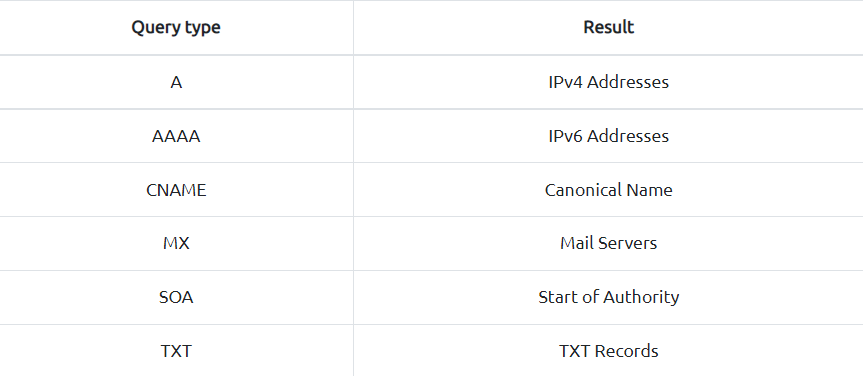
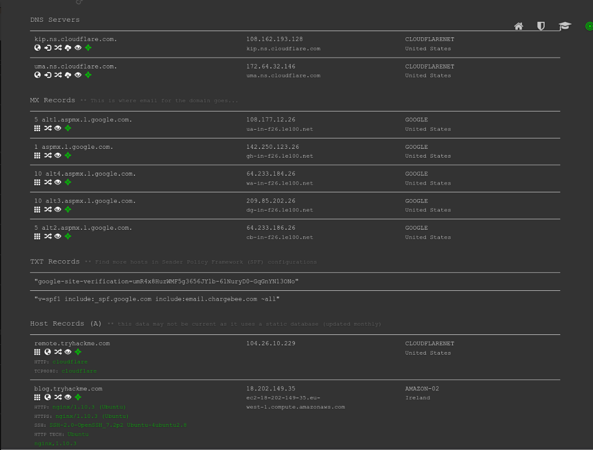
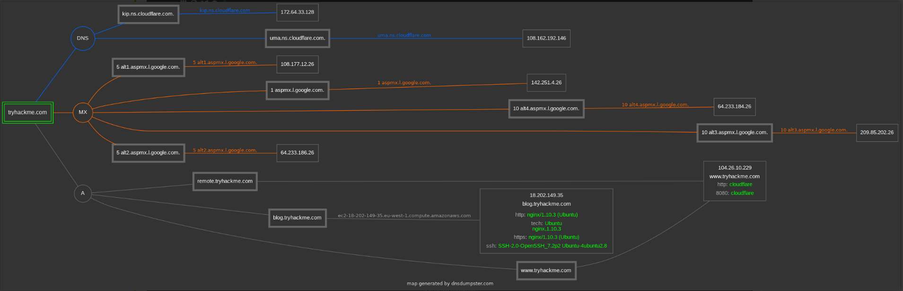
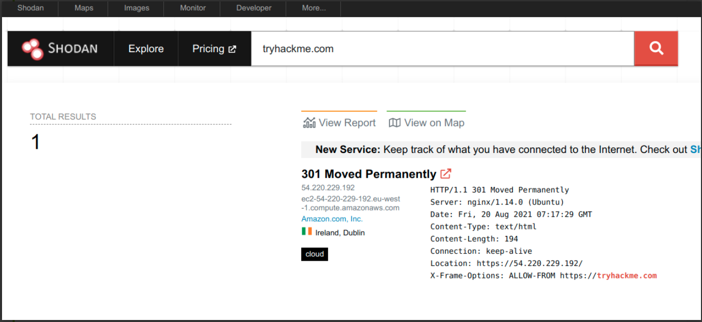

# Passive Reconnaissance

## Introduction

Sebelum masuk ke sistem komputer dan jaringan, dalam Seni Perang, Sun Tzu mengajarkan, “Jika Anda mengenal musuh dan mengenal diri sendiri, kemenangan Anda tidak akan diragukan lagi.” Jika Anda berperan sebagai penyerang, Anda perlu mengumpulkan informasi tentang sistem target Anda. Jika Anda memainkan peran bertahan, Anda perlu mengetahui apa yang akan ditemukan musuh Anda tentang sistem dan jaringan Anda.

Kita membagi reconnaissance menjadi dua:

1. Passive Reconnaissance
2. Active Reconnaissance

Dalam passive reconnaissance, Anda mengandalkan pengetahuan yang tersedia untuk umum. Ini adalah pengetahuan yang dapat Anda akses dari sumber daya yang tersedia untuk umum tanpa terlibat langsung dengan target. Anggap saja seperti Anda melihat wilayah target dari jauh tanpa menginjakkan kaki di wilayah itu.

Kegiatan passive reconnaissance mencakup banyak kegiatan, misalnya:

- Mencari catatan DNS domain dari server DNS publik.
- Mengecek iklan lowongan yang berhubungan dengan website target.
- Membaca artikel berita tentang perusahaan target.

Active reconnaissance, di sisi lain, tidak dapat dicapai secara diam-diam. Hal ini membutuhkan keterlibatan langsung dengan target. Anggap saja seperti Anda memeriksa kunci di pintu dan jendela, di antara titik masuk potensial lainnya.

Contoh kegiatan active reconnaissance meliputi:

- Menghubungkan ke salah satu server perusahaan seperti HTTP, FTP, dan SMTP.
- Memanggil perusahaan dalam upaya mendapatkan informasi (social engineering).
- Memasuki tempat perusahaan berpura-pura menjadi tukang reparasi.

Mempertimbangkan sifat invasif dari active reconnaissance, seseorang dapat dengan cepat mendapat masalah hukum kecuali ia memperoleh otorisasi hukum yang tepat.

## whois

WHOIS adalah protokol request dan response yang mengikuti spesifikasi [RFC 3912](https://www.ietf.org/rfc/rfc3912.txt). Server WHOIS mendengarkan pada port TCP 43 untuk request yang masuk. Pencatat domain (registrar) bertanggung jawab untuk memelihara catatan WHOIS untuk nama domain yang disewanya. Server WHOIS membalas dengan berbagai informasi terkait domain yang diminta. Yang menarik, kita dapat mempelajari:

- Registrar: Melalui registrar mana nama domain didaftarkan?
- Info kontak pendaftar: Nama, organisasi, alamat, telepon, dll. (kecuali disembunyikan melalui layanan privasi)
- Tanggal pembuatan, pembaruan, dan kedaluwarsa: Kapan nama domain pertama kali didaftarkan? Kapan terakhir diperbarui? Dan kapan harus diperbaharui?
- Nama Server: Server mana yang diminta untuk menyelesaikan nama domain?

Untuk mendapatkan informasi ini, kita perlu menggunakan klien `whois` atau layanan online. Banyak layanan online menyediakan informasi `whois`; namun, biasanya lebih cepat dan nyaman menggunakan klien whois lokal Anda. Anda dapat dengan mudah mengakses klien whois Anda di terminal. Sintaksnya adalah `whois DOMAIN_NAME`, dengan `DOMAIN_NAME` adalah domain yang Anda coba dapatkan informasi lebih lanjut. Perhatikan contoh berikut menjalankan `whois tryhackme.com`.

```
user@TryHackMe$ whois tryhackme.com
[Querying whois.verisign-grs.com]
[Redirected to whois.namecheap.com]
[Querying whois.namecheap.com]
[whois.namecheap.com]
Domain name: tryhackme.com
Registry Domain ID: 2282723194_DOMAIN_COM-VRSN
Registrar WHOIS Server: whois.namecheap.com
Registrar URL: http://www.namecheap.com
Updated Date: 2021-05-01T19:43:23.31Z
Creation Date: 2018-07-05T19:46:15.00Z
Registrar Registration Expiration Date: 2027-07-05T19:46:15.00Z
Registrar: NAMECHEAP INC
Registrar IANA ID: 1068
Registrar Abuse Contact Email: abuse@namecheap.com
Registrar Abuse Contact Phone: +1.6613102107
Reseller: NAMECHEAP INC
Domain Status: clientTransferProhibited https://icann.org/epp#clientTransferProhibited
Registry Registrant ID: 
Registrant Name: Withheld for Privacy Purposes
Registrant Organization: Privacy service provided by Withheld for Privacy ehf
[...]
URL of the ICANN WHOIS Data Problem Reporting System: http://wdprs.internic.net/
>>> Last update of WHOIS database: 2021-08-25T14:58:29.57Z <<<
For more information on Whois status codes, please visit https://icann.org/epp
```

Kita bisa melihat banyak informasi; kita akan memeriksanya sesuai urutan yang ditampilkan. Pertama, kita melihat bahwa kita diarahkan ke `whois.namecheap.com` untuk mendapatkan informasi kita. Dalam kasus ini dan saat ini, `namecheap.com` mempertahankan catatan WHOIS untuk nama domain ini. Selanjutnya, kita dapat melihat tanggal pembuatan beserta tanggal pembaruan terakhir dan tanggal kedaluwarsa.

Selanjutnya, kita memperoleh informasi tentang registrar dan registrant. kita dapat menemukan nama pendaftar dan informasi kontak kecuali mereka menggunakan beberapa layanan privasi. Meskipun tidak ditampilkan di atas, kita mendapatkan kontak admin dan teknis untuk domain ini.

Informasi yang dikumpulkan dapat diperiksa untuk menemukan permukaan serangan baru, seperti rekayasa sosial atau serangan teknis. Misalnya, tergantung pada ruang lingkup uji penetrasi, Anda dapat mempertimbangkan serangan terhadap server email pengguna admin atau server DNS, dengan asumsi mereka dimiliki oleh klien Anda dan termasuk dalam ruang lingkup uji penetrasi.

Penting untuk dicatat bahwa karena alat otomatis menyalahgunakan kueri WHOIS untuk mengumpulkan alamat email, banyak layanan WHOIS mengambil tindakan terhadap hal ini. Mereka mungkin menyunting alamat email, misalnya. Selain itu, banyak pendaftar berlangganan layanan privasi untuk menghindari alamat email mereka diambil oleh spammer dan menjaga kerahasiaan informasi mereka.

## nslookup and dig

Pada tugas sebelumnya, kita menggunakan protokol WHOIS untuk mendapatkan berbagai informasi tentang nama domain yang kita cari. Secara khusus, kita bisa mendapatkan server DNS dari registrar.

Temukan alamat IP nama domain menggunakan `nslookup`, yang merupakan singkatan dari Name Server Look Up. Anda perlu mengeluarkan perintah `nslookup DOMAIN_NAME`, misalnya, `nslookup tryhackme.com`. Atau, secara lebih umum, Anda dapat menggunakan `nslookup OPTIONS DOMAIN_NAME SERVER`. Ketiga parameter utama tersebut adalah:

- **OPTIONS** berisi jenis kueri seperti yang ditunjukkan pada tabel di bawah ini. Misalnya, Anda dapat menggunakan A untuk alamat IPv4 dan AAAA untuk alamat IPv6.
- **DOMAIN_NAME** adalah nama domain yang Anda cari.
- **SERVER** adalah server DNS yang ingin Anda kueri. Anda dapat memilih server DNS lokal atau publik apa pun untuk ditanyakan. Cloudflare menawarkan 1.1.1.1 dan 1.0.0.1, Google menawarkan 8.8.8.8 dan 8.8.4.4, dan Quad9 menawarkan 9.9.9.9 dan 149.112.112.112. Ada banyak lagi server DNS publik yang dapat Anda pilih jika Anda menginginkan alternatif untuk server DNS ISP Anda.



Misalnya, `nslookup -type=A tryhackme.com 1.1.1.1` (atau `nslookup -type=a tryhackme.com 1.1.1.1` karena tidak case sensitive) dapat digunakan untuk mengembalikan semua alamat IPv4 yang digunakan oleh tryhackme.com.

```
user@TryHackMe$ nslookup -type=A tryhackme.com 1.1.1.1
Server:		1.1.1.1
Address:	1.1.1.1#53

Non-authoritative answer:
Name:	tryhackme.com
Address: 172.67.69.208
Name:	tryhackme.com
Address: 104.26.11.229
Name:	tryhackme.com
Address: 104.26.10.229
```

`A` dan `AAAA` masing-masing digunakan untuk mengembalikan alamat IPv4 dan IPv6. Pencarian ini berguna untuk mengetahui dari perspektif pengujian penetrasi. Pada contoh di atas, kita memulai dengan satu nama domain, dan kita memperoleh tiga alamat IPv4. Masing-masing alamat IP ini dapat diperiksa lebih lanjut untuk ketidakamanan, dengan asumsi mereka berada dalam ruang lingkup uji penetrasi.

Katakanlah Anda ingin mempelajari tentang server email dan konfigurasi untuk domain tertentu. Anda dapat mengeluarkan `nslookup -type=MX tryhackme.com`. Berikut ini contohnya:

```
user@TryHackMe$ nslookup -type=MX tryhackme.com
Server:		127.0.0.53
Address:	127.0.0.53#53

Non-authoritative answer:
tryhackme.com	mail exchanger = 5 alt1.aspmx.l.google.com.
tryhackme.com	mail exchanger = 1 aspmx.l.google.com.
tryhackme.com	mail exchanger = 10 alt4.aspmx.l.google.com.
tryhackme.com	mail exchanger = 10 alt3.aspmx.l.google.com.
tryhackme.com	mail exchanger = 5 alt2.aspmx.l.google.com.
```

Kita dapat melihat bahwa konfigurasi email tryhackme.com saat ini menggunakan Google. Karena MX mencari server Mail Exchange, kita melihat bahwa ketika server email mencoba mengirimkan email `@tryhackme.com`, ia akan mencoba menyambung ke `aspmx.l.google.com`, yang memiliki urutan 1. Jika sibuk atau tidak tersedia, server surat akan mencoba menyambung ke server pertukaran surat berurutan berikutnya, `alt1.aspmx.l.google.com` atau `alt2.aspmx.l.google.com`.

Google menyediakan server email yang terdaftar; oleh karena itu, kita seharusnya tidak mengharapkan server email menjalankan versi server yang rentan. Namun, dalam kasus lain, kita mungkin menemukan server email yang tidak diamankan atau ditambal secara memadai.

Untuk kueri DNS yang lebih canggih dan fungsionalitas tambahan, Anda dapat menggunakan `dig`, akronim untuk "Domain Information Groper," jika Anda penasaran. Mari gunakan `dig` untuk mencari data MX dan membandingkannya dengan `nslookup`. Kita bisa menggunakan `dig DOMAIN_NAME`, tetapi untuk menentukan tipe record, kita akan menggunakan `dig DOMAIN_NAME TYPE`. Secara opsional, kita dapat memilih server yang ingin kita query menggunakan `dig @SERVER DOMAIN_NAME TYPE`.

- SERVER adalah server DNS yang ingin Anda kueri.
- DOMAIN_NAME adalah nama domain yang Anda cari.
- TYPE berisi jenis record DNS, seperti yang ditunjukkan pada tabel yang disediakan sebelumnya.

```
user@TryHackMe$ dig tryhackme.com MX

; <<>> DiG 9.16.19-RH <<>> tryhackme.com MX
;; global options: +cmd
;; Got answer:
;; ->>HEADER<
```

Perbandingan cepat antara output `nslookup` dan `dig` menunjukkan bahwa `dig` mengembalikan lebih banyak informasi, seperti TTL (Time To Live) secara default. Jika Anda ingin menanyakan server DNS 1.1.1.1, Anda dapat menjalankan `dig @1.1.1.1 tryhackme.com MX`.

## DNSDumpster

Alat pencarian DNS, seperti nslookup dan dig, tidak dapat menemukan subdomain sendiri. Domain yang Anda periksa mungkin menyertakan subdomain berbeda yang dapat mengungkapkan banyak informasi tentang target. Misalnya, jika tryhackme.com memiliki subdomain wiki.tryhackme.com dan webmail.tryhackme.com, Anda ingin mempelajari lebih lanjut tentang keduanya karena mereka dapat menyimpan banyak informasi tentang target Anda. Ada kemungkinan bahwa salah satu subdomain ini telah diatur dan tidak diperbarui secara berkala. Kurangnya pembaruan rutin yang tepat biasanya mengarah ke layanan yang rentan. Tapi bagaimana kita bisa tahu bahwa subdomain seperti itu ada?

Kita dapat mempertimbangkan untuk menggunakan beberapa mesin telusur untuk menyusun daftar subdomain yang diketahui publik. Satu mesin pencari tidak akan cukup; apalagi, kita harus berharap untuk melalui setidaknya puluhan hasil untuk menemukan data yang menarik. Lagi pula, Anda mencari subdomain yang tidak diiklankan secara eksplisit, dan karenanya tidak perlu sampai ke halaman pertama hasil pencarian. Pendekatan lain untuk menemukan subdomain seperti itu adalah dengan mengandalkan kueri paksa untuk menemukan subdomain mana yang memiliki catatan DNS.

Untuk menghindari pencarian yang memakan waktu, kita dapat menggunakan layanan online yang menawarkan jawaban rinci untuk permintaan DNS, seperti [DNSDumpster](https://dnsdumpster.com/). Jika kita mencari DNSDumpster untuk `tryhackme.com`, kita akan menemukan subdomain `blog.tryhackme.com`, yang tidak dapat disediakan oleh kueri DNS biasa. Selain itu, DNSDumpster akan mengembalikan informasi DNS yang dikumpulkan dalam tabel dan grafik yang mudah dibaca. DNSDumpster juga akan memberikan informasi yang dikumpulkan tentang server yang mendengarkan.

Kita akan mencari `tryhackme.com` di DNSDumpster untuk memberi Anda gambaran tentang hasil yang diharapkan. Di antara hasilnya, kita mendapatkan daftar server DNS untuk domain yang kita cari. DNSDumpster juga menyelesaikan nama domain ke alamat IP dan bahkan mencoba melakukan geolokasi. Kita juga dapat melihat data MX; DNSDumpster menyelesaikan kelima server pertukaran surat ke alamat IP masing-masing dan memberikan informasi lebih lanjut tentang pemilik dan lokasi. Akhirnya, kita dapat melihat catatan TXT. Praktis satu permintaan sudah cukup untuk mengambil semua informasi ini.



DNSDumpster juga akan merepresentasikan informasi yang dikumpulkan secara grafis. DNSDumpster menampilkan data dari tabel tadi sebagai grafik. Anda dapat melihat DNS dan MX bercabang ke server masing-masing dan juga menunjukkan alamat IP.



## Shodan.io

Saat Anda ditugaskan untuk menjalankan uji penetrasi terhadap target tertentu, sebagai bagian dari fase pengintaian pasif, layanan seperti [Shodan.io](https://www.shodan.io/) dapat membantu mempelajari berbagai informasi tentang jaringan klien, tanpa terhubung secara aktif ke jaringan tersebut. Selanjutnya, di sisi defensif, Anda dapat menggunakan layanan yang berbeda dari Shodan.io untuk mempelajari tentang perangkat yang terhubung dan terbuka milik organisasi Anda.

Shodan.io mencoba terhubung ke setiap perangkat yang dapat dijangkau secara online untuk membangun mesin pencari dari "hal-hal" yang terhubung berbeda dengan mesin pencari untuk halaman web. Setelah mendapat response, ia mengumpulkan semua informasi yang terkait dengan layanan dan menyimpannya dalam database untuk membuatnya dapat dicari. Pertimbangkan catatan yang disimpan dari salah satu server tryhackme.com.



Catatan ini menunjukkan server web; namun, seperti yang telah disebutkan, Shodan.io mengumpulkan informasi yang terkait dengan perangkat apa pun yang dapat ditemukan terhubung secara online. Mencari tryhackme.com di Shodan.io akan menampilkan setidaknya catatan yang ditunjukkan pada tangkapan layar di atas. Melalui hasil pencarian Shodan.io ini, kita dapat mempelajari beberapa hal terkait pencarian kita, seperti:

- alamat IP
- perusahaan hosting
- lokasi geografis
- jenis dan versi server

## Summary

Secara khusus, kita membahas alat baris perintah, `whois`, `nslookup`, dan `dig`. Kita juga membahas dua layanan `DNSDumpster` dan `Shodan.io` yang tersedia untuk umum. Kekuatan alat tersebut adalah Anda dapat mengumpulkan informasi tentang target Anda tanpa terhubung langsung ke mereka. Selain itu, kumpulan informasi yang mungkin Anda temukan menggunakan alat semacam itu bisa sangat besar setelah Anda menguasai opsi pencarian dan terbiasa membaca hasilnya.

| Tujuan | Commandline Example |
| ------ | ------------------- |
| Lookup WHOIS record | `whois tryhackme.com` |
| Lookup DNS A records | `nslookup -type=A tryhackme.com` |
| Lookup DNS MX records at DNS server | `nslookup -type=MX tryhackme.com 1.1.1.1` |
| Lookup DNS TXT records | `nslookup -type=TXT tryhackme.com` |
| Lookup DNS A records | `dig tryhackme.com A` |
| Lookup DNS MX records at DNS server	 | `dig @1.1.1.1 tryhackme.com MX` |
| Lookup DNS TXT records | `dig tryhackme.com TXT` |
