# 04_02_****Active Reconnaissance****

> Mempelajari cara menggunakan alat sederhana seperti traceroute, ping, telnet, dan browser web untuk mengumpulkan informasi.
> 

## Pengantar

Pada bab sebelumnya, *passive reconnaissance* memungkinkan kita untuk mengumpulkan informasi tentang target tanpa keterlibatan atau koneksi langsung apa pun. Bisa dikatakan teknik tersebut kita hanya menonton dari jauh atau memeriksa informasi yang tersedia untuk umum.

*Active reconnaissance* mengharuskan kita melakukan semacam kontak dengan target. Kontak ini dapat berupa panggilan telepon atau kunjungan ke perusahaan target dengan alasan untuk mengumpulkan lebih banyak informasi, biasanya sebagai bagian dari *social engineering*. Atau, itu bisa berupa koneksi langsung ke sistem target, baik mengunjungi situs web mereka atau memeriksa apakah firewall mereka memiliki port SSH yang terbuka. Anggap saja seperti kita sedang memeriksa jendela dan kunci pintu suatu rumah dengan cermat. Oleh karena itu, penting untuk diingat untuk tidak terlibat dalam pekerjaan *active reconnaissance* sebelum mendapatkan otorisasi hukum yang ditandatangani dari klien.

Pada bab ini, kita akan fokus pada *active reconnaissance*. *Active reconnaissance* dimulai dengan koneksi langsung yang dibuat ke mesin target. Koneksi semacam itu mungkin meninggalkan informasi di log yang menunjukkan alamat IP klien, waktu koneksi, dan durasi koneksi, dan lain-lain. Namun, tidak semua koneksi mencurigakan. Dimungkinkan untuk membiarkan *active reconnaissance* kita muncul sebagai aktivitas klien biasa. Misalnya web browsing; tidak ada yang akan mencurigai browser yang terhubung ke server web target di antara ratusan pengguna sah lainnya. Kita dapat menggunakan teknik tersebut untuk keuntungan kita saat bekerja sebagai bagian dari *red team (attackers)* dan tidak ingin membuat *blue team (defenders)* tahu hal tersebut.

Pada bab ini, kita membahas berbagai alat yang biasanya disertakan dengan sebagian besar sistem operasi atau mudah didapat. Kita mulai dengan web browser dan developer tools. Kemudian, membahas tools seperti `ping`, `traceroute`, dan `telnet`. 

## Web Browser

Ada beberapa cara di mana kita dapat menggunakan web browser untuk mengumpulkan informasi tentang target.

Pada tingkat transport, browser terhubung ke:

- Port TCP 80 secara default ketika website diakses melalui HTTP
- Port TCP 443 secara default ketika website diakses melalui HTTPS

Karena port 80 dan 443 adalah port default untuk HTTP dan HTTPS, web browser tidak menampilkannya di *address bar*. Namun, dimungkinkan untuk menggunakan port kustom untuk mengakses layanan. Misalnya, https://127.0.0.1:8834/ akan terhubung ke 127.0.0.1 (localhost) di port 8834 melalui protokol HTTPS. Jika ada server HTTPS yang mendengarkan pada port itu, kita akan menerima halaman web.

Saat menjelajahi halaman web, kita dapat menekan `Ctrl+Shift+I`di PC atau `Option + Command + I`( `⌥ + ⌘ + I`) di Mac untuk membuka *Developer Tools* di Firefox maupun Google Chrome. *Developer tools* memungkinkan kita untuk memeriksa banyak hal yang telah diterima dan ditukar oleh browser dengan server. Misalnya, kita dapat melihat dan bahkan memodifikasi file JavaScript (JS), memeriksa cookie yang disetel pada sistem kita dan menemukan struktur folder dari konten situs.

Di bawah ini adalah screenshot dari Developer Tools Firefox. 

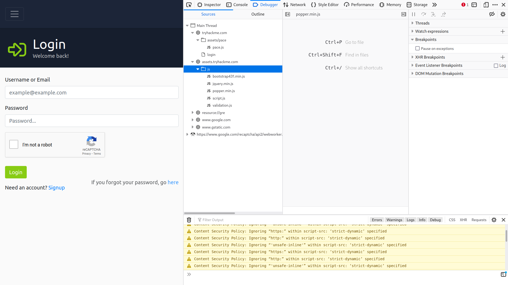

Ada juga banyak add-on untuk Firefox dan Chrome yang dapat membantu dalam penetration testing. Berikut adalah beberapa contoh:

- **FoxyProxy**
    
    Memungkinkan kita dengan cepat mengubah server proxy yang kita gunakan untuk mengakses situs web target. Ekstensi browser ini bisa digunakan saat menggunakan alat seperti Burp Suite.  [disini](https://addons.mozilla.org/en-US/firefox/addon/foxyproxy-standard)
    
- **User-Agent Switcher and Manager**
    
    Memberi kita kemampuan untuk berpura-pura mengakses halaman web dari sistem operasi yang berbeda atau web browser yang berbeda. Dengan kata lain, kita dapat berpura-pura menjelajahi situs menggunakan iPhone padahal sebenarnya Anda mengaksesnya dari Mozilla Firefox. [disini](https://addons.mozilla.org/en-US/firefox/addon/user-agent-string-switcher/)
    
- **Wappalyzer**
    
    Memberikan wawasan tentang teknologi yang digunakan di situs web yang dikunjungi. Ekstensi semacam itu berguna, terutama ketika Anda mengumpulkan semua informasi ini saat menjelajahi situs web seperti pengguna lain. [disini](https://addons.mozilla.org/en-US/firefox/addon/wappalyzer/)
    

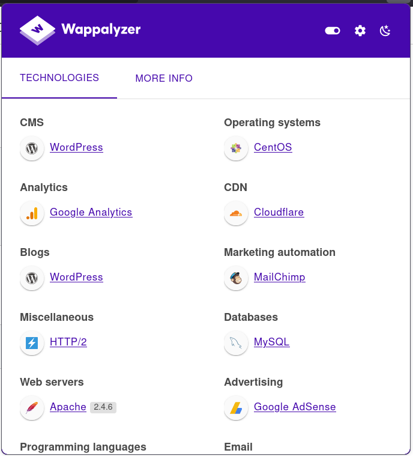

## Ping

Seperti halnya olahraga ping-pong. Ping bertujuan untuk memeriksa apakah kita dapat menjangkau *remote system* dan bahwa *remote system* dapat menghubungi/ mengembalikan kembali. Dengan kata lain, awalnya, ini digunakan untuk memeriksa konektivitas jaringan. Namun, pada bab ini kita akan menggunakan untuk memeriksa apakah *remote system* sedang online atau tidak.

Secara sederhana, perintah Ping mengirim paket ke *remote system*, dan *remote system* membalas. Dengan cara ini, kita dapat menyimpulkan bahwa *remote system* sedang online dan jaringan bekerja di antara kedua sistem, sebelum kita melakukan pemindaian mendetail untuk menemukan sistem operasi dan layanan yang sedang berjalan.

Secara teori Ping adalah perintah yang mengirimkan paket ICMP Echo ke *remote system*. Jika *remote system* online, dan paket ping dirutekan dengan benar dan tidak diblokir oleh firewall apa pun, *remote system* harus mengirim kembali ICMP Echo Reply (balasan). Demikian pula, balasan Ping harus mencapai sistem pertama jika diarahkan dengan benar dan tidak diblokir oleh firewall apa pun.

Untuk melakukan perintah ini kita dapat mengiputkan perintah `ping MACHINE_IP`atau `ping HOSTNAME` di terminal linux. Jika kita tidak menentukan hitungan pada sistem Linux, kita harus menekan `CTRL+c`untuk memaksanya Ping berhenti. Oleh karena itu, kita mungkin mempertimbangkan `ping -c 10 MACHINE_IP`jika kita hanya ingin mengirim sepuluh paket. Ini setara dengan `ping -n 10 MACHINE_IP`pada sistem MS Windows.

Secara teknis, Ping berada di bawah protokol ICMP (Internet Control Message Protocol). 

Dalam contoh berikut, kita telah menentukan jumlah total paket menjadi 5. Dari terminal AttackBox, kami mulai melakukan ping `MACHINE_IP`. Kami mengetahui bahwa `MACHINE_IP`itu aktif dan tidak memblokir permintaan gema ICMP. Selain itu, semua firewall dan router pada rute paket juga tidak memblokir permintaan gema ICMP.

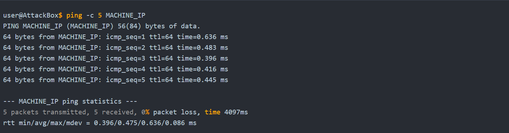

Dalam contoh di atas, kita melihat dengan jelas bahwa sistem target merespons. Output ping adalah indikator bahwa itu online dan dapat dijangkau. Kita telah mengirimkan lima paket, dan kita menerima lima balasan. Kita perhatikan bahwa, rata-rata, butuh 0,475 md (milidetik) untuk balasan mencapai sistem kita, dengan maksimum 0,636 md.

Dari sudut pandang penetration testing, kita akan mencoba menemukan lebih banyak tentang target ini. Kita akan mencoba mempelajari sebanyak mungkin, misalnya port mana yang terbuka dan layanan mana yang sedang berjalan.

Mari kita pertimbangkan kasus berikut: kita mematikan mesin virtual target dan kemudian mencoba melakukan ping `MACHINE_IP`. Seperti yang Anda harapkan dalam contoh berikut, kita tidak menerima balasan apa pun.

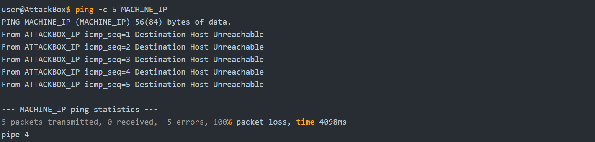

Dalam hal ini, kita sudah tahu bahwa kita telah mematikan komputer target yang memiliki MACHINE_IP. Untuk setiap ping, sistem yang kita gunakan merespons dengan "Destination Host Unreachable." Kita dapat melihat bahwa kita telah mengirimkan lima paket, tetapi tidak ada yang diterima, sehingga paket hilang 100%.

Secara umum, ketika kita tidak mendapatkan balasan ping, ada beberapa penjelasan yang akan menjelaskan mengapa kita tidak mendapatkan balasan ping, misalnya:

- Komputer tujuan tidak responsif; mungkin masih boot atau dimatikan, atau OS macet.
- Itu dicabut dari jaringan, atau ada perangkat jaringan yang rusak di seberang jalan.
- Firewall dikonfigurasi untuk memblokir paket tersebut. Firewall mungkin merupakan bagian dari perangkat lunak yang berjalan pada sistem itu sendiri atau perangkat jaringan yang terpisah. Perhatikan bahwa firewall MS Windows memblokir ping secara default.
- Sistem Anda dicabut dari jaringan.

## Traceroute

Perintah traceroute *melacak rute* yang diambil oleh paket dari sistem Anda ke host lain. Tujuan dari traceroute adalah untuk menemukan alamat IP dari router atau hop yang dilintasi sebuah paket saat ia berpindah dari sistem Anda ke host target. Perintah ini juga mengungkapkan jumlah router di antara kedua sistem. Ini sangat membantu karena menunjukkan jumlah hop (router) antara sistem Anda dan host target. Namun, perhatikan bahwa rute yang diambil oleh paket mungkin berubah karena banyak router menggunakan protokol perutean dinamis yang beradaptasi dengan perubahan jaringan.

Di Linux dan macOS, perintah yang digunakan adalah `traceroute MACHINE_IP`, dan di MS Windows, adalah `tracert MACHINE_IP`. `traceroute`mencoba menemukan router yang melintasi jalur dari sistem Anda ke sistem target.

Tidak ada cara langsung untuk menemukan jalur dari sistem Anda ke sistem target. Kita mengandalkan ICMP untuk "menipu" router agar mengungkapkan alamat IP mereka. Kita dapat melakukannya dengan menggunakan Time To Live (TTL) kecil di bidang header IP. Meskipun T dalam TTL adalah singkatan dari waktu, TTL menunjukkan jumlah maksimum router/hop yang dapat dilewati sebuah paket sebelum dijatuhkan; TTL bukan jumlah maksimum satuan waktu. Ketika sebuah router menerima sebuah paket, ia mengurangi TTL satu per satu sebelum meneruskannya ke router berikutnya. Gambar berikut menunjukkan bahwa setiap kali paket IP melewati router, nilai TTL-nya berkurang 1. Awalnya, ia meninggalkan sistem dengan nilai TTL 64, mencapai sistem target dengan nilai TTL 60 setelah melewati 4 router.

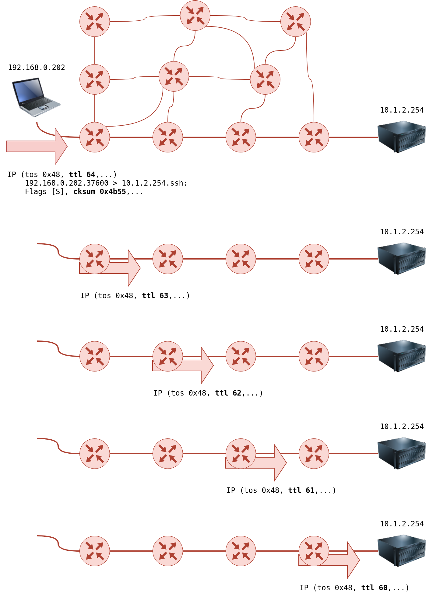

Namun, jika TTL mencapai 0, itu akan dijatuhkan, dan ICMP Time-to-Live terlampaui akan dikirim ke pengirim asli. Pada gambar berikut, sistem mengatur TTL ke 1 sebelum mengirimkannya ke router. Router pertama di jalur tersebut mengurangi TTL sebesar 1, menghasilkan TTL 0. Akibatnya, router ini akan membuang paket dan mengirim pesan kesalahan waktu ICMP melebihi waktu transit. Perhatikan bahwa beberapa router dikonfigurasi untuk tidak mengirim pesan ICMP seperti itu saat membuang paket.

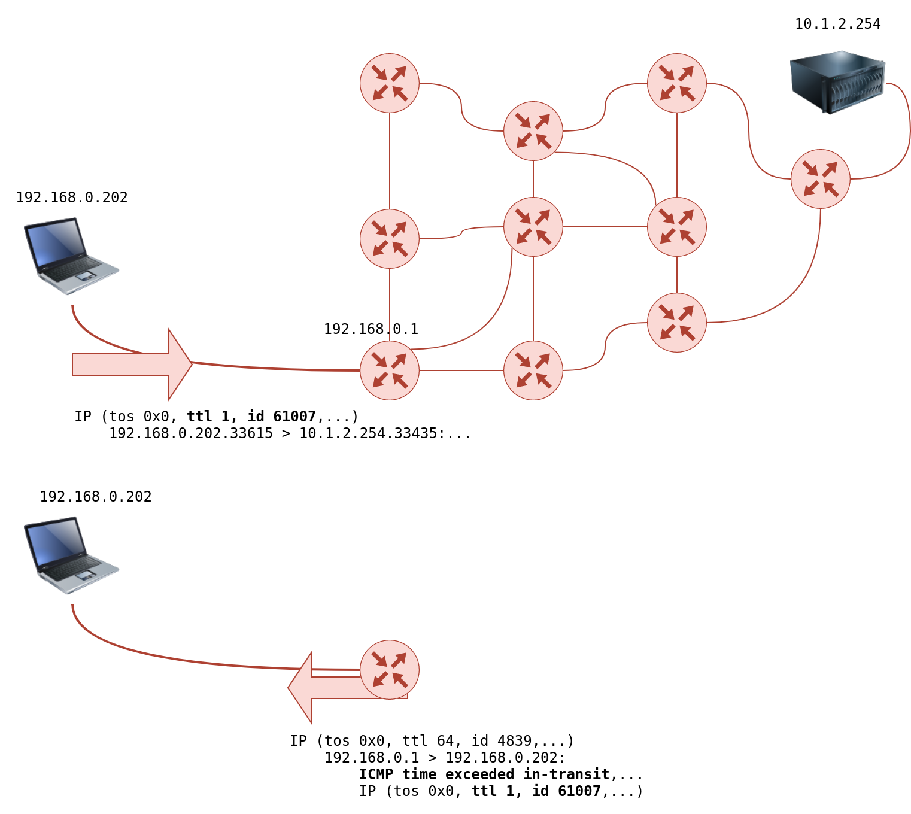

Di Linux, `traceroute`akan mulai dengan mengirimkan datagram UDP dalam paket IP TTL menjadi 1. Dengan demikian, hal itu menyebabkan router pertama menemukan TTL=0 dan mengirimkan kembali ICMP Time-to-Live yang terlampaui. Oleh karena itu, TTL 1 akan mengungkapkan alamat IP router pertama kepada Anda. Kemudian akan mengirim paket lain dengan TTL=2; paket ini akan dijatuhkan di router kedua. Dan seterusnya.

Dalam contoh berikut, kita menjalankan perintah yang sama, `traceroute tryhackme.com`dari AttackBox TryHackMe. Kami melihat bahwa proses yang berbeda mungkin mengarah ke rute yang berbeda yang diambil oleh paket.

Traceroute A

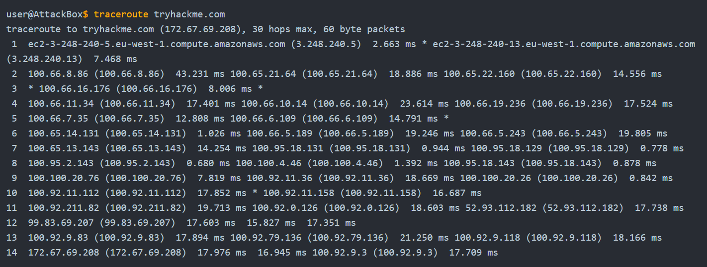

Dalam output traceroute di atas, kita memiliki 14 baris bernomor, setiap baris mewakili satu router/hop. Sistem kita mengirimkan tiga paket dengan TTL disetel ke 1, kemudian tiga paket dengan TTL disetel ke 2, dan seterusnya. Tergantung pada topologi jaringan, kita mungkin mendapatkan balasan dari hingga 3 router yang berbeda, tergantung pada rute yang diambil oleh paket. Pertimbangkan baris nomor 12, router kedua belas dengan alamat IP yang terdaftar telah menjatuhkan paket tiga kali dan mengirim pesan ICMP melebihi waktu transit. Baris `12 99.83.69.207 (99.83.69.207) 17.603 ms 15.827 ms 17.351 ms`menunjukkan waktu dalam milidetik untuk setiap balasan mencapai sistem kita.

Di sisi lain, kita dapat melihat bahwa kita hanya menerima satu balasan pada baris ketiga. Dua bintang pada output `3 * 100.66.16.176 (100.66.16.176) 8.006 ms *`menunjukkan bahwa sistem kita tidak menerima dua waktu ICMP yang diharapkan melebihi pesan dalam perjalanan.

Akhirnya, pada baris pertama dari output, kita dapat melihat bahwa paket-paket yang meninggalkan AttackBox mengambil rute yang berbeda. Kita dapat melihat dua router yang merespons TTL menjadi satu. Sistem kita tidak pernah menerima pesan ICMP ketiga yang diharapkan.

Traceroute B

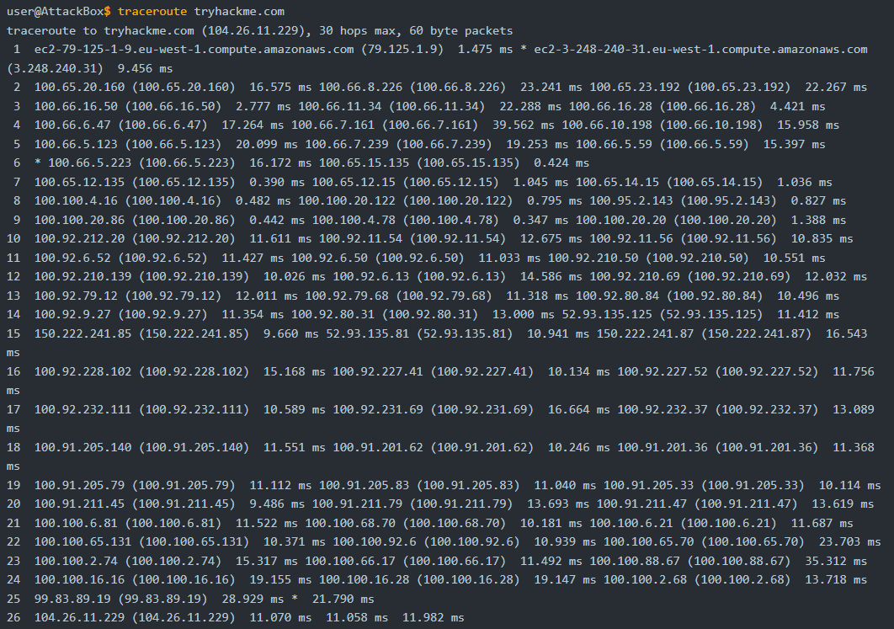

Dalam menjalankan kedua program traceroute, kita melihat bahwa paket mengambil rute yang lebih panjang kali ini, melewati 26 router. Jika Anda menjalankan traceroute ke sistem dalam jaringan Anda, rute tersebut kemungkinan tidak akan berubah. Namun, kita tidak dapat mengharapkan rute tetap saat paket harus melalui router lain di luar jaringan kita.

Untuk meringkas, kita dapat memperhatikan hal-hal berikut:

- Jumlah hop/router antara sistem Anda dan sistem target bergantung pada waktu Anda menjalankan traceroute. Tidak ada jaminan bahwa paket Anda akan selalu mengikuti rute yang sama, bahkan jika Anda berada di jaringan yang sama atau Anda mengulangi perintah traceroute dalam waktu singkat.
- Beberapa router mengembalikan alamat IP publik. Anda dapat memeriksa beberapa router ini berdasarkan cakupan pengujian penetrasi yang dimaksudkan.
- Beberapa router tidak memberikan balasan.

## Telnet

Protokol TELNET (Teletype Network) dikembangkan pada tahun 1969 untuk berkomunikasi dengan sistem jarak jauh/ *remote system* melalui *Command-Line Interface* (CLI). Oleh karena itu, perintah `telnet`tersebut menggunakan protokol TELNET untuk *remote administration*. Port default yang digunakan oleh telnet adalah 23. Dari sudut pandang keamanan, `telnet`mengirimkan semua data, termasuk nama pengguna dan kata sandi, dalam bentuk teks yang jelas/ *clear-text*. Mengirim dalam cleartext memudahkan siapa saja, yang memiliki akses ke saluran komunikasi, untuk mencuri kredensial login. Alternatif yang aman adalah protokol SSH (Secure SHell).

Namun, klien telnet, dengan kesederhanaannya, dapat digunakan untuk tujuan lain. Mengetahui bahwa klien telnet bergantung pada protokol TCP , kita dapat menggunakan Telnet untuk terhubung ke layanan apa pun dan mengambil pesan. Menggunakan `telnet MACHINE_IP PORT`, kita dapat terhubung ke layanan apa pun yang berjalan di TCP dan bahkan bertukar beberapa pesan kecuali jika menggunakan enkripsi.

Katakanlah kita ingin menemukan informasi lebih lanjut tentang web server, mendengarkan/ *listening* dengan port 80. Kita terhubung ke server pada port 80, dan kemudian kita berkomunikasi menggunakan protokol HTTP. Kita tidak perlu menyelami protokol HTTP, kita hanya perlu memberikan perintah`GET / HTTP/1.1`. Untuk menentukan sesuatu selain daripada halaman indeks default, kita dapat menuliskan perintah `GET /page.html HTTP/1.1`, yang akan meminta `page.html`. Kita juga menetapkan ke remote web server bahwa kita ingin menggunakan HTTP versi 1.1 untuk komunikasi. Untuk mendapatkan respons yang valid, alih-alih kesalahan, kita perlu memasukkan beberapa nilai untuk host`host: example` dan tekan enter dua kali. Menjalankan langkah-langkah ini akan menyediakan halaman indeks yang diminta.

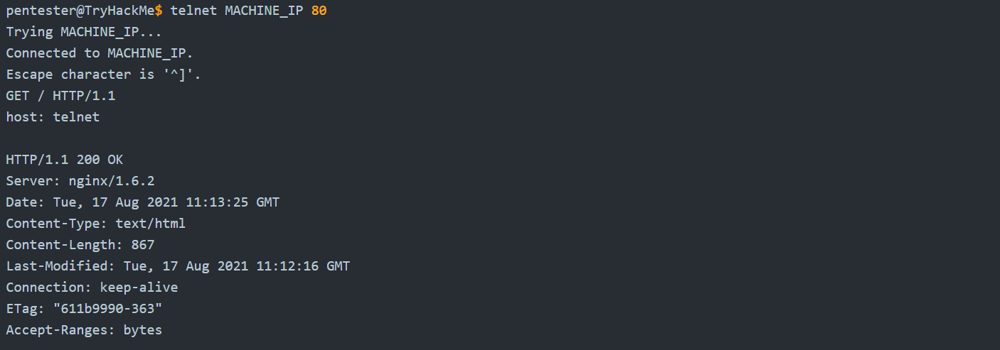

Yang menarik dengan menggunakan Telnet kita dapat menemukan jenis dan versi web server yang diinstal, `Server: nginx/1.6.2`. Dalam contoh ini, kita berkomunikasi dengan web server, jadi kita menggunakan perintah HTTP dasar. Jika kita terhubung ke server email, kita perlu menggunakan perintah yang tepat berdasarkan protokol, seperti SMTP dan POP3.

## Netcat

Netcat atau `nc` berfungsi sebagai klien yang terhubung ke *listening port,* sebagai alternatif ini dapat bertindak sebagai server yang mendengarkan pada port pilihan kita. Netcat mendukung protokol TCP dan UDP. Oleh karena itu, alat ini dapat dengan mudah digunakan sebagai klien atau server sederhana melalui TCP atau UDP.

Pertama, kita dapat terhubung ke server, seperti yang kita lakukan dengan Telnet, untuk menangkap header menggunakan `nc MACHINE_IP PORT`, perintah ini sangat mirip dengan `telnet MACHINE_IP PORT`. Perhatikan bahwa kita mungkin perlu menekan SHIFT+ENTER setelah baris GET.

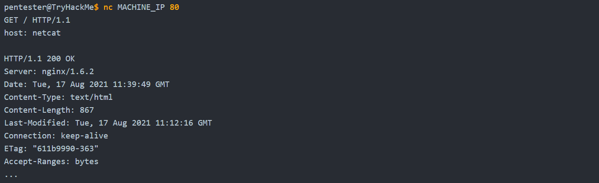

Di terminal yang ditunjukkan di atas, kita menggunakan netcat untuk terhubung ke MACHINE_IP port 80 menggunakan `nc MACHINE_IP 80`. Selanjutnya, kita memberikan perintah GET untuk halaman default menggunakan `GET / HTTP/1.1` , kita menentukan ke server target bahwa klien kita mendukung HTTP versi 1.1. Terakhir, kita perlu memberi nama pada host kita, jadi kita menambahkan baris baru,`host: netcat` . Kita dapat memberi nama host kita apa saja karena ini tidak berdampak.

Berdasarkan output kita menerima `Server: nginx/1.6.2`, kita dapat mengatakan bahwa pada port 80, kita memiliki Nginx versi 1.6.2 yang mendengarkan koneksi masuk.

Kita dapat menggunakan netcat untuk mendengarkan di port TCP dan terhubung ke port untuk mendengarkan sistem lain.

Pada sistem server , di mana kita ingin membuka port dan mendengarkannya, kita dapat mengeluarkan `nc -lp 1234`atau lebih baik lagi, `nc -vnlp 1234`, yang sama dengan `nc -v -l -n -p 1234`. Urutan huruf yang tepat tidak menjadi masalah selama nomor port didahului langsung oleh `-p`.

| Opsi | Deskripsi |
| --- | --- |
| -l | Mode dengar |
| -p | Menentukan nomor Port |
| -n | Hanya numerik; tidak ada resolusi nama host melalui DNS |
| -v | Output verbose (opsional, namun berguna untuk menemukan bug apa pun) |
| -vv | Sangat Verbose (opsional) |
| -k | Tetap mendengarkan setelah klien terputus |

Catatan:

- Opsi `p` seharusnya muncul tepat sebelum nomor port yang ingin Anda dengarkan.
- Opsi `n` akan menghindari pencarian dan peringatan DNS.
- Nomor port kurang dari 1024 memerlukan hak akses root untuk mendengarkan.

Di sisi *klien* , kita akan mengeluarkan `nc MACHINE_IP PORT_NUMBER`. Berikut adalah contoh penggunaan `nc`untuk echo. Setelah kita berhasil membuat koneksi ke server, apa pun yang kita ketik di sisi klien akan digaungkan di sisi server dan sebaliknya.

Perhatikan contoh berikut. Di sisi server, kita akan mendengarkan pada port 1234. Kita dapat melakukannya dengan perintah `nc -vnlp 1234`(sama seperti `nc -lvnp 1234`). Dalam kasus kita, server yang mendengarkan memiliki alamat IP `MACHINE_IP`, sehingga kita dapat menghubungkannya dari sisi klien dengan menjalankan `nc MACHINE_IP 1234`. Pengaturan ini akan menggemakan apa pun yang akan kita ketik di satu sisi ke sisi lain TCP tunnel. Kita dapat menemukan rekaman proses di bawah ini. Perhatikan bahwa server mendengarkan ada di sisi kiri layar.

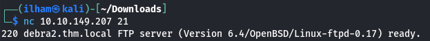

## Ringkasan

Sangat mudah untuk menyatukan beberapa dari mereka melalui skrip shell untuk membangun jaringan primitif dan pemindai sistem. Kita dapat menggunakan `traceroute`untuk memetakan jalur ke target, `ping`untuk memeriksa apakah sistem target merespons ICMP Echo, dan `telnet`untuk memeriksa port mana yang terbuka dan dapat dijangkau dengan mencoba menghubungkannya.